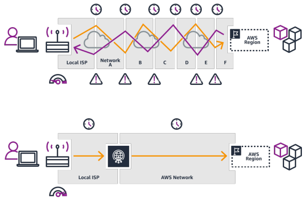

<!--  -->

# Aprovechando la infraestrucutra global de AWS
## ¿Por qué hacer una solicitud global?
Una **aplicación global** es una aplicación desplegada en **múltiples geografías**, en AWS pueden ser **regiones** y/o **edge locations**

1. **Disminución de la latencia**
    - La latencia es el tiempo que tarda un paquete de red en llegar a un servidor
    - Un paquete de Asia tarda en llegar a Estados Unidos
    - Implementa tus aplicaciones más cerca de tus usuarios para disminuir la latencia y mejorar la experiencia
2. **Recuperación de desastres (Disaster Recovery - DR)**
    - Si una región de AWS se cae (terremoto, tormentas, corte de energía, política)...
    - Puedes conmutar por error a otra región y que tu aplicación siga funcionando
    - Un plan de RD es importante para aumentar la disponibilidad de tu aplicación
3. **Protección contra ataques** la infraestructura global distribuida es más difícil de atacar

## [Infraestructura global de AWS](https://aws.amazon.com/es/about-aws/global-infrastructure/regions_az/)
- **Regiones** para desplegar aplicaciones e infraestructura
- **Zonas de disponibilidad** formadas por múltiples centros de datos
- **Edge Locations** *(puntos de presencia)* para la entrega de contenidos lo más cerca posible de los usuarios

## Aplicaciones globales en AWS
- **DNS global: Route 53**
    - Ideal para encaminar a los usuarios al despliegue más cercano con la menor latencia
    - Excelente para las estrategias de recuperación de desastres
- **Red global de entrega de contenidos (CDN): CloudFront**
    - Replica parte de una aplicación a las ubicaciones edge de AWS - disminuye la latencia
    - Almacena las solicitudes comunes - mejora la experiencia del usuario y disminuye la latencia
- **S3 Transfer Acceleration:**
    - Acelera las cargas y descargas globales en Amazon S3
- **AWS Global Accelerator:**
    - Mejora la dispon

## [Amazon Route 53](https://aws.amazon.com/route53) - Visión general
- Route53 es un DNS gestionado (Sistema de Nombres de Dominio)
- El DNS es una colección de reglas y registros que ayuda a los clientes a entender cómo llegar a un servidor a través de las URL
- En AWS, los registros más comunes son
    - www.google.com => `12.34.56.78` == **Registro A (IPv4)**
    - www.google.com => `2001:0db8:85a3:0000:0000:8a2e:0370:7334` == **AAAA IPv6**
    - search.google.com => `www.google.com` == **CNAME**: nombre de host a nombre de host
    - ejemplo.com => recurso AWS == **Alias** (ej: ELB, CloudFront, S3, RDS, etc...)

### Políticas de enrutamiento de Amazon Route 53
- **Simple Routing Policy**
- **Weighted Routing Policy**
- **Latency Routing Policy**
- **Failover Routing Policy**

> [!IMPORTANT]
> Se recomienda conocerlas para el examen CCP

## [AWS CloudFront](https://aws.amazon.com/cloudfront)

- Red de entrega de contenidos (CDN)
- **Mejora el rendimiento de lectura, el contenido se almacena en caché en edge location**
- Mejora la experiencia de los usuarios
- +400 puntos de presencia a nivel mundial (ubicaciones edge)
- **Protección DDoS, integración con Shield, AWS Web Application Firewall**

### CloudFront - Orígenes
- **Bucket S3**
    - Para distribuir archivos y almacenarlos en caché en el borde
    - Seguridad mejorada con CloudFront **Origin Access Control (OAC)**
    - OAC sustituye a Origin Access Identity (OAI)
    - CloudFront puede utilizarse como entrada (para subir archivos a S3)
- **Origen personalizado (HTTP)**
    - Application Load Balancer
    - Instancia EC2
    - Sitio web S3 (primero debes habilitar el bucket como sitio web S3 estático)
    - Cualquier backend HTTP que desees

### CloudFront a alto nivel

### CloudFront - S3 como origen

### CloudFront vs S3 Cross Region Replication (CRR)
- CloudFront:
    - Red Global Edge
    - Los archivos se almacenan en caché durante un TTL (quizás un día)
    - **Es ideal para contenidos estáticos que deben estar disponibles en todas partes**
- S3 Cross Region Replication (CRR):
    - Debe configurarse para cada región en la que se quiera que se produzca la replicación
    - Los archivos se actualizan casi en tiempo real
    - Sólo lectura
    - **Ideal para contenidos dinámicos que deben estar disponibles con baja latencia en pocas regiones**

## [S3 Transfer Acceleration](https://aws.amazon.com/s3/transfer-acceleration)

Aumenta la velocidad de transferencia transfiriendo el archivo a una ubicación edge de AWS que reenviará los datos al bucket de S3 en la región de destino

## [AWS Global Accelerator](https://aws.amazon.com/global-accelerator)
- Mejora la **disponibilidad** y el **rendimiento** global de la aplicación utilizando la **red global de AWS**
- Aprovecha la red interna de AWS para optimizar la ruta hacia la aplicación (60% de mejora)
- Se crean **2 IP Anycast** para la aplicación y el tráfico se envía a través de los p**untos de presencia (Edge Locations)**
- Las Edge Locations envían el tráfico a la aplicación

#### Comparativa del tráfico sin y con AWS Global Accelerator

### AWS Global Accelerator vs CloudFront
- Ambos utilizan la red global de AWS y sus ubicaciones de borde en todo el mundo
- Ambos servicios se integran con **AWS Shield** para la protección DDoS
- **CloudFront - Red de entrega de contenidos (CDN)**
    - Mejora el rendimiento del contenido almacenable en caché (como imágenes y vídeos)
    - El contenido se entrega en edge location
- **Global Accelerator**
    - Sin almacenamiento en caché, proxy de paquetes en el borde a las aplicaciones que se ejecutan en una o más regiones de AWS.
    - Mejora el rendimiento de una amplia gama de aplicaciones sobre TCP o UDP
    - Bueno para casos de uso de HTTP que requieren direcciones IP estáticas
    - Bueno para casos de uso de HTTP que requieran una conmutación por error regional determinista y rápida

## [AWS Outposts](https://aws.amazon.com/outposts)
Cloud híbrido: empresas que mantienen una infraestructura local junto a una infraestructura en la nube

Por lo tanto, hay dos formas de tratar con los sistemas de IT:
1. Una para el Cloud de AWS (utilizando la consola de AWS, la CLI y las API de AWS)
2. Una para su infraestructura on-premise

Los AWS Outposts son **"racks de servidores"** que ofrecen la misma infraestructura, servicios, API y herramientas de AWS para crear tus propias aplicaciones en las instalaciones al igual que en el Cloud

**AWS configurará y administrará los "racks Outposts"** dentro de nuestra infraestructura local y podremos empezar a aprovechar los servicios de AWS en las instalaciones

Eres responsable de la seguridad física del rack de Outposts

### Ventajas:
- Acceso de baja latencia a los sistemas locales
- Procesamiento local de datos
- Residencia de datos
- Migración más fácil de las instalaciones a el Cloud
- Servicio totalmente gestionado

### Algunos servicios que funcionan en Outposts:
- Amazon EC2 
- Amazon EBS 
- Amazon S3 
- Amazon EKS 
- Amazon ECS 
- Amazon RDS 
- Amazon EMR

## [AWS WaveLength](https://aws.amazon.com/wavelength)
- Las **WaveLength Zones** son despliegues de infraestructura incrustados en los centros de datos de los proveedores de telecomunicaciones de las redes 5G
- Lleva los servicios de AWS al límite de las redes 5G, Ejemplo: `EC2`, `EBS`, `VPC`...
- Aplicaciones de latencia ultrabaja a través de las redes 5G
- El tráfico no sale de la red del proveedor de servicios de comunicación (**CSP**)
- Conexión segura y de gran ancho de banda con la región AWS matriz
- Sin cargos adicionales ni acuerdos de servicio

> *Casos de uso:*
> Ciudades inteligentes, diagnósticos asistidos por ML, vehículos conectados, flujos de vídeo en directo interactivos, AR/VR, juegos en tiempo real, ...