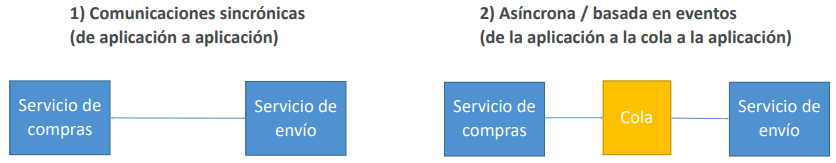
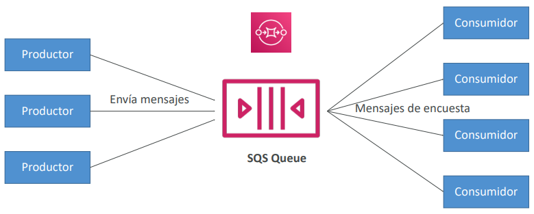
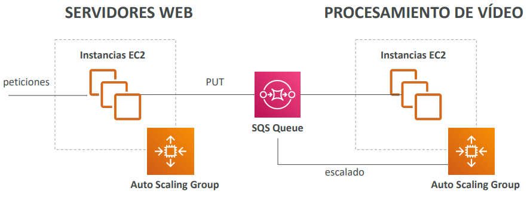
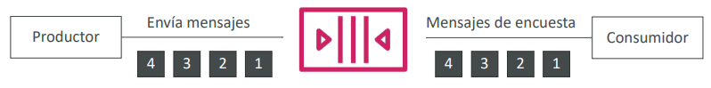
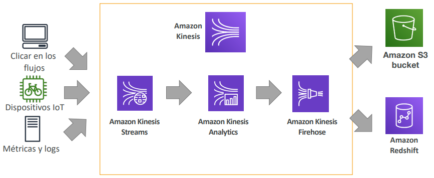
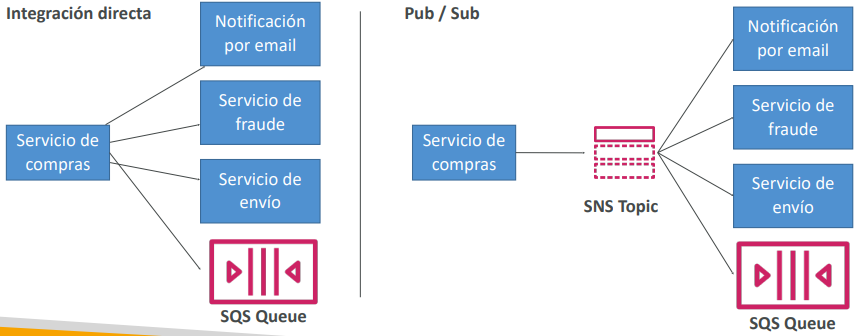
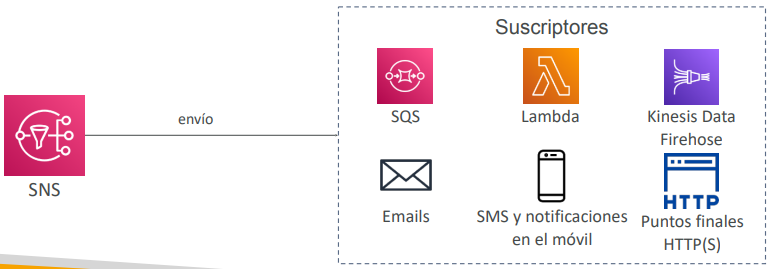

# Integración en el Cloud
- Cuando empezamos a desplegar varias aplicaciones, es inevitable que tengan que comunicarse entre sí
- Hay dos patrones de comunicación entre aplicaciones

- La sincronización entre aplicaciones puede ser problemática si hay picos repentinos de tráfico
- ¿Qué pasa si de repente necesitamos codificar 1000 vídeos cuando normalmente son 10?
- En ese caso, es mejor **desacoplar** nuestras aplicaciones:
    - usando SQS: modelo de cola
    - usando SNS: modelo pub/sub
    - utilizando Kinesis: modelo de flujo de datos en tiempo real
- ¡Estos servicios pueden escalar independientemente de nuestra aplicación!

> [!TIP]
> Siempre que se hable de **desacoplar** hay que pensar en estos servicios!

### ¿Qué es una cola?

## [Amazon SQS](https://aws.amazon.com/sqs) – Cola estándar
- La oferta más antigua de AWS (más de 10 años)
- Servicio totalmente gestionado (~serverless), utilizado para **desacoplar** aplicaciones
- Escala desde 1 mensaje por segundo hasta 10.000 por segundo
- Retención de mensajes por defecto 4 días, máximo de 14 días
- No hay límite en el número de mensajes que puede haber en la cola
- **Los mensajes se eliminan después de ser leídos por los consumidores**
- Baja latencia (<10 ms en publicación y recepción)
- **Los consumidores comparten el trabajo de leer los mensajes y escalan horizontalmente**

### SQS para desvincular los niveles de aplicación

### Amazon SQS – Cola FIFO
**FIFO** = First In First Out (ordenación de los mensajes en la cola)

Los mensajes son procesados en orden por el consumidor

## [Amazon Kinesis](https://aws.amazon.com/kinesis)
- **Servicio gestionado para recopilar, procesar y analizar datos de streaming en tiempo real a cualquier escala**
- Demasiado detallado para el examen Cloud Practitioner, pero es bueno saberlo:
    - **Kinesis Data Streams:** streaming de baja latencia para ingerir datos a escala desde cientos de miles de fuentes
    - **Kinesis Data Firehose:** carga streams en S3, Redshift, ElasticSearch, etc...
    - **Kinesis Data Analytics:** realiza análisis en tiempo real de streams mediante SQL
    - **Kinesis Video Streams:** Monitorización de streams de vídeo en tiempo real para analítica o ML

> [!TIP]
> Para el examen, cada vez que salga algo asociado a **streaming de big data en tiempo real** y **Analíticas en tiempo real** hay que pensar en Kinesis

#### Kinesis (visión general de alto nivel)

## [Amazon SNS](https://aws.amazon.com/sns)
### *¿Y si queremos enviar un mensaje a muchos receptores?*

- Los "**publicadores** de eventos" sólo envían mensajes a un SNS Topic
- Tantos "**suscriptores** de eventos" como queramos escuchar las notificaciones del SNS Topic
- Cada suscriptor del Topic **recibirá todos los mensajes**
- Hasta 12.500.000 suscriptores por SNS Topic, límite de 100.000 Topics

## [Amazon MQ](https://aws.amazon.com/amazon-mq)
- SQS, SNS son servicios "nativos del Cloud”: protocolos propietarios de AWS
- Las aplicaciones tradicionales que se ejecutan desde las instalaciones pueden utilizar protocolos abiertos como: MQTT, AMQP, STOMP, Openwire, WSS
- Al migrar al Cloud, en lugar de rediseñar la aplicación para utilizar SQS y SNS, podemos utilizar Amazon MQ
- **Amazon MQ es un servicio gestionado de intermediación / broker** de mensajes para `Rabbit MQ` y `ActiveMQ`
- Amazon MQ no "escala" tanto como SQS / SNS
- Amazon MQ se ejecuta en servidores, puede ejecutarse en Multi-AZ con conmutación por error
- Amazon MQ tiene tanto la función de cola (~SQS) como la de tema (~SNS)

> [!TIP]
> Cuando necesitamos migrar una aplicación tradicional al cloud **Sin tener que rediseñar el sistema de colas** hay que pensar en Amazon MQ

- **SQS:**
    - Servicio de colas en AWS
    - Múltiples productores, los mensajes se conservan hasta 14 días
    - Múltiples consumidores comparten la lectura y borran los mensajes cuando han terminado
    - Se utiliza para **desacoplar** aplicaciones en AWS
- **SNS:**
    - Servicio de notificaciones en AWS
    - Suscriptores: Correo electrónico, Lambda, SQS, HTTP, Móvil...
    - Múltiples suscriptores, envía todos los mensajes a todos ellos
    - Sin retención de mensajes
- **Kinesis:** streaming de datos en tiempo real, persistencia y análisis
- **Amazon MQ:** broker de mensajes gestionados para ActiveMQ y RabbitMQ en el Cloud (protocolos MQTT, AMQP..

