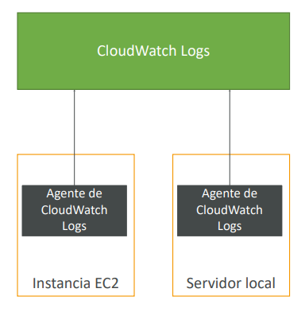
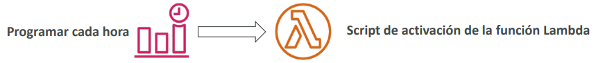
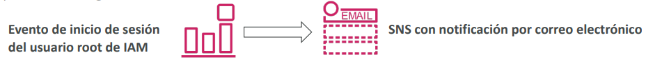
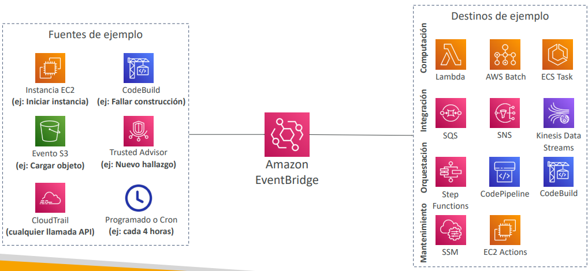
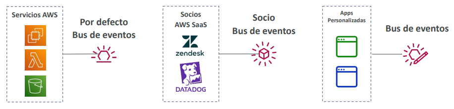
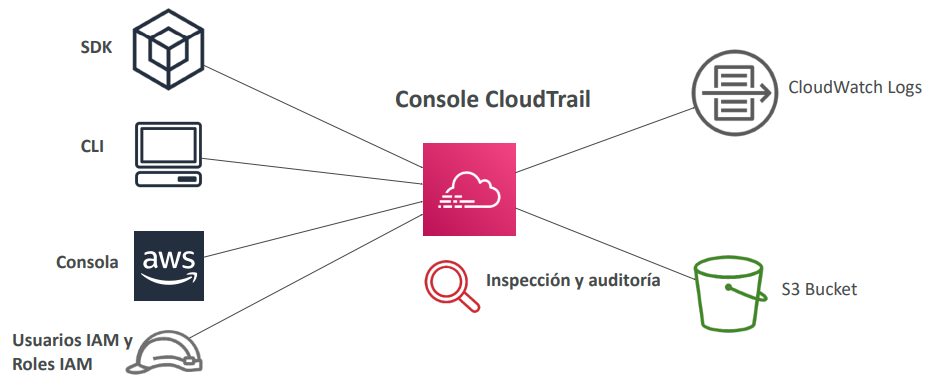

<!--  -->

# Monitorización del Cloud

## [Amazon CloudWatch Metrics](https://aws.amazon.com/cloudwatch)
- CloudWatch proporciona métricas para todos los servicios de AWS
- La métrica es una variable a monitorizar (`CPU Utilization`, `Networking`...)
- Las métricas tienen marcas de tiempo
- Podemos crear dashboards de CloudWatch con las métricas

### Métricas importantes
- **Instancias EC2:** Utilización de la CPU, Comprobaciones de estado, Red
(no RAM)
    - Métricas por defecto cada 5 minutos
    - Opción de monitorización detallada ($$$): métricas cada 1 minuto
- **Volúmenes EBS:** Lecturas/escrituras de disco
- **Buckets S3:** BucketSizeBytes, NumberOfObjects, AllRequests
- **Facturación:** Cargo total estimado (sólo en us-east-1)
- **Límites de servicio:** cuánto has estado utilizando una API de servicio
- **Métricas personalizadas:** introduce tus propias métricas

## Amazon CloudWatch Alarms
- Las alarmas se utilizan para activar las notificaciones de cualquier métrica
- Acciones de las alarmas...
    - **Autoescalado:** aumentar o disminuir el número de instancias EC2 "deseadas
    - **Acciones de EC2:** detener, terminar, reiniciar o **recuperar una instancia de EC2**
    - **Notificaciones SNS:** enviar una notificación a un tema SNS
- Varias opciones (muestreo, porcentaje %, máximo, mínimo, etc...)
- Puedes elegir el periodo sobre el que evaluar una alarma
- Ejemplo: crear una **alarma de facturación** en la métrica de facturación de CloudWatch
- Estados de la alarma:
    - `OK`
    - `INSUFFICIENT_DATA`
    - `ALARM`

## [Amazon CloudWatch Logs](https://docs.aws.amazon.com/AmazonCloudWatch/latest/logs/WhatIsCloudWatchLogs.html)
- CloudWatch Logs puede recoger logs de:
    - Elastic Beanstalk: recogida de logs desde la aplicación
    - ECS: recopilación desde los contenedores
    - AWS Lambda: recogida de logs de funciones
    - CloudTrail basado en un filtro
    - **Agentes de logs de CloudWatch: en máquinas EC2 o en servidores locales**
    - Route53: registro de consultas DNS
- Permite la **monitorización de logs en tiempo real**
- Retención de logs de CloudWatch ajustable

### CloudWatch Logs para EC2
- Por defecto, ningún logs de tu instancia EC2 irá a CloudWatch
- Tienes que ejecutar un agente de CloudWatch en EC2 para enviar los archivos de logs que quieras
- Asegúrate de que los permisos IAM son correctos
- **El agente de logs de CloudWatch también se puede configurar en las instalaciones**

## [Amazon EventBridge](https://aws.amazon.com/eventbridge) - (previamente CloudWatch Events)
- Programar: Trabajos Cron (scripts programados)

- Patrón de eventos: Reglas de eventos para reaccionar ante un servicio que hace algo

- Activar funciones Lambda, enviar mensajes SQS/SNS...

### Reglas de Amazon EventBridge

### Buses de eventos

- **Registro de esquemas:** esquema de eventos del modelo
- Puedes **archivar los eventos** (todos/filtro) enviados a un bus de eventos (indefinidamente o por un periodo determinado)
- Posibilidad de **reproducir los eventos archivados**

## [AWS CloudTrail](https://aws.amazon.com/cloudtrail )
- **Proporciona gobernanza, normativa y auditoría para nuestra cuenta de AWS**
- CloudTrail está activado por defecto
- Obtén un **historial de eventos / llamadas a la API realizadas en nuestra cuenta de AWS** por:
    - `Consola`
    - `SDK`
    - `CLI`
    - `Servicios de AWS`
- Puedes poner logs de CloudTrail en CloudWatch Logs o en S3
- **Un rastro puede aplicarse a todas las Regiones (por defecto) o a una sola región.**
- Si se elimina un recurso en AWS, **¡investiga primero CloudTrail!**

