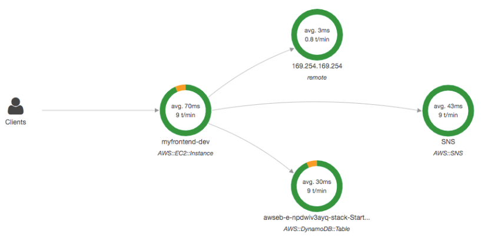
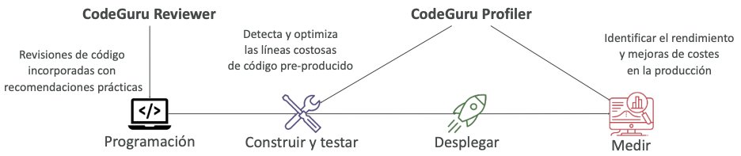

# Monitorización del Cloud
## [Amazon CloudWatch](https://aws.amazon.com/cloudwatch)
### [Amazon CloudWatch Metrics](https://docs.aws.amazon.com/AmazonCloudWatch/latest/monitoring/working_with_metrics.html)
- CloudWatch proporciona métricas para todos los servicios de AWS
- La métrica es una variable a monitorizar (`CPU Utilization`, `Networking`...)
- Las métricas tienen marcas de tiempo
- Podemos crear dashboards de CloudWatch con las métricas

#### Métricas importantes
- **Instancias EC2:** Utilización de la CPU, Comprobaciones de estado, Red
(no RAM)
    - Métricas por defecto cada 5 minutos
    - Opción de monitorización detallada ($$$): métricas cada 1 minuto
- **Volúmenes EBS:** Lecturas/escrituras de disco
- **Buckets S3:** BucketSizeBytes, NumberOfObjects, AllRequests
- **Facturación:** Cargo total estimado (sólo en us-east-1)
- **Límites de servicio:** cuánto has estado utilizando una API de servicio
- **Métricas personalizadas:** introduce tus propias métricas

### [Amazon CloudWatch Alarms](https://docs.aws.amazon.com/AmazonCloudWatch/latest/monitoring/AlarmThatSendsEmail.html)
- Las alarmas se utilizan para activar las notificaciones de cualquier métrica
- Acciones de las alarmas...
    - **Autoescalado:** aumentar o disminuir el número de instancias EC2 "deseadas
    - **Acciones de EC2:** detener, terminar, reiniciar o **recuperar una instancia de EC2**
    - **Notificaciones SNS:** enviar una notificación a un tema SNS
- Varias opciones (muestreo, porcentaje %, máximo, mínimo, etc...)
- Puedes elegir el periodo sobre el que evaluar una alarma
- Ejemplo: crear una **alarma de facturación** en la métrica de facturación de CloudWatch
- Estados de la alarma:
    - `OK`
    - `INSUFFICIENT_DATA`
    - `ALARM`

### [Amazon CloudWatch Logs](https://docs.aws.amazon.com/AmazonCloudWatch/latest/logs/WhatIsCloudWatchLogs.html)
- CloudWatch Logs puede recoger logs de:
    - Elastic Beanstalk: recogida de logs desde la aplicación
    - ECS: recopilación desde los contenedores
    - AWS Lambda: recogida de logs de funciones
    - CloudTrail basado en un filtro
    - **Agentes de logs de CloudWatch: en máquinas EC2 o en servidores locales**
    - Route53: registro de consultas DNS
- Permite la **monitorización de logs en tiempo real**
- Retención de logs de CloudWatch ajustable

#### CloudWatch Logs para EC2
- Por defecto, ningún logs de nuestra instancia EC2 irá a CloudWatch
- Tienes que ejecutar un agente de CloudWatch en EC2 para enviar los archivos de logs que quieras
- Asegúrate de que los permisos IAM son correctos
- **El agente de logs de CloudWatch también se puede configurar en las instalaciones**

## [Amazon EventBridge](https://aws.amazon.com/eventbridge) - (previamente CloudWatch Events)
- Programar: Trabajos Cron (scripts programados)

- Patrón de eventos: Reglas de eventos para reaccionar ante un servicio que hace algo

- Activar funciones Lambda, enviar mensajes SQS/SNS...

### Reglas de Amazon EventBridge

### Buses de eventos

- **Registro de esquemas:** esquema de eventos del modelo
- Puedes **archivar los eventos** (todos/filtro) enviados a un bus de eventos (indefinidamente o por un periodo determinado)
- Posibilidad de **reproducir los eventos archivados**

## [AWS CloudTrail](https://aws.amazon.com/cloudtrail )
- **Proporciona gobernanza, normativa y auditoría para nuestra cuenta de AWS**
- CloudTrail está activado por defecto
- Obtén un **historial de eventos / llamadas a la API realizadas en nuestra cuenta de AWS** por:
    - `Consola`
    - `SDK`
    - `CLI`
    - `Servicios de AWS`
- Puedes poner logs de CloudTrail en CloudWatch Logs o en S3
- **Un rastro puede aplicarse a todas las Regiones (por defecto) o a una sola región.**
- Si se elimina un recurso en AWS, **¡investiga primero CloudTrail!**

## [AWS X-Ray](https://aws.amazon.com/xray)
- Depuración en producción, a la vieja usanza:
    - Prueba localmente
    - Añade declaraciones de logs en todas partes
    - Vuelve a desplegar en producción
- Los formatos de logs difieren entre aplicaciones y el análisis de logs es difícil.
- Depuración: un gran monolito "fácil", servicios distribuidos "difícil"
- No hay vistas comunes de toda nuestra arquitectura

### Análisis visual de nuestras aplicaciones

### Ventajas de AWS X-Ray
- Resolución de problemas de rendimiento (cuellos de botella)
- Comprender las dependencias en una arquitectura de microservicios
- Identificar los problemas del servicio
- Revisar el comportamiento de las solicitudes
- Encontrar errores y excepciones
- Responde a ¿Cumplimos el Acuerdo de nivel de servicio (SLA) de tiempo?
- Responde a ¿Dónde estoy limitado?
- Identificar los usuarios que se ven afectados

## [Amazon CodeGuru](https://aws.amazon.com/codeguru)
- Un servicio con tecnología ML para **revisiones de código automatizadas y recomendaciones sobre el rendimiento de las aplicaciones**

**Amazon CodeGuru Ofrece dos funcionalidades**
- **CodeGuru Reviewer:** revisiones de código automatizadas para el análisis estático del código (`desarrollo`)
- **CodeGuru Profiler:** visibilidad/recomendaciones sobre el rendimiento de la aplicación durante el tiempo de ejecución (`producción`)

### [Amazon CodeGuru Reviewer](https://docs.aws.amazon.com/codeguru/latest/reviewer-ug/welcome.html)
- Identifica problemas críticos, vulnerabilidades de seguridad y fallos difíciles de encontrar
- Ejemplo: mejores prácticas de codificación comunes, fugas de recursos, detección de seguridad, validación de entradas
- Utiliza el Machine Learning y el razonamiento automatizado
- Lecciones aprendidas a través de millones de revisiones de código en miles de repositorios de código abierto y de Amazon
- Soporta Java y Python
- Se integra con GitHub, Bitbucket y AWS CodeCommit

### [Amazon CodeGuru Profiler](https://docs.aws.amazon.com/codeguru/latest/profiler-ug/what-is-codeguru-profiler.html)
- Ayuda a comprender el comportamiento en tiempo de ejecución de tu aplicación
- Ejemplo: identificar si tu aplicación está consumiendo una capacidad de CPU excesiva en una rutina de logs
- **Funciones:**
    - Identificar y eliminar las ineficiencias del código
    - Mejorar el rendimiento de la aplicación (por ejemplo, reducir la utilización de la CPU)
    - Disminuye los costes de computación
    - Proporciona un resumen de la pila (identifica los objetos que consumen memoria)
    - Detección de anomalías
- Soporta aplicaciones que se ejecutan en AWS o en las instalaciones
- Mínima sobrecarga en la aplicación

## [AWS Health Dashboard](https://docs.aws.amazon.com/health/latest/ug/getting-started-health-dashboard.html)

### AWS Health Dashboard - Historial de Servicios
- Muestra todas las regiones, todos los servicios y su salud
- Muestra información histórica de cada día
- Tiene un canal RSS al que puedes suscribirte
- Antes se llamaba AWS Service Health Dashboard

### AWS Health Dashboard - Estado de su cuenta
- Anteriormente llamado AWS Personal Health Dashboard (PHD)
- El AWS Account Health Dashboard proporciona **alertas y orientación** para solucionar problemas cuando AWS experimenta **eventos que pueden afectarnos**.
- Mientras que el Service Health Dashboard muestra el estado general de los servicios de AWS, el Account Health Dashboard nos ofrece una **visión personalizada del rendimiento y la disponibilidad de los servicios de AWS subyacentes a tus recursos de AWS**.
- El dashboard muestra **información relevante y oportuna** para ayudarte a gestionar los eventos en curso y proporciona **notificaciones proactivas** para ayudarte a planificar las **actividades programadas**.
- **Puede agregar datos de toda una AWS Organizations**
- Servicio global
- Muestra cómo las caídas de AWS nos afectan directamente a nuestra cuenta y a nuestros recursos de AWS
- Alertas, remedios, actividades proactivas y programadas

## Resumen - Monitorización
- **CloudWatch**:
    - **Métricas**: monitorización del rendimiento de los servicios AWS y métricas de facturación
    - **Alarmas**: automatiza la notificación, realiza acciones EC2, notifica a SNS en función de la métrica
    - **Logs**: recopila logs de instancias EC2, servidores, funciones Lambda...
    - **Eventos (o EventBridge)**: reacciona a eventos en AWS, o activa una regla según un programa
- **CloudTrail**: audita las llamadas a la API realizadas en nuestra cuenta de AWS
- **CloudTrail Insights**: análisis automatizado de tus Eventos CloudTrail
- **X-Ray**: rastrea las peticiones realizadas a través de nuestras aplicaciones distribuidas
- **AWS Health Dashboard**: estado de todos los servicios de AWS en todas las regiones
- **AWS Health Dashboard – Estado de su cuenta**: eventos de AWS que afectan a tu infraestructura
- **Amazon CodeGuru**: revisiones de código automatizadas y recomendaciones sobre el rendimiento de las aplicaciones

