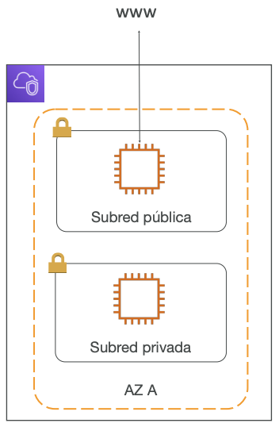
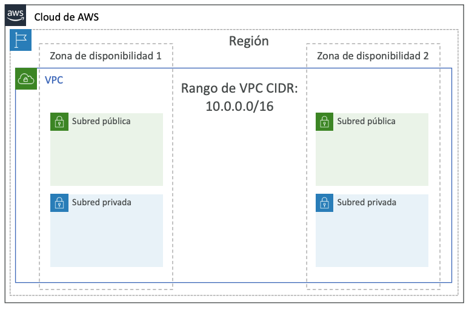
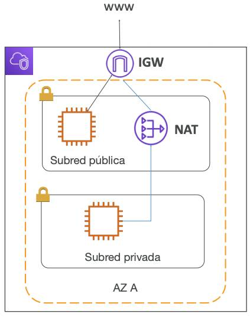
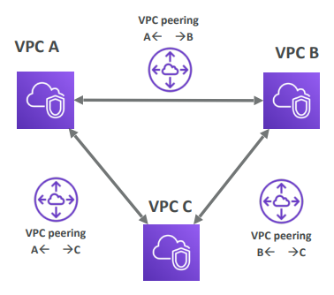
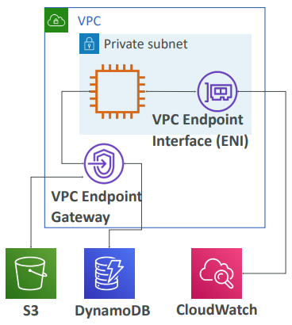
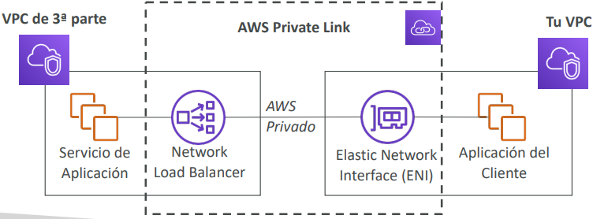
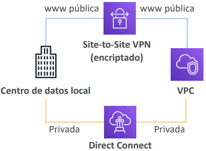
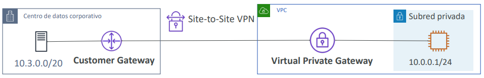

## Virtual Private Cloud (VPC)
- La VPC es algo que se debe conocer en profundidad para el AWS Certified Solutions Architect Associate y el AWS Certified SysOps Administrator

> [!TIP]
> **En el nivel AWS Certified Cloud Practitioner, se debe conocer:**
> - VPC, subredes `subnets`, puertas de enlace de Internet `internet gateways` y puertas de enlace NAT
> - Grupos de seguridad `security groups`, ACL de red `network ACL` (NACL), logs de flujo de la VPC
> - VPC Peering, VPC Endpoints
> - Site to Site VPN y Direct Connect
> - Transit Gateway
> - **Para el examen de CCP salen solo 1 ó 2 preguntassobre VPC**

### Direcciones IP en AWS
- IPv4 - Protocolo de Internet versión 4 (4.300 millones de direcciones)
    - **IPv4 pública** - puede utilizarse en Internet
    - La instancia EC2 obtiene una nueva dirección IP pública cada vez que se detiene y se inicia (por defecto)
    - **IPv4 privada** - se puede utilizar en redes privadas (LAN) como la red interna de AWS (por ejemplo, 192.168.1.1)
    - La IPv4 privada es fija para las Instancias EC2 aunque las inicies/detengas
- **IP elástica** - nos permite adjuntar una dirección IPv4 pública fija a la instancia EC2
    - **Nota: tiene un coste continuo si no se adjunta a la instancia EC2 o si se detiene la instancia EC2**
- **IPv6 - Protocolo de Internet versión 6** (3.4 x 10^38 direcciones)
    - Cada dirección IP es pública (no hay rango privado)
    - Ejemplo: 2001:db8:3333:4444:cccc:dddd:eeee:ffff

## Manual de VPC y subredes
- **VPC - Virtual Private Cloud**: red privada para desplegar nuestros recursos (recurso regional) 
- Las **subredes** nos permiten particionar tu red dentro de tu VPC (recurso de zona de disponibilidad)
- Una **subred pública** `public subnet` es una subred accesible desde Internet
- Una **subred privada** `private subnet` es una subred a la que no se puede acceder desde Internet 
- Para definir el acceso a internet y entre subredes, utilizamos las `route tables` tablas de rutas (tablas de enrutamiento).

### Diagrama de VPC

### Gateway de Internet y Gateways NAT

- Los [**Gateways de Internet**](https://docs.aws.amazon.com/vpc/latest/userguide/VPC_Internet_Gateway.html) ayudan a nuestras instancias de la VPC a conectarse con Internet
- Las subredes públicas tienen una ruta hacia el gateway de Internet.
- Los [**Gateways NAT**](https://docs.aws.amazon.com/vpc/latest/userguide/vpc-nat-gateway.html) (gestionados por AWS) y las [**Instancias NAT**](https://docs.aws.amazon.com/vpc/latest/userguide/VPC_NAT_Instance.html) (autogestionadas) permiten que nuestras instancias en nuestros **subredes privadas** accedan a internet sin dejar de ser privadas

### ACL de red (NACL) y grupos de seguridad
- [**NACL (ACL de red)**](https://docs.aws.amazon.com/vpc/latest/userguide/vpc-network-acls.html)
    - Un firewall que controla el tráfico desde y hacia la subred
    - Puede tener reglas ALLOW y DENY
    - Se adjuntan a nivel de subred
    - Las reglas sólo incluyen direcciones IP
- [**Grupos de seguridad**](https://docs.aws.amazon.com/vpc/latest/userguide/vpc-security-groups.html)
    - Un firewall que controla el tráfico hacia y desde una ENI / Instancia EC2
    - Puede tener sólo reglas ALLOW
    - Las reglas incluyen direcciones IP y otros grupos de seguridad

#### Grupo de seguridad vs ACL de red (NACL) 

|Security group (Grupo de seguridad)|ACL de red|
|---|---|
|Opera en el nivel de la instancia|Opera en el nivel de la subred|
|Solo admite reglas de permiso|Admite reglas de permiso y de denegación|
|Es con estado: el tráfico de retorno se admite automáticamente, independientemente de las reglas|Es sin estado: las reglas deben permitir de forma explícita el tráfico de retorno|
|Evaluamos todas las normas antes de decidir si permitir el tráfico|Procesamos las reglas en orden, empezando por la regla numerada más baja, al decidir si permitir el tráfico|
|Se aplica a una instancia únicamente si alguien especifica el grupo de seguridad al lanzar la instancia, o asocia el grupo de seguridad a la instancia más adelante|Se aplica automáticamente a todas las instancias de las subredes con las que se ha asociado (por lo tanto, proporciona una capa de defensa adicional si las reglas del grupo de seguridad son demasiado permisivas)|

## Logs de flujo de la VPC - [VPC Flow Logs](https://docs.aws.amazon.com/vpc/latest/userguide/flow-logs.html)
- Captura información sobre el tráfico IP que entra en tus interfaces:
    - Logs de flujo de **VPC**
    - Logs de flujo de la **subred**
    - Logs de flujo de la **Interfaz de Red Elástica (ENI)**
- Ayuda a supervisar y solucionar problemas de conectividad. Ejemplo:
    - Subredes a Internet
    - Subredes a subredes
    - Internet a subredes
- Captura también la información de red de las interfaces gestionadas por AWS: Elastic Load Balancers, ElastiCache, RDS, Aurora, etc.
- Los datos de logs de flujo de VPC pueden ir a S3, CloudWatch Logs y Kinesis Data Firehose

## [VPC Peering](https://docs.aws.amazon.com/vpc/latest/peering/what-is-vpc-peering.html)
- Conectar dos VPC, de forma privada, utilizando la red de AWS
- Haz que se comporten como si estuvieran en la misma red
- No deben tener un CIDR (rango de direcciones IP) superpuesto
- La conexión VPC Peering **no es transitiva** (ver diagrama, debe establecerse para cada VPC que necesite comunicarse entre sí)

### [VPC Endpoints](https://docs.aws.amazon.com/vpc/latest/privatelink/create-interface-endpoint.html)
- Los endpoints te permiten conectarte a los servicios de AWS **utilizando una red privada** en lugar de la red www pública
- Esto te proporciona mayor seguridad y menor latencia para acceder a los servicios de AWS
- VPC Endpoint **Gateway**: S3 y DynamoDB
- VPC Endpoint **Interface**: el resto

### [AWS PrivateLink (Servicios VPC Endpoint)](https://docs.aws.amazon.com/vpc/latest/userguide/endpoint-services-overview.html)
- La forma más segura y escalable de exponer un servicio a miles de VPCs
- No requiere peering de VPC, gateway de Internet, NAT, tablas de rutas...
- Requiere un Network Load Balancer (VPC de servicio) y un ENI (VPC de cliente)

### Site to Site VPN y Direct Connect
| **Site to Site VPN**                    | **Direct Connect (DX)**                                     |
| --------------------------------------- | ----------------------------------------------------------- |
| Conecta una VPN local a AWS             | Establece una conexión física entre las instalaciones y AWS |
| La conexión se encripta automáticamente | La conexión es privada, segura y rápida                     |
| Pasa por el Internet público            | Pasa por una **red privada**                                |
| —                                       | Tarda al menos un mes en establecerse                       |

### [Site to Site VPN](https://docs.aws.amazon.com/vpn/latest/s2svpn/VPC_VPN.html)
- En las instalaciones: debes utilizar un **Customer Gateway (CGW)**
- AWS: debe utilizar un **Virtual Private Gateway (VGW)**

## [Client VPN](https://docs.aws.amazon.com/vpn/latest/clientvpn-admin/what-is.html)
- Conectar desde tu ordenador mediante OpenVPN a tu red privada en AWS y en las instalaciones
- Te permite conectarte a tus instancias EC2 a través de una IP privada (como si estuvieras en la red VPC privada)
- Pasa por el **Internet público**

## [Transit Gateway](https://aws.amazon.com/transit-gateway/)
> Las topologías de red pueden complicarse!!!

- Para tener peering transitivo entre miles de VPC y locales, conexión hub-and-spoke (estrella)
- Un único Gateway para proporcionar esta funcionalidad
- Funciona con el Gateway de Direct Connect y las conexiones VPN

## Resumen - Virtual Private Cloud (VPC)
- **VPC:** Virtual Private Cloud (nube privada virtual)
- **Subredes:** Vinculadas a una AZ, partición de red de la VPC
- **Gateway de Internet:** A nivel de la VPC, proporcionan acceso a Internet
- **Los Gateways NAT / Instancias:** Dan acceso a Internet a las subredes privadas
- **NACL:** Sin estado, reglas de subred para entrada y salida
- **Grupos de seguridad:** Con estado, operan a nivel de instancia EC2 o ENI
- **VPC Peering:** Conecta dos VPC con rangos de IP no solapados, y no transitivos
- **IP elástica:** IPv4 pública fija, coste continuo si no se utiliza
---
- **VPC Endpoints:** Proporcionan acceso privado a los servicios de AWS dentro de la VPC
- **PrivateLink:** Conecta de forma privada a un servicio en una VPC de terceros
- **Logs de flujo de la VPC:** Registros de tráfico de red
- **Site to Site VPN:** VPN a través de la Internet pública entre el Data Center local y AWS
- **VPN de cliente:** Conexión OpenVPN desde tu ordenador a tu VPC
- **Direct Connect:** Conexión privada directa a AWS (conexiòn física)
- **Transit Gateway:** Conecta miles de redes VPC y locales entre sí

