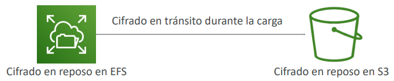

# Seguridad y normativa
## Modelo de responsabilidad compartida de AWS
#### Responsabilidad de AWS - Seguridad DEL Cloud

- Proteger la infraestructura (hardware, software, instalaciones y redes) que ejecuta todos los servicios de AWS
- Servicios gestionados como S3, DynamoDB, RDS, etc.

#### Responsabilidad del cliente - Seguridad DENTRO DEL Cloud
- En el caso de la instancia EC2, el cliente es responsable de la gestión del sistema operativo invitado (incluidos los parches y actualizaciones de seguridad), la configuración del firewall y la red, el IAM
- Encriptación de los datos de la aplicación

#### Controles compartidos:
- Gestión de parches, gestión de la configuración, concienciación y formación

### Ejemplo para RDS
#### Responsabilidad de AWS:
- Gestionar la instancia EC2 subyacente, desactivar el acceso SSH
- Parcheo automatizado de la BD
- Parcheo automatizado del SO
- Auditar la instancia subyacente y los discos y garantizar su funcionamiento

#### Tu responsabilidad:
- Comprobar las reglas de entrada de puertos / IP / grupo de seguridad en el SG de la BD
- Creación de usuarios en la base de datos y permisos
- Crear una base de datos con o sin acceso público
- Asegúrate de que los grupos de parámetros o la BD están configurados para permitir sólo conexiones SSL
- Configuración del cifrado de la base de datos

### Ejemplo para S3
#### Responsabilidad de AWS:
- Garantizarte que obtienes almacenamiento ilimitado
- Garantizarte la encriptación
- Garantizar la separación de los datos entre diferentes clientes
- Garantizar que los empleados de AWS no puedan acceder a nuestros datos

#### Tu responsabilidad:
- Configuración del bucket
- Política de bucket / configuración pública
- Usuario y roles IAM
- Habilitar el cifrado

## ¿Qué es un ataque DDoS*?
*Distributed Denial-of-Service

Un **ataque DDoS (Distributed Denial of Service)** ocurre cuando **muchos equipos distribuidos (a menudo infectados o controlados por un atacante)** envían **grandes volúmenes de tráfico o peticiones** a un servidor, aplicación o red, con el objetivo de **agotarle los recursos** (CPU, memoria o ancho de banda).

Como resultado, el sistema **se vuelve muy lento o deja de responder** para los usuarios legítimos.

*Ejemplo:* miles de bots accediendo simultáneamente a una web hasta colapsarla.

Existen varios tipos, como:
- **De volumen:** saturan el ancho de banda.
- **De protocolo:** explotan debilidades en TCP/IP o HTTP.
- **De capa de aplicación:** simulan tráfico legítimo (más difíciles de detectar).

## Protección DDoS en AWS
- **AWS Shield Standard:** protege contra ataques DDOS a tu sitio web y aplicaciones, para todos los clientes sin coste adicional
- **AWS Shield Advanced:** protección DDoS premium 24/7
- **AWS WAF:** Filtra solicitudes específicas basadas en reglas
- **CloudFront y Route 53:**
    - Protección de la disponibilidad mediante una red de borde global
    - Combinado con AWS Shield, proporciona mitigación de ataques en el borde
- **Prepárate para escalar:** aprovecha AWS Auto Scaling

*Ejemplo de arquitectura de referencia para la protección DDoS*

## [AWS Shield](https://aws.amazon.com/shield/)
### AWS Shield Standard:
- Servicio gratuito que se activa para cada cliente de AWS
- Proporciona protección contra ataques como SYN/UDP Floods, ataques de reflexión y otros ataques de capa 3/capa 4

### AWS Shield Advanced:
- Servicio opcional de mitigación de DDoS (3.000 dólares al mes por organización)
- Protege contra ataques más sofisticados en `Amazon EC2`, `Elastic Load Balancing (ELB)`, `Amazon CloudFront`, `AWS Global Accelerator` y `Route 53`
- Acceso 24 horas al día, 7 días a la semana, al equipo de respuesta DDoS de AWS
(DRP)
- Protegerte contra las tarifas más altas durante los picos de uso debidos a los DDoS

## [AWS WAF – Web Application Firewall](https://aws.amazon.com/waf/)
- Protege nuestros aplicaciones web de las vulnerabilidades web más comunes (Capa 7)
- La* **Capa 7 es HTTP** (frente a la Capa 4 que es TCP)
- Despliega en el `Application Load Balancer`, `API Gateway`, `CloudFront`

- Define la ACL (Lista de Control de Acceso a la Web):
    - Las reglas pueden incluir **direcciones IP**, cabeceras HTTP, cuerpo HTTP o cadenas URI
    - Protege de los ataques más comunes: **inyección SQL** y **Cross-Site Scripting (XSS)**
    - Restricciones de tamaño, **geo-match (bloquear países)**
    - **Reglas basadas en la tasa** (para contar las ocurrencias de los eventos) - **para la protección DDoS**

## [AWS Network Firewall](https://aws.amazon.com/network-firewall/)
- Protege toda tu Amazon VPC
- Protección de capa 3 a capa 7
- En cualquier dirección, puedes inspeccionar
    - Tráfico de VPC a VPC
    - Saliente a Internet
    - Entrante desde Internet
    - Hacia / desde Direct Connect y VPN Site-to-Site

> [!IMPORTANT]
> Si hay una pregunta que trate sobre proteger nuestra VPC en general piensa instantáneamente en AWS Network Firewall

## Pruebas de penetración en el Cloud de AWS

- Los clientes de AWS pueden llevar a cabo evaluaciones de seguridad o pruebas de penetración en su infraestructura de AWS **sin la aprobación previa de AWS en 8 servicios**:
    - Instancias de Amazon EC2, NAT Gateways y Elastic Load Balancers
    - Amazon RDS
    - Amazon CloudFront
    - Amazon Aurora
    - Amazon API Gateway
    - Funciones AWS Lambda y Lambda Edge
    - Recursos de Amazon Lightsail
    - Entornos de Amazon Elastic Beanstalk
- La lista puede aumentar con el tiempo (no se nos hará la pregunta en el examen)
- **Actividades prohibidas:**
    - Caminar por la zona DNS a través de las Zonas Alojadas de Amazon Route 53
    - Denial of Service (DoS), Distributed Denial of Service (DDoS), DoS simulado, DDoS simulado
    - Inundación de puertos
    - Inundación de protocolos
    - Inundación de solicitudes (inundación de solicitudes de inicio de sesión, inundación de solicitudes de API)
- Para cualquier otro evento simulado, contacta con aws-securitysimulated-event@amazon.com

## Cifrado de datos - Datos en reposo vs. Datos en tránsito

- **En reposo:** datos almacenados o archivados en un dispositivo
    - En un disco duro, en una instancia RDS, en S3 Glacier Deep Archive, etc.
- **En tránsito (en movimiento):** datos que se trasladan de un lugar a otro
    - Transferencia de las instalaciones a AWS, de EC2 a DynamoDB, etc.
    - **Significa que los datos se transfieren en la red**
- Queremos cifrar los datos en ambos estados para protegerlos.
- Para ello aprovechamos las **claves de cifrado**

## [AWS KMS (Key Management Service)](https://aws.amazon.com/kms/)
- KMS = **AWS gestiona las claves de cifrado por nosotros**
- **Opción de cifrado:** (lo podemos poner o no)
    - Volúmenes EBS: cifrar volúmenes
    - Buckets S3: Encriptación de objetos en el lado del servidor
    - Base de datos Redshift: cifrado de datos
    - Base de datos RDS: cifrado de datos
    - Unidades EFS: cifrado de datos
- **Cifrado activado automáticamente:** (AWS lo pone por defecto)
    - Logs de CloudTrail
    - S3 Glacier
    - Storage Gateway

> [!IMPORTANT]
> Cada vez que escuches "encriptación" para un servicio de AWS, lo más probable es que se trate de KMS

## [CloudHSM](https://aws.amazon.com/cloudhsm/)
- KMS => AWS gestiona el software de encriptación
- CloudHSM => AWS proporciona el **hardware** de encriptación
- Hardware dedicado (HSM = Módulo de Seguridad de Hardware)
- Gestionas por completo nuestros propias claves de cifrado (no AWS)
- El dispositivo HSM es resistente a la manipulación, cumple la normativa FIPS 140-2 Nivel 3

### Diagrama CloudHSM

## Tipos de Customer Master Keys: CMK
- **CMK gestionado por el cliente:**
    - Creada, gestionada y utilizada por el cliente, puede ser activada o desactivada
    - Posibilidad de política de rotación (se genera una nueva clave cada año, se conserva la antigua)
    - Posibilidad de traer tu propia clave
- **CMK gestionada por AWS:**
    - Creada, gestionada y utilizada en nombre del cliente por AWS
    - Utilizada por los servicios de AWS (aws/s3, aws/ebs, aws/redshift)
- **CMK propiedad de AWS:**
    - Colección de CMKs que un servicio de AWS posee y gestiona para utilizarlas en múltiples cuentas
    - AWS puede utilizarlas para proteger los recursos de tu cuenta (pero no puedes ver las claves)
- **Claves CloudHSM (almacén de claves personalizado):**
    - Claves generadas desde tu propio dispositivo de hardware CloudHSM
    - Las operaciones criptográficas se realizan dentro del cluster CloudHSM

## [AWS Certificate Manager (ACM)](https://aws.amazon.com/certificate-manager/)
- Nos permite aprovisionar, gestionar y desplegar  fácilmente los **certificados SSL/TLS**
- Se utilizan para proporcionar encriptación en vuelo para los sitios web (HTTPS)
- Admite certificados TLS públicos y privados
- Gratuito para los certificados TLS públicos
- Renovación automática de certificados TLS
- Integraciones con (carga de certificados TLS en)
    - Elastic Load Balancers
    - Distribuciones de CloudFront
    - APIs en API Gateway

## [AWS Secrets Manager](https://aws.amazon.com/secrets-manager/)
- Servicio más nuevo, destinado a almacenar secretos
- Capacidad para forzar la **rotación de secretos** cada X días
- Automatizar la generación de secretos en la rotación (utiliza Lambda)
- Integración con Amazon RDS (MySQL, PostgreSQL, Aurora)
- Los secretos se encriptan mediante KMS
- Principalmente pensado para la integración con RDS

## [AWS Artifact](https://aws.amazon.com/artifact/) (no es realmente un servicio)
- **Portal que proporciona a los clientes acceso bajo demanda a la documentación de conformidad de AWS y a los acuerdos de AWS**

### Artifact Reports
Te permite descargar los documentos de seguridad y conformidad de AWS de auditores externos, como las certificaciones ISO de AWS, los informes del sector de las tarjetas de pago (PCI) y los informes de control de sistemas y organizaciones (SOC)

### Artifact Agreements
Te permite revisar, aceptar y hacer un seguimiento del estado de los acuerdos de AWS, como el Business Associate Addendum (BAA) o la Health Insurance Portability and Accountability Act (HIPAA) para una cuenta individual o en tu organización

- Puede utilizarse para **apoyar la auditoría interna o la normativa**

> [!IMPORTANT]
> Cada vez que salgan estas siglas y nos pidan dónde obtener esta información, reponde AWS Artifact

## [Amazon GuardDuty](https://aws.amazon.com/guardduty/)
- Descubrimiento inteligente de amenazas para proteger la cuenta de AWS
- Utiliza algoritmos de Machine Learning, detección de anomalías y datos de terceros
- Se activa con un clic (30 días de prueba), sin necesidad de instalar software
- Los datos de entrada incluyen:
    - **Logs de eventos de CloudTrail** - llamadas inusuales a la API, despliegues no autorizados
        - **Eventos de gestión de CloudTrail** - crear subred VPC, crear rastro, ...
        - **Eventos de datos S3 de CloudTrail** - obtener objeto, listar objetos, eliminar objeto, ...
    - **Logs de flujo de la VPC** - tráfico interno inusual, dirección IP inusual
    - **Logs de DNS** - instancias EC2 comprometidas que envían datos codificados dentro de las consultas DNS
- **Características opcionales** - EKS Audit Logs, RDS & Aurora, EBS, Lambda, S3 Data Events…
- Puedes configurar **reglas de EventBridge de CloudWatch** para ser notificado en caso de hallazgos
- Las reglas de EventBridge pueden dirigirse a AWS Lambda o SNS
- **Puede proteger contra ataques de criptomonedas (tiene un "hallazgo" dedicado a ello)**

## [Amazon Inspector](https://aws.amazon.com/inspector/)
- **Evaluaciones de seguridad automatizadas**
- **Para instancias EC2**
    - Aprovechando el agente **AWS System Manager (SSM)**
    - Analiza contra **accesibilidad no intencionada a la red**
    - Analizar el **SO en ejecución** frente a vulnerabilidades conocidas
- **Para imágenes de contenedor enviadas a Amazon ECR**
    - Evaluación de las imágenes de contenedor a medida que se envían
- **Para Funciones Lambda**
    - Identifica vulnerabilidades de software en el código de las funciones y en las dependencias de los paquetes
    - Evaluación de funciones a medida que se despliegan

- Informes e integración con AWS Security Hub
- Envío de hallazgos a Amazon Event Bridg

### ¿Qué evalúa Amazon Inspector?
- Recuerda: **sólo para instancias EC2, imágenes de contenedor y funciones Lambda**
- Escaneo continuo de la infraestructura, sólo cuando sea necesario
- Vulnerabilidades de paquetes (EC2, ECR & Lambda) - base de datos de CVE
- Accesibilidad de la red (EC2)
- Se asocia una puntuación de riesgo a todas las vulnerabilidades para priorizarlas

## [AWS Config](https://aws.amazon.com/config/)
- Ayuda a **auditar y registrar la normativa de nuestros recursos de AWS**
- Ayuda a **registrar las configuraciones y los cambios a lo largo del tiempo**
- Posibilidad de almacenar los datos de configuración en S3 (analizados por Athena)
- Preguntas que se pueden resolver con AWS Config:
    - ¿Hay acceso SSH sin restricciones a mis grupos de seguridad?
    - ¿Mis buckets tienen acceso público?
    - ¿Cómo ha cambiado la configuración de mi ALB con el tiempo?
- Puedes recibir alertas (notificaciones SNS) de cualquier cambio
- AWS Config es un servicio por región
- Puede agregarse entre regiones y cuentas

Recurso de AWS Config 
- Ver la normativa de un recurso a lo largo del tiempo 
- Ver la configuración de un recurso a lo largo del tiempo 
- Ver las llamadas a la API de CloudTrail si están activadas

## [Amazon Macie](https://aws.amazon.com/macie/)
- Amazon Macie es un servicio de seguridad y privacidad de datos totalmente gestionado que utiliza el **machine learning y la concordancia de patrones para descubrir y proteger nuestros datos sensibles en AWS.**
- Macie nos ayuda a identificar y alertar sobre los **datos sensibles, como la información personal identificable (PII)**

> [!IMPORTANT]
> Si nos preguntan algo que haga referencia a descubrir datos sensibles piensa en AWS Macie

## [AWS Security Hub](https://aws.amazon.com/security-hub/)
- Herramienta de seguridad central para gestionar la seguridad en varias cuentas de AWS y automatizar las comprobaciones de seguridad
- Dashboards integrados que muestran el estado actual de la seguridad y la normativa para tomar medidas rápidamente
- Agrega automáticamente alertas en formatos predefinidos o de hallazgos personales de varios servicios de AWS y herramientas de socios de AWS:
    - `Config`
    - `GuardDuty`
    - `Inspector`
    - `Macie`
    - `IAM Access Analyzer`
    - `AWS Systems Manager`
    - `AWS Firewall Manager`
    - `AWS Health`
    - `AWS Partner Network Solutions`

> ![NOTE]
> Primero debemos habilitar el servicio de configuración de AWS!

## [Amazon Detective](https://aws.amazon.com/detective/)
- GuardDuty, Macie y Security Hub se utilizan para identificar posibles problemas de seguridad, o hallazgos
- A veces los hallazgos de seguridad requieren un análisis más profundo para aislar la causa raíz y tomar medidas: es un proceso complejo
- Amazon Detective **analiza, investiga e identifica rápidamente la causa raíz de los problemas de seguridad o las actividades sospechosas (mediante ML y grafos)**
- **Recoge y procesa automáticamente los eventos** de Logs de flujo de la VPC, CloudTrail, GuardDuty y crea una vista unificada
- Produce visualizaciones con detalles y contexto para llegar a la causa raíz

## AWS Abuse
- Informar de la sospecha de que los recursos de AWS se utilizan con fines abusivos o ilegales
- Los comportamientos abusivos y prohibidos son:
    - **Spam:** recibir correos electrónicos no deseados desde una dirección IP propiedad de AWS, sitios web y foros con spam de los recursos de AWS
    - **Escaneo de puertos:** envío de paquetes a sus puertos para descubrir los no seguros
    - **Ataques DoS o DDoS:** direcciones IP propiedad de AWS que intentan sobrecargar o colapsar tus servidores/software
    - **Intentos de intrusión:** logs en tus recursos
    - **Alojar contenido censurable o con derechos de autor:** distribuir contenido ilegal o con derechos de autor sin consentimiento
    - **Distribución de malware:** recursos de AWS que distribuyen software para dañar ordenadores o máquinas
- Ponte en contacto con el equipo de abusos de AWS: [AWS abuse form](https://aws.amazon.com/forms/report-abuse), o abuse@amazonaws.com

## Privilegios de usuario root
- Usuario root = Propietario de la cuenta (creado cuando se crea la cuenta)
- Tiene acceso completo a todos los servicios y recursos de AWS
- **Bloquea las claves de acceso del usuario root de tu cuenta de AWS**
- No utilices la cuenta root para las tareas cotidianas, ni siquiera para las administrativas
- Acciones que sólo puede realizar el usuario root:
    - **Cambiar la configuración de la cuenta** (nombre de la cuenta, dirección de correo electrónico, contraseña del usuario root, claves de acceso del usuario root)
    - Ver ciertas facturas de impuestos
    - **Cerrar la cuenta de AWS**
    - Restaurar los permisos del usuario IAM
    - **Cambiar o cancelar el plan de AWS Support**
    - **Registrarse como vendedor en el Marketplace de instancias reservadas**
    - Configurar un bucket de Amazon S3 para habilitar la MFA
    - Editar o eliminar una política de bucket de Amazon S3 que incluya un ID de VPC o un ID de endpoints de VPC no válido
    - Registrarse en GovCloud

## [IAM Access Analyzer](https://aws.amazon.com/iam/access-analyzer/?nc1=h_ls)
- Averigua qué recursos se comparten externamente
    - Buckets S3
    - Roles IAM
    - Claves KMS
    - Funciones Lambda y capas
    - Colas SQS
    - Secrets Manager
- Definir **zona de confianza** = Cuenta de AWS o AWS Organization
- Acceso fuera de zona de confianza => hallazgos

## Resumen - Seguridad y normativa
- **Responsabilidad compartida en AWS**
- **Shield:** Protección DDoS automática + soporte 24/7 avanzado
- **WAF:** Firewall para filtrar las peticiones entrantes basado en reglas
- **KMS:** Claves de cifrado gestionadas por AWS
- **CloudHSM:** Cifrado por hardware, gestionamos las claves de cifrado
- **AWS Certificate Manager:** Aprovisiona, administra e implementa certificados SSL/TLS
- **Artifact:** Accede a informes de normativa como PCI, ISO, etc...
- **GuardDuty:** Encuentra comportamientos maliciosos con los logs de VPC, DNS y CloudTrail
- **Inspector:** Encuentra vulnerabilidades de software en EC2, Imágenes ECR y funciones Lambda
- **Network Firewall:** Protege la VPC contra ataques de red
___
- **Config:** Rastrea los cambios de configuración y el cumplimiento de la normativa
- **Macie:** Encuentra datos sensibles (por ejemplo, datos PII) en buckets de Amazon S3
- **CloudTrail:** Rastrea las llamadas a la API realizadas por los usuarios dentro de la cuenta
- **AWS Security Hub:** reúne los resultados de seguridad de varias cuentas de AWS
- **Amazon Detective:** encuentra la causa raíz de los problemas de seguridad o las actividades sospechosas
- **AWS Abuse:** Informa de los recursos de AWS utilizados con fines abusivos o ilegales
- **Privilegios del usuario root:**
    - Cambia la configuración de la cuenta
    - Cierra tu cuenta de AWS
    - Cambia o cancela tu plan de AWS Support
    - Registrarte como vendedor en el Marketplace de instancias reservadas
- **IAM Access Analyzer:** identifica qué recursos se comparten externamente

