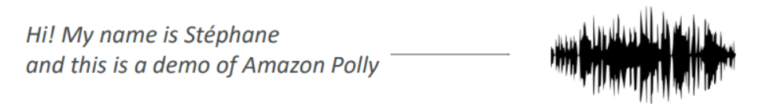
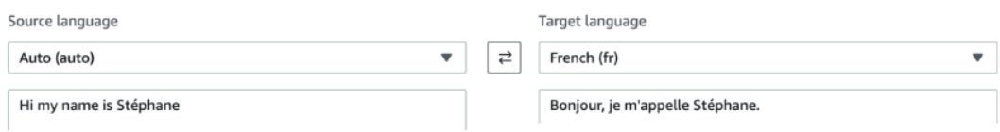
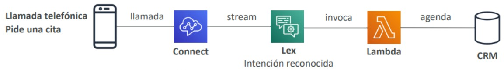
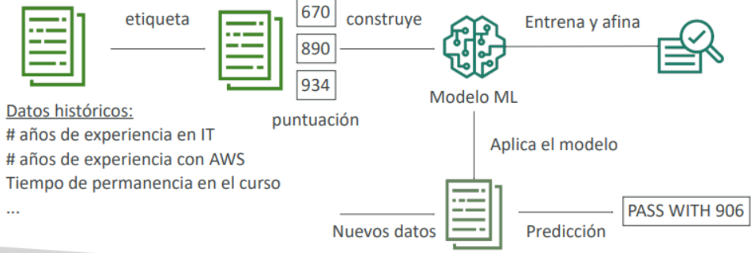
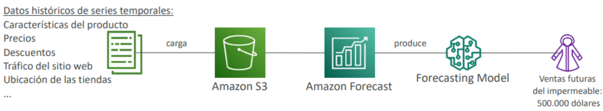
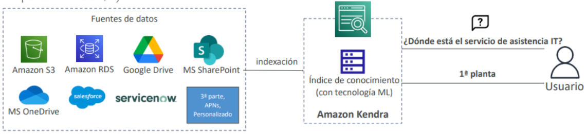
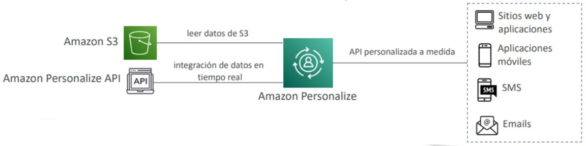
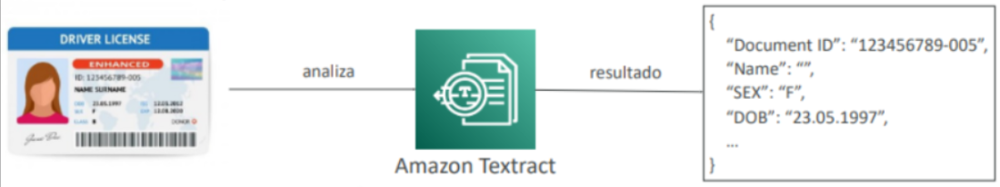

# Machine Learning
## [Amazon Rekognition](https://aws.amazon.com/rekognition/)
- Encuentra **objetos, personas, textos, escenas en imágenes y vídeos** mediante Machine Learning ML
- **Análisis facial y búsqueda facial** para hacer verificación de usuarios, recuento de personas
- Crear una base de datos de "caras conocidas" o comparar con famosos

> *Casos de uso:*
> - Etiquetado
> - Moderación de contenidos
> - Detección de textos
> - Detección y análisis de rostros (género, rango de edad, emociones...)
> - Búsqueda y verificación de rostros
> - Reconocimiento de famosos
> - Trayectoria (por ejemplo, para el análisis de juegos deportivos)

## [Amazon Transcribe](https://aws.amazon.com/transcribe/)
- **Convierte** automáticamente **el habla en texto**
- Utiliza un **proceso de deep learning** llamado **reconocimiento automático del habla (ASR)** para
convertir el habla en texto de forma rápida y precisa
- **Elimina automáticamente la Información de Identificación Personal (PII)**
- **Soporta identificación automática de idioma para audio multilingüe**

> *Casos de uso:*
> - transcribir llamadas de atención al cliente
> - automatizar el subtitulado y los subtítulos
> - generar metadatos para los activos de los medios de comunicación para crear un archivo con todas las posibilidades de búsqueda

## [Amazon Polly](https://aws.amazon.com/polly/)
- Convierte el texto en voz real utilizando el aprendizaje profundo
- Permitiendo crear aplicaciones que hablan

## [Amazon Translate](https://aws.amazon.com/translate/)
- **Traducción** natural y precisa de **idiomas**
- Amazon Translate te permite **localizar contenidos** -como sitios web y aplicaciones- para **usuarios internacionales**, y traducir fácilmente grandes volúmenes de texto de forma eficiente.

## [Amazon Lex](https://aws.amazon.com/lex/) & [Amazon Connect](https://aws.amazon.com/connect/)
- **Amazon Lex:** (la misma tecnología que impulsa a Alexa)
    - Reconocimiento automático del habla (ASR) para convertir el habla en texto
    - Comprensión del Lenguaje Natural (NLU) para reconocer la intención del texto, de las personas que llaman
    - Ayuda a crear chatbots, bots de centros de llamadas
- **Amazon Connect:**
    - Recibe llamadas, crea flujos de contacto, **centro de contacto virtual** basado en la nube
    - Puede integrarse con otros sistemas CRM o AWS
    - Sin pagos iniciales, un 80% más barato que las soluciones tradicionales de centro de contacto

> [!IMPORTANT]
> Cada vez que haya una pregunta enfocada a chatbots piensa en Amazon Lex!

## [Amazon Comprehend](https://aws.amazon.com/comprehend/)
- Para el **Natural Language Processing – NLP (Procesamiento del Lenguaje Natural - PNL)**
- Servicio totalmente gestionado y sin servidor
- Utiliza el Machine Learning para encontrar ideas y relaciones en el texto
    - Lenguaje del texto
    - Extrae frases clave, lugares, personas, marcas o eventos
    - Comprende lo positivo o negativo del texto
    - Analiza el texto utilizando la tokenización y las partes del discurso
    - Organiza automáticamente una colección de archivos de texto por temas

> *Ejemplos de casos de uso:*
> - Analiza las interacciones con los clientes (correos electrónicos) para encontrar lo que conduce a una experiencia positiva o negativa
> - Crea y agrupa artículos por temas que Comprehend descubrirá

## [Amazon SageMaker](https://aws.amazon.com/sagemaker/)
- Servicio totalmente gestionado para que los desarrolladores/científicos de datos construyan modelos ML
- Normalmente, es difícil hacer todos los procesos en un solo lugar + aprovisionar servidores
- Proceso de Machine Learning (simplificado): predecir la nota de tu examen

## [Amazon Forecast](https://aws.amazon.com/forecast/)
- Servicio totalmente gestionado que utiliza el ML para ofrecer previsiones muy precisas
- Ejemplo: predecir las futuras ventas de un chubasquero
- Un 50% más de precisión que mirando los datos por sí mismos
- Reduce el tiempo de previsión de meses a horas
- Casos de uso: Planificación de la demanda de productos, planificación financiera, planificación de recursos, ...

## [Amazon Kendra](https://aws.amazon.com/kendra/)
- **Servicio de búsqueda de documentos** totalmente gestionado y potenciado por Machine Learning
- Extrae respuestas de un documento (texto, pdf, HTML, PowerPoint, MS Word, preguntas frecuentes...)
- Capacidades de búsqueda en lenguaje natural
- Aprende de las interacciones/retroalimentación de los usuarios para promover los resultados preferidos (aprendizaje incremental)
- Capacidad de afinar manualmente los resultados de la búsqueda (importancia de los datos, frescura, personalización, ...)

## [Amazon Personalize](https://aws.amazon.com/personalize/)
- Servicio de ML totalmente gestionado para crear aplicaciones con recomendaciones personalizadas en tiempo real
- Ejemplo: recomendaciones/reclasificación de productos personalizados, marketing directo personalizado
- Ejemplo: El usuario compró herramientas de jardinería, proporciona recomendaciones sobre la próxima que debe comprar
- La misma tecnología utilizada por Amazon.com
- Se integra en sitios web existentes, aplicaciones, SMS, sistemas de marketing por correo electrónico, ...
- Se implementa en días, no en meses (no es necesario construir, formar y desplegar soluciones de ML)

> *Ejemplos de casos de uso:*
> Tiendas minoristas, medios de comunicación y entretenimiento... recomendaciones pára estos usuarios

> [!IMPORTANT]
> Cada vez que en el examen haya una mención a un servicio de recomendaciones personalizadas piensa en Amazon Personalize

## [Amazon Textract](https://aws.amazon.com/textract/)
- Extrae automáticamente el texto, la escritura y los datos de cualquier documento escaneado utilizando IA y ML
- Extrae datos de formularios y tablas
- Leer y procesar cualquier tipo de documento (PDFs, imágenes, ...)

> *Casos de uso:*
> - Servicios financieros (por ejemplo, facturas, informes financieros)
> - Sanidad (por ejemplo, historiales médicos, reclamaciones de seguros)
> - Sector público (por ejemplo, formularios fiscales, documentos de identidad, pasaportes)

## Resumen - Machine Learning
- **Rekognition:** detección de caras, etiquetado, reconocimiento de famosos
- **Transcribe:** de audio a texto (por ejemplo, subtítulos)
- **Polly:** de texto a audio
- **Translate:** traducciones
- **Lex:** construir bots conversacionales - chatbots
- **Connect:** centro de contacto en el Cloud
- **Comprehend:** procesamiento del lenguaje natural
- **SageMaker:** Machine Learning para todos los desarrolladores y científicos de datos
- **Forecast:** construye previsiones muy precisas
- **Kendra:** motor de búsqueda con ML
- **Personalize:** recomendaciones personalizadas en tiempo real
- **Textract:** detecta texto y datos en los documentos

