

<!--  -->

# Gestión de cuentas, facturación y asistencia

## [AWS Organizations](https://aws.amazon.com/organizations)
- Servicio global
- Permite gestionar **varias cuentas de AWS**
- La cuenta principal es la master account (cuenta maestra)
- Beneficios de costes:
    - **Facturación consolidada** en todas las cuentas: método de pago único
    - Beneficios de precios por **uso agregado** (descuento por volumen para EC2, S3...)
    - **Agrupación de instancias EC2 reservadas** para un ahorro óptimo
- La API está disponible para **automatizar la creación de cuentas de AWS**
- **Restringe los privilegios de las cuentas mediante Políticas de Control de Servicios (SCP)**

### Estrategias multicuenta
- Crear cuentas por **departamento**, por **centro de costes**, por **dev / test / prod**, en función de las **restricciones normativas** (usando SCP), para un **mejor aislamiento de los recursos** (ej.: VPC), para tener **límites de servicio separados por cuenta**, cuenta aislada para **logs**
- Cuenta múltiple vs. Cuenta única VPC múltiple
- Utilizar normas de etiquetado para la facturación
- Activa CloudTrail en todas las cuentas, envía los logs a la cuenta S3 central
- Enviar los logs de CloudWatch a la cuenta central de logs

### Unidades Organizativas (UO) - Ejemplos

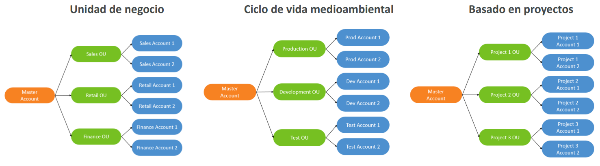

### AWS Organization

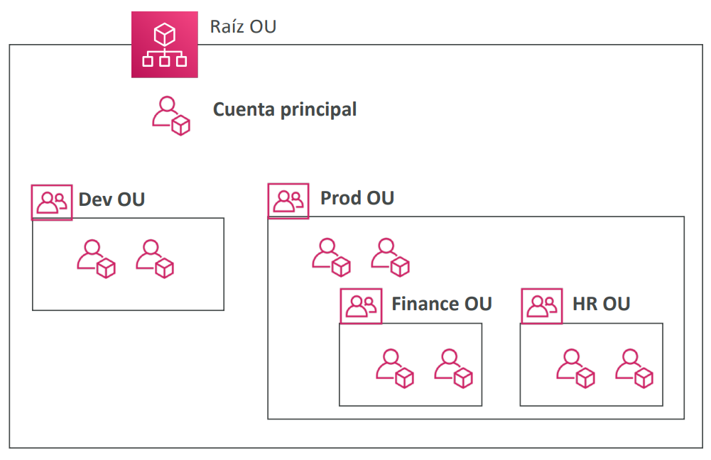

## Políticas de Control de Servicios (SCP)

- Lista blanca o negra de acciones IAM
- Se aplican a nivel de **OU** (organizational Unit) o de **Cuenta**
- No se aplica a la Cuenta Maestra
- El SCP se aplica a todos los **usuarios y roles** de la cuenta, incluido el usuario root
- El SCP no afecta a los roles vinculados al servicio
- Los roles vinculados a servicios permiten que otros servicios de AWS se integren con las AWS Organizations y no pueden ser restringidos por SCP.
- El SCP debe tener un ALLOW explícito (no permite nada por defecto)

> *Casos de uso:*
> - Restringir el acceso a determinados servicios (por ejemplo: no se puede utilizar EMR)
> - Aplicar la normativa PCI deshabilitando explícitamente los servicios

## Jerarquía SCP

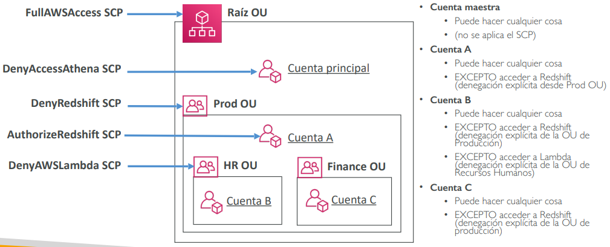

## AWS Organization – Facturación consolidada
- Cuando se activa, te proporciona:
    - **Uso combinado** - combina el uso en todas las cuentas de AWS en la Organización de AWS para **compartir los precios por volumen, las Instancias Reservadas y los descuentos de los Planes de Ahorro**
    - **Una factura** - obtener una factura para todas las cuentas de AWS en la Organización de AWS
- La cuenta de administración puede desactivar el uso compartido de los descuentos de las instancias reservadas para cualquier cuenta de la organización de AWS, incluida ella misma

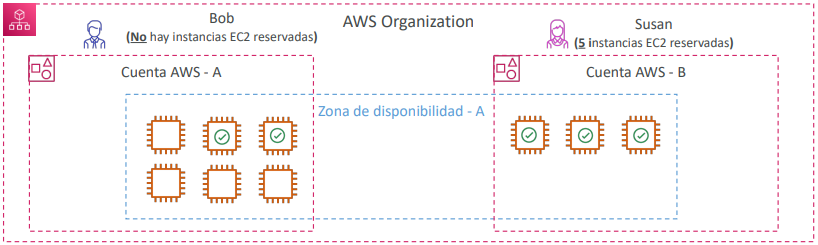

## [AWS Control Tower](https://aws.amazon.com/controltower)
- Una forma fácil de **configurar y gobernar un entorno AWS multicuenta seguro** y conforme a las mejores prácticas
- Ventajas:
    - Automatiza la configuración de tu entorno en unos pocos clics
    - Automatiza la gestión continua de las políticas
    - Detecta las infracciones de las políticas y las corrige
    - Supervisa la normativa a través de un dashboards interactivo
- La AWS Control Tower se ejecuta sobre las Organizaciones de AWS:
    - Configura automáticamente las AWS Organizations para organizar las cuentas e implementar las SCP (Políticas de Control de Servicios)

## [AWS Resource Access Manager (AWS RAM)](https://aws.amazon.com/ram)
- Comparte los recursos de AWS que poseas con otras cuentas de AWS
- Comparte con cualquier cuenta o dentro de tu organización
- ¡Evita la duplicación de recursos!
- Los recursos soportados incluyen Aurora, Subredes de VPC, Transit Gateway, Route 53, EC2 Hosts dedicados...

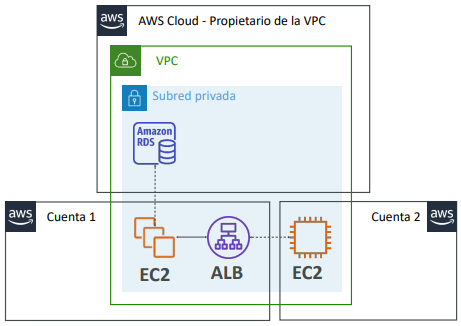
<figcaption>Como se aprecia en la imagen existe una master account que tiene una VPC compartida y una RDS DB, los demás recursos están desplegados en otras dos cuentas pero en la VPC de la master account</figcaption>

## [AWS Service Catalog](https://aws.amazon.com/servicecatalog)

- Los usuarios que son nuevos en AWS tienen demasiadas opciones, y pueden crear stacks que no sean conformes / estén en línea con el resto de la organización
- Algunos usuarios sólo quieren un **portal rápido de autoservicio** para lanzar un conjunto de **productos autorizados** predefinidos **por los administradores**
- Incluye: máquinas virtuales, bases de datos, opciones de almacenamiento, etc.

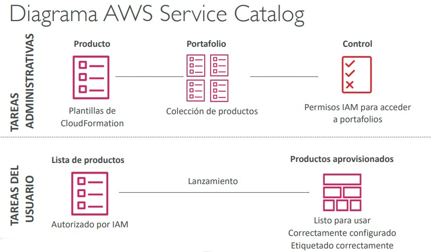
<figcaption>Ejemplo de uso del servicio Service Catalog</figcaption>

## Modelos de precios en AWS

AWS tiene 4 modelos de precios:
1. **Paga por lo que usas:** sigue siendo ágil, responde, cumple con las demandas de escala
2. **Ahorra cuando reserves:** minimiza los riesgos, gestiona de forma predecible los presupuestos, cumple con los requisitos a largo plazo 
> Las reservas están disponibles para instancias reservadas de EC2, capacidad reservada de DynamoDB, nodos reservados de ElastiCache, instancias reservadas de RDS y nodos reservados de Redshift
3. **Paga menos usando más:** descuentos por volumen
4. **Paga menos al crecer AWS**

### Servicios y niveles gratuitos en AWS
- IAM
- VPC
- Facturación consolidada

Servicios gratuitos pero que generan costos por los servicios que éstos crean:
- Elastic Beanstalk
- CloudFormation
- Auto Scaling Groups

### Precios de computación - EC2
- Sólo se cobra por lo que usas
- Número de instancias
- Configuración de las instancias:
    - Capacidad física
    - Región
    - Sistema operativo y software
    - Tipo de instancia
    - Tamaño de la instancia
- Tiempo de funcionamiento del ELB y cantidad de datos procesados
- Monitorización detallada

#### Instancias bajo demanda:
- Mínimo de 60s
- Paga por segundo (Linux/Windows) o por hora (otros)
#### Instancias reservadas:
- Hasta un 75% de descuento en comparación con las instancias bajo demanda en la tarifa por hora
- Compromiso de 1 o 3 años
- Todo por adelantado, parcialmente por adelantado, sin adelantado
#### Instancias spot:
- Hasta un 90% de descuento en comparación con la tarifa horaria bajo demanda
- Puja por la capacidad no utilizada
#### Host dedicado:
- Bajo demanda
- Reserva para un compromiso de 1 o 3 años
- Planes de ahorro como alternativa para ahorrar en el uso sostenido

### Precio de computación – Lambda y ECS
#### Lambda:
- Pago por llamada
- Pago por duración
#### ECS:
- Modelo de tipo de lanzamiento de EC2: No hay tarifas adicionales, pagas por los recursos de AWS almacenados y creados en tu aplicación
#### Fargate:
- Modelo de tipo de lanzamiento Fargate: Pagas por los recursos de vCPU y memoria asignados a tus aplicaciones en tus contenedores

### Precios de almacenamiento - S3
- **Clase de almacenamiento:** S3 Standard, S3 Infrequent Access, S3 One-Zone IA, S3 Intelligent Tiering, S3 Glacier and S3 Glacier Deep Archive
- Número y tamaño de los objetos: El precio puede ser escalonado (en función del volumen)
- Número y tipo de solicitudes
- Transferencia de datos FUERA de la región S3
- Aceleración de la transferencia en S3
- Transiciones del ciclo de vida
- Servicio similar: EFS (pago por uso, tiene reglas de acceso y ciclo de vida poco frecuentes)

### Precios de almacenamiento - EBS
- Tipo de volumen (en función del rendimiento)
- Volumen de almacenamiento en GB por mes **provisionado**
- IOPS:
    - SSD de propósito general: Incluido
    - IOPS provisionadas SSD: Cantidad provisionada en IOPS
    - Magnético Número de peticiones
- Snapshots:
    - Coste de datos añadidos por GB al mes
- Transferencia de datos:
    - La transferencia de datos salientes está escalonada para descuentos por volumen
    - La entrada es gratis

### Precios de las bases de datos - RDS
- Facturación por horas
- Características de la base de datos:
    - Motor
    - Tamaño
    - Clase de memoria
- Tipo de compra:
    - Bajo demanda
    - Instancias reservadas (1 o 3 años) con pago inicial requerido
- Almacenamiento de copias de seguridad: No hay cargo adicional por el almacenamiento de copias de seguridad hasta el 100% del almacenamiento total de tu base de datos para una región.
- Almacenamiento adicional (por GB al mes)
- Número de peticiones de entrada y salida al mes
- Tipo de despliegue (el almacenamiento y la E/S son variables):
    - Una única AZ
    - Varias AZ
- Transferencia de datos:
    - La transferencia de datos salientes está escalonada por descuentos por volumen
    - La entrante es gratis

### Entrega de contenidos – CloudFront
- Los precios son diferentes en las distintas regiones geográficas
- Agregado para cada ubicación de borde, luego se aplica a tu factura
- Transferencia de datos a domicilio (descuento por volumen)
- Número de peticiones HTTP/HTTPS

### Costes de red en AWS por GB - Simplificado
- Utiliza la IP privada en lugar de la IP pública para obtener un buen ahorro y un mejor rendimiento de la red
- Utiliza la misma AZ para obtener el máximo ahorro (a costa de la alta disponibilidad)

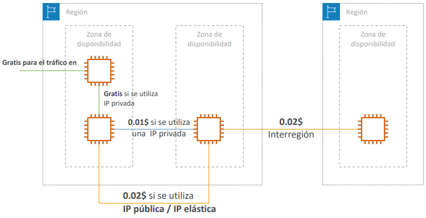

## [Planes de ahorro (Saving Plans)](https://aws.amazon.com/savingsplans)

- Comprométete a pagar una determinada cantidad de dólares por hora durante 1 o 3 años
- La forma más fácil de establecer compromisos a largo plazo en AWS
- Configuración desde la consola AWS Cost Explorer

### Plan de ahorro EC2
- Hasta un 72% de descuento en comparación con el plan bajo demanda
- **Comprométete al uso de familias de instancias individuales en una región (por ejemplo, C5 o M5)**
- Independientemente de la AZ, el tamaño (m5.xl a m5.4xl), el SO (Linux/Windows) o la tenencia
- Todo por adelantado, parcialmente por adelantado, sin adelantado

### Plan de ahorro de computación
- Hasta un 66% de descuento en comparación con el plan bajo demanda
- Independientemente de la **familia**, **la región**, el tamaño, el sistema operativo, la tenencia y las **opciones de computación**
- Opciones de computación: EC2, Fargate, Lambda

### Plan de ahorro de Machine Learning: SageMaker...

## [AWS Compute Optimizer](https://aws.amazon.com/compute-optimizer)
- **Reduce los costes** y **mejora el rendimiento** recomendando los recursos de AWS óptimos para tus cargas de trabajo
- Te ayuda a elegir las configuraciones óptimas y a dimensionar correctamente tus cargas de trabajo (sobre/subprovisionamiento)
- Utiliza Machine Learning para analizar las **configuraciones de tus recursos** y sus **métricas de utilización CloudWatch**
- Recursos soportados
- Instancias EC2
    - Grupos de autoescalado de EC2
    - Volúmenes EBS
    - Funciones Lambda
    - Reduce tus costes hasta un 25% 
- Las recomendaciones se pueden exportar a S3

## Herramientas de facturación y cálculo de costes

### Estimación de costes en el Cloud:
- [Calculadora de precios](https://calculator.aws)

### Seguimiento de los costes en el Cloud:
- Dashboards de facturación
- Etiquetas de asignación de costes
- Cost and Usage Reports (AWS CUR)
- Cost Explorer

### Seguimiento de los planes de costes:
- Alarmas de facturación
- Presupuestos

## AWS Pricing Calculator
## Dashboards de facturación de AWS
## Etiquetas (tags) de asignación de costes
- Utiliza las **etiquetas de asignación** de costes para hacer un seguimiento detallado de tus costes de AWS
- **Etiquetas generadas por AWS**
    - Se aplican automáticamente al recurso que creas
    - Comienza con el prefijo **aws: (por ejemplo, aws: createdBy)**
- **Etiquetas definidas por el usuario**
    - Definidas por el usuario
    - Comienza con el prefijo **user:**

### Etiquetado y grupos de recursos
- Los **Tags** o **etiquetas** se utilizan para organizar los recursos:
    - EC2: instancias, imágenes, load balancers, grupos de seguridad...
    - RDS, recursos VPC, Route 53, usuarios IAM, etc.
    - Los recursos creados por CloudFormation se etiquetan todos de la misma manera
- Nomenclatura libre, las etiquetas más comunes son: Nombre, Entorno, Equipo...
- Las etiquetas pueden utilizarse para crear **grupos de recursos**
    - Crear, mantener y ver una colección de recursos que comparten etiquetas comunes
    - Gestionar estas etiquetas utilizando el Tag Editor (editor de etiquetas)

## [Cost and Usage Reports (AWS CUR)](https://aws.amazon.com/aws-cost-management/aws-cost-and-usage-reporting)
- Profundiza en tus costes y uso de AWS
- El Informe de Costes y Uso de AWS contiene el **conjunto más completo de datos de costes y uso de AWS disponible**, incluyendo metadatos adicionales sobre los servicios de AWS, los precios y las reservas (**por ejemplo, las instancias reservadas (RIs) de Amazon EC2**).
- El AWS Cost & Usage Report (AWS CUR) enumera el uso de AWS para cada categoría de servicio utilizada por una cuenta y sus usuarios de IAM en partidas horarias o diarias, así como cualquier etiqueta que hayas activado con fines de asignación de costes.
- Puede integrarse con Athena, Redshift o QuickSight

## [Cost Explorer](https://aws.amazon.com/aws-cost-management/aws-cost-explorer)
- Visualiza, entiende y gestiona tus costes y uso de AWS a lo largo del tiempo
- Crea informes personalizados que analicen los datos de costes y uso.
- Analiza tus datos a alto nivel: costes totales y uso en todas las cuentas
- O con granularidad mensual, por horas, a nivel de recursos
- Elige un **plan de ahorro** óptimo (para reducir los precios de tu factura)
- **Prevé el uso hasta 12 meses basándote en el uso anterior**

### Cost Explore- Coste mensual por servicio de AWS
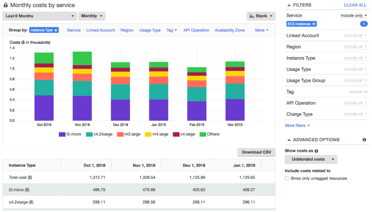

### Cost Explore- Nivel de horas y recursos
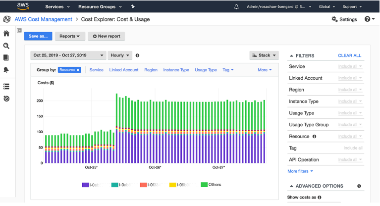

### Cost Explorer - Plan de ahorro, Alternativa a las instancias reservadas
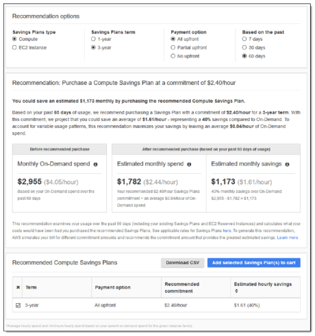

### Cost Explorer – Previsión de uso

## Alarmas de facturación en CloudWatch
- **La métrica de los datos de facturación se almacena en CloudWatch us-east-1**
- Los datos de facturación son para los costes **globales** de AWS en todo el mundo
- Es para el coste real, no para los costes proyectados
- Pretende ser una simple alarma (no tan potente como AWS Budgets)

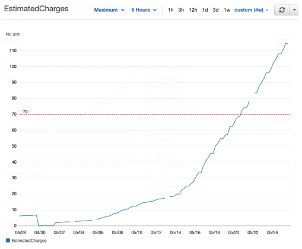

## [AWS Budgets](https://aws.amazon.com/es/aws-cost-management/aws-budgets)
- Crea un presupuesto y envía alarmas cuando los costes superen el presupuesto
- 4 tipos de presupuestos: Uso, Coste, Reserva, Planes de ahorro
- Para las instancias reservadas (RI)
- Haz un seguimiento de la utilización
- Soporta EC2, ElastiCache, RDS, Redshift
- Hasta 5 notificaciones SNS por presupuesto
- Puedes filtrar por: servicio, cuenta vinculada, etiqueta, opción de compra, tipo de instancia, región, zona de disponibilidad, operación API, etc.
- Las mismas opciones que el AWS Cost Explorer
- 2 presupuestos son gratuitos, luego 0,02$/día/presupuesto

## [AWS Cost Anomaly Detection](https://aws.amazon.com/aws-cost-management/aws-cost-anomaly-detection)
- **Monitorización continua de tus costes y uso mediante ML para detectar gastos inusuales**
- Aprende tus patrones de gasto únicos e históricos para detectar picos de costes puntuales y/o aumentos continuos de costes (no necesitas definir umbrales)
- Monitoriza servicios de AWS, cuentas asociadas, etiquetas de asignación de costes o categorías de costes
- Te envía el informe de detección de anomalías con el análisis de la causa raíz
- Recibe notificaciones con alertas individuales o un resumen diario/semanal (mediante SNS)

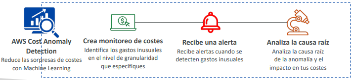

## [AWS Service Quotas](https://docs.aws.amazon.com/general/latest/gr/aws_service_limits.html)
- Avisarte cuando estés cerca de un umbral de valor de cuota de servicio
- Crear alarmas CloudWatch en la consola cuotas de servicio
- Ejemplo: Ejecuciones concurrentes de Lambda
- Solicita un aumento de cuota a AWS Service Quotas o apaga los recursos antes de que se alcance el límite

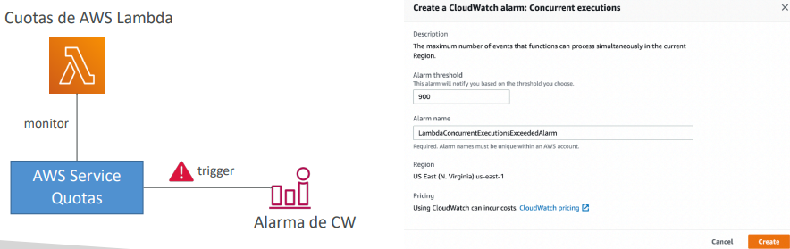

## [Trusted Advisor](https://aws.amazon.com/premiumsupport/technology/trusted-advisor/?nc1=h_ls)
- Sin necesidad de instalar nada - evaluación de
alto nivel de la cuenta de AWS
- Analiza tus cuentas de AWS y proporciona
recomendaciones en 5 categorías
- Optimización de costes - Rendimiento - Seguridad - Tolerancia a los fallos - Límites del servicio

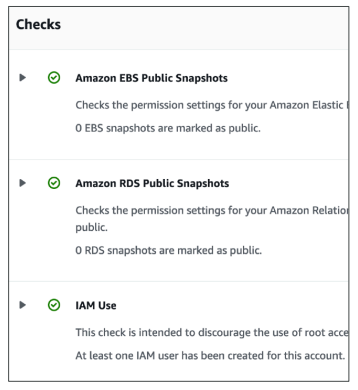

### [Planes de soporte de Trusted Advisor](https://aws.amazon.com/premiumsupport/plans)

| **7 Core Checks (7 controles básicos)** | **Full Checks (Controles completos)** |
|---------------------------------------|----------------------------------------|
| **Plan de soporte:** Basic y Developer | **Plan de soporte:** Business y Enterprise |
| - Permisos de buckets S3   - Grupos de seguridad – Puertos específicos sin restricciones   - Uso de IAM (un usuario IAM como mínimo)   - MFA en la cuenta root   - Snapshots de EBS públicos   - Snapshots públicos de RDS   - Service Quotas | - Comprobaciones completas disponibles en las 5 categorías   - Posibilidad de establecer alarmas de CloudWatch cuando se alcanzan los límites   - **Acceso programado mediante la AWS Support API** |

## [Precios de los planes de soporte de AWS](https://aws.amazon.com/premiumsupport/pricing)

> [!IMPORTANT]
> Los planes de soporte han cambiado, ya no son explícitamente los descritos acontinuación

### Planes de soporte de AWS - Basic
- **Servicio de atención al cliente y comunidades** - Acceso 24x7 al servicio de atención al cliente, documentación, libros blancos y foros de soporte.
- **AWS Trusted Advisor** - Acceso a las 7 comprobaciones principales de Trusted Advisor y orientación para aprovisionar tus recursos siguiendo las mejores prácticas para aumentar el rendimiento y mejorar la seguridad.
- **AWS Personal Health Dashboard** - Una visión personalizada de la salud de los servicios de AWS, y alertas cuando tus recursos se ven afectados.

### Planes de soporte de AWS - Developer
- Todo el plan de soporte basic+
- **Acceso por correo electrónico en horario laboral** a los asociados de soporte de Cloud
- Casos ilimitados / 1 contacto principal
- **Gravedad de los casos / tiempos de respuesta:**
    - Orientación general: < 24 horas laborables
    - Sistema deteriorado: < 12 horas laborables

### Planes de soporte de AWS - Business (24/7)
- Destinado a ser utilizado si tienes cargas de **trabajo de producción**
- **Trusted Advisor** - Conjunto completo de comprobaciones + acceso a la API
- **Acceso telefónico, por correo electrónico y por chat 24x7** a los ingenieros de soporte de Cloud
- Casos ilimitados / contactos ilimitados
- Acceso a la Gestión de Eventos de Infraestructura **por una tarifa adicional**.
- Gravedad de los casos / tiempos de respuesta:
    - Orientación general: < 24 horas laborables
    - Sistema deteriorado: < 12 horas laborables
    - **Sistema de producción deteriorado: < 4 horas**
    - **Sistema de producción averiado: < 1 hora**

### Planes de soporte de AWS - Enterprise On-Ramp
- Destinado a ser utilizado si tienes **cargas de trabajo de producción o críticas para el negocio**
- Todo el Plan de Soporte Business +
- Acceso a un grupo de **Gestores Técnicos de Cuentas (TAM)**
- **Equipo de soporte de atención** (para la facturación y las mejores prácticas de la cuenta)
- **Gestión de eventos de infraestructura, revisiones de operaciones y bien diseñadas**
- Gravedad de los casos / tiempos de respuesta:
    - ...
    - Sistema de producción deteriorado: < 4 horas
    - Sistema de producción averiado: < 1 hora
    - **Sistema crítico de negocio caído: < 30 minutos**

## Planes de soporte de AWS - Enterprise
- Destinado a ser utilizado si tienes **cargas de trabajo de misión crítica**
- Todo el Plan de Soporte Business +
- Acceso a un **Gestor Técnico de Cuentas (TAM)** designado
- **Equipo de soporte de atención** (para la facturación y las mejores prácticas de la cuenta)
- **Gestión de eventos de la infraestructura, revisiones de operaciones y de la arquitectura**
- Gravedad de los casos / tiempos de respuesta:
    - ...
    - Sistema de producción deteriorado: < 4 horas
    - Sistema de producción averiado: < 1 hora
    - **Sistema crítico de negocio caído**: < 15 minutos