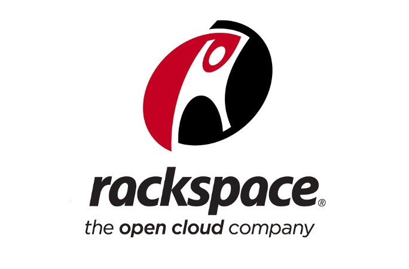
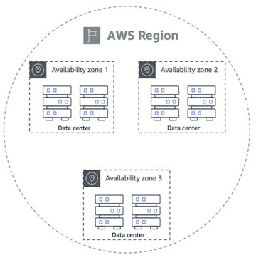
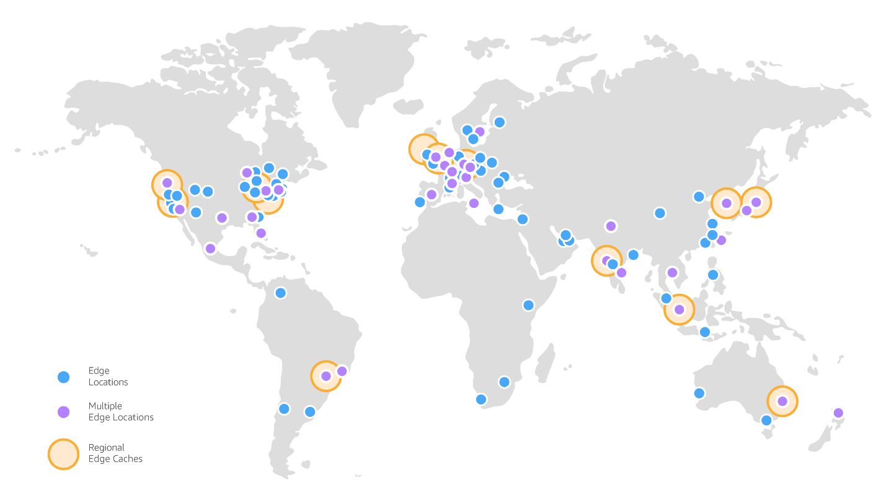

# Qué es el Cloud Computing
## Problemas con el enfoque tradicional de las IT

- Pagar el alquiler del centro de datos
- Pagar el suministro eléctrico, la refrigeración y el mantenimiento
- Añadir y sustituir el hardware lleva tiempo
- El escalado es limitado
- Contratar un equipo 24/7 para supervisar la infraestructura
- ¿Cómo hacer frente a las catástrofes? (terremoto, apagón, incendio...)
- ¿Podemos externalizar todo esto?
## ¿Qué es el Cloud Computing?
- El Cloud Computing (Computación en la nube) es el **suministro bajo demanda** de potencia de cálculo, almacenamiento en bases de datos, aplicaciones y otros recursos informáticos.
- A través de una plataforma de servicios en el cloud con **precios de pago por uso**.
- Puedes **aprovisionar exactamente el tipo y el tamaño** de los recursos informáticos que necesitas.
- Puedes acceder a tantos recursos como necesites, **casi al instante**.
- Forma sencilla de acceder a **servidores, almacenamiento, bases de datos** y un conjunto de **servicios de aplicaciones**.
- Amazon Web Services (AWS) posee y mantiene el hardware conectado a la red necesario para estos servicios de aplicaciones, mientras que aprovisionas y utilizas lo que necesitas a través de una aplicación web.

## Los modelos de despliegue del Cloud
### Cloud privado:
- Servicios en el cloud utilizados por una sola organización, no expuestos al público
- Control total
- Seguridad para aplicaciones sensibles
- Satisfacer necesidades empresariales específicas

### Cloud público:
- Recursos en el cloud que son propiedad de un proveedor de servicios en el cloud y son operados por él, y que se suministran a través de Internet
- Seis ventajas de la computación en el cloud

### Cloud híbrido:
- Mantener algunos servidores en las instalaciones y extender algunas capacidades al cloud
- Control de los activos sensibles en tu infraestructura privada
- Flexibilidad y rentabilidad del cloud público

## Las cinco características del Cloud computing
**1. Autoservicio bajo demanda (on-demand):**
- Los usuarios pueden aprovisionar recursos y utilizarlos sin interacción humana del proveedor de servicios

**2. Amplio acceso a la red:**
- Los recursos están disponibles a través de la red, y pueden ser accedidos por diversas plataformas de clientes

**3. Alquiler múltiple y agrupación de recursos:**
- Varios clientes pueden compartir la misma infraestructura y aplicaciones con seguridad y privacidad
- Múltiples clientes reciben servicio desde los mismos recursos físicos

**4. Rápida elasticidad y escalabilidad:**
- Adquirir y disponer de recursos de forma automática y rápida cuando sea necesario
- Escala rápida y fácilmente en función de la demanda

**5. Servicio medido:**
- El uso se mide, los usuarios pagan correctamente por lo que han utilizado

## Seis ventajas del Cloud computing
**1. Cambia el gasto de capital (CAPEX) por el gasto operativo (OPEX)**
- Pagar bajo demanda: no poseer el hardware
- Reducción del coste total de propiedad (TCO) y de los gastos operativos (OPEX)

**2. Te beneficias de economías de escala masivas**
- Los precios se reducen ya que AWS es más eficiente debido a la gran escala

**3. Deja de adivinar la capacidad**
- Escala basada en el uso real medido

**4. Aumentar la velocidad y la agilidad**

**5. Deja de gastar dinero en el funcionamiento y el mantenimiento de los centros de datos**

**6. Sé global en minutos:** aprovecha la infraestructura global de AWS

## Problemas resueltos por el Cloud
- **Flexibilidad:** Cambia los tipos de recursos cuando sea necesario.
- **Rentabilidad:** Paga por lo que utilizas.
- **Escalabilidad:** Permite acomodar mayores cargas reforzando el hardware o añadiendo nodos adicionales.
- **Elasticidad:** Capacidad de reducir y aumentar la escala cuando sea necesario.
- **Alta disponibilidad y tolerancia a los fallos:** Construye a través de los centros de datos (data centers).
- **Agilidad:** Desarrollar, testear y lanzar rápidamente aplicaciones de software.

## Tipos de Cloud Computing
| En las instalaciones | Infraestructura como servicio (IaaS) | Plataforma como servicio (PaaS) | Software como servicio (SaaS) |
|----------------------|----------------------|-------------------------------------|--------------------------------|
 |  |  |  |
 |  |  |  |
 |  |  |  |
 |  |  |  |
 |  |  |  |
 |  |  |  |
 |  |  |  |
 |  |  |  |
 |  |  |  |

-------------------

### Infraestructura como servicio (IaaS)
- Proporciona bloques de construcción para la IT en el cloud
- Proporciona redes, ordenadores y espacio de almacenamiento de datos
- Máximo nivel de flexibilidad
- Fácil paralelismo con la IT tradicional en las instalaciones### Plataforma como servicio (PaaS)
- Elimina la necesidad de que tu organización gestione la infraestructura
subyacente
- Se centra en el despliegue y la gestión de tus aplicaciones### Software como servicio (SaaS)
- Producto completo que es ejecutado y gestionado por el proveedor de servicios

## Ejemplo de tipos de Cloud Computing 
- Infraestructura como servicio: 
    - Amazon EC2 (en AWS) 
    - GCP, Azure, Rackspace, Digital Ocean, Linode 
- Plataforma como servicio: 
    - Elastic Beanstalk (en AWS) 
    - Heroku, Google App Engine (GCP), Windows Azure (Microsoft) 
- Software como servicio: 
    - Muchos servicios de AWS (por ejemplo, Rekognition para el
aprendizaje automático)
    - Google Apps (Gmail), Dropbox, Zoom

## Precios del Cloud - Visión general rápida
AWS tiene 3 fundamentos de precios, siguiendo el modelo de precios
de pago por uso
1. **Computación:** Pagar por el tiempo de computación
2. **Almacenamiento:** Paga por los datos almacenados en el Cloud
3. **Transferencia de datos FUERA del Cloud:** La transferencia de datos hacia adentro es gratuita

> [!IMPORTANT]
> Resuelve el costoso problema de las IT tradicionales

## Infraestructura global de AWS 

.)
.)
- AWS Regions 
- Regiones de AWS 

- AWS Availability Zones 
- Zonas de disponibilidad de AWS 

- AWS Data Centers 
- Centros de datos de AWS 

- AWS Edge Locations / Points of Presence 
- Puntos de presencia de AWS

### Regiones de AWS

- AWS tiene Regiones en todo el mundo 
- Los nombres pueden ser us-east-1, eu-west-3... 
- Una región es un grupo de centros de datos 
- La mayoría de los servicios de AWS son de ámbito regional

### ¿Cómo elegir una región de AWS?
- **Cumplimiento de los requisitos legales y de gobernanza de datos:** los datos nunca salen de una región sin tu permiso explícito.
- **Proximidad a los clientes:** latencia reducida.
- **Servicios disponibles en una región:** los nuevos servicios y las nuevas funciones no están disponibles en todas las regiones.
- **Precios:** los precios varían de una región a otra y son transparentes en la página de precios del servicio.

### Zonas de disponibilidad de AWS
- Cada región tiene muchas zonas de disponibilidad (normalmente 3, el mínimo es 3, el máximo es 6). Ejemplo:
    - ap-southeast-2a
    - ap-southeast-2b
    - ap-southeast-2c
- Cada zona de disponibilidad (AZ) es uno o varios centros de datos discretos con alimentación, red y conectividad redundantes.
- Están separadas unas de otras, de modo que están aisladas de las catástrofes.
- Están conectadas con redes de alto ancho de banda y latencia ultrabaja.

### Puntos de presencia de AWS (Edge Locations)
- Amazon tiene +450 puntos de presencia (+10 cachés regionales) en +90 ciudades de +40 países.
- El contenido se entrega a los usuarios finales con menor latencia.

## Tour por la consola de AWS

- AWS cuenta con servicios globales:
    - Identity and Access Management (IAM)
    - Route 53 (servicio DNS)
    - CloudFront (Red de entrega de contenido)
    - WAF (Firewall de aplicaciones web)
- La mayoría de los servicios de AWS son de ámbito regional:
    - Amazon EC2 (Infraestructura como servicio)
    - Elastic Beanstalk (Plataforma como servicio)
    - Lambda (Función como servicio)
    - Rekognition (Software como servicio)

## Modelo de responsabilidad compartida & Política de uso aceptable

