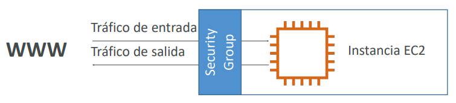
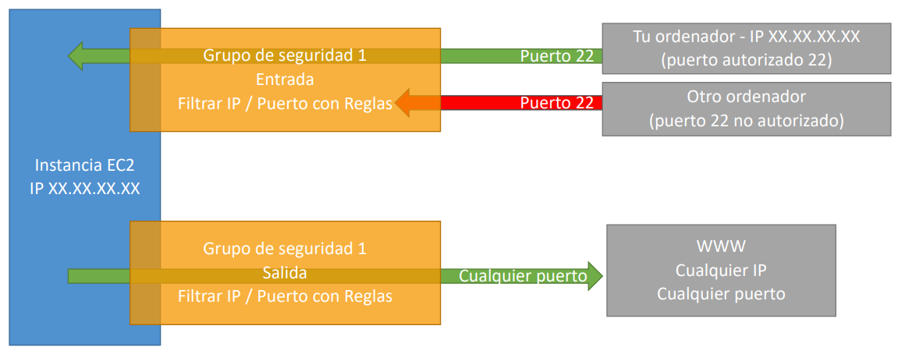
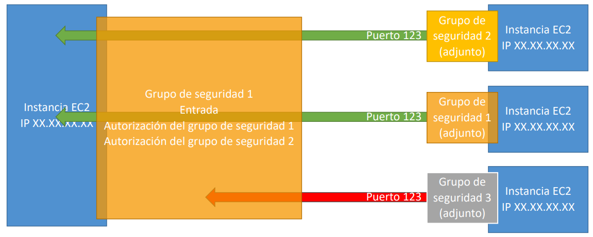

# EC2: Elastic Computing Cloud

## Amazon EC2
- EC2 es una de las ofertas más populares de AWS.
- EC2 = Elastic Compute Cloud = Infraestructura como servicio (IaaS).
- Consiste principalmente en la capacidad de:
  - Alquilar máquinas virtuales (EC2).
  - Almacenar datos en unidades virtuales (EBS).
  - Distribuir la carga entre las máquinas (ELB).
  - Escalar los servicios mediante un Auto Scaling Group (ASG), también conocido en español como Grupo de Autoescalado.
- Conocer EC2 es fundamental para entender el funcionamiento del Cloud.

## Opciones de tamaño y configuración de EC2
- **Sistema operativo (OS)**: Linux, Windows o Mac OS
- **Cuánta potencia de cálculo y núcleos (CPU)**
- **Cuánta memoria de acceso aleatorio (RAM)**
- **Cuánto espacio de almacenamiento**:
  - Conectado a la red (**EBS y EFS**)
  - Hardware (**EC2 Instance Store**)
- **Tarjeta de red**: velocidad de la tarjeta, dirección IP pública
- **Reglas de firewall**: grupo de seguridad
- **Script de arranque** (configurar en el primer lanzamiento): Datos de usuario de EC2

## Datos del usuario de EC2
- Es posible arrancar nuestras instancias utilizando **un script de datos de usuario** de EC2.
- **Bootstrapping** significa lanzar comandos cuando una máquina se inicia.
- Ese script sólo **se ejecuta una vez** en el **primer arranque de la instancia**.
- Los datos de usuario de EC2 se utilizan para automatizar tareas de arranque como:
  - Instalar actualizaciones
  - Instalación de software
  - Descarga de archivos comunes de Internet
  - Cualquier cosa que se te ocurra
- El script de datos de usuario de EC2 se ejecuta con el usuario root.

## Tipos de instancias de EC2

- Se pueden utilizar diferentes tipos de instancias EC2 optimizadas para diferentes casos de uso.
- AWS tiene la siguiente convención de nombres:
  
  **m5.2xlarge**

  - **m**: clase de instancia
  - **5**: generación (AWS los mejora con el tiempo)
  - **2xlarge**: tamaño dentro de la clase de instancia

### Instancias de Propósito general - General Purpose
- Excelente para una diversidad de cargas de trabajo, como servidores web o repositorios de código.
- Equilibrio entre:
  - Computación
  - Memoria
  - Red

### Instancias de Computación optimizada - Compute Optimized
- Ideal para tareas de cálculo intensivo que requieren procesadores de alto rendimiento:
  - Cargas de trabajo de procesamiento por lotes
  - Transcodificación de medios
  - Servidores web de alto rendimiento
  - Computación de alto rendimiento (HPC)
  - Modelado científico y aprendizaje automático
  - Servidores dedicados a juegos
 
### Instancias de Memoria optimizada - Memory Optimized
- Rápido rendimiento para cargas de trabajo que procesan grandes conjuntos de datos en memoria.
- Casos de uso:
  - Alto rendimiento, bases de datos relacionales/no relacionales
  - Almacenes de caché distribuidos a escala web
  - Bases de datos en memoria optimizadas para BI (business intelligence)
  - Aplicaciones que realizan el procesamiento en tiempo real de grandes datos no estructurados

### Instancias de Almacenamiento optimizado - Storage Optimized
- Ideal para tareas de almacenamiento intensivo que requieran un acceso alto y secuencial de lectura y escritura a grandes conjuntos de datos en el almacenamiento local.
- Casos de uso:
  - Sistemas de procesamiento de transacciones en línea (OLTP) de alta frecuencia
  - Bases de datos relacionales y NoSQL
  - Caché para bases de datos en memoria (por ejemplo, Redis)
  - Aplicaciones de almacenamiento de datos
  - Sistemas de archivos distribuidos

## Introducción a los grupos de seguridad
- Los grupos de seguridad son la base de la seguridad de la red en AWS.
- Controlan cómo se permite el tráfico dentro o fuera de nuestras Instancias EC2.

- Los grupos de seguridad sólo contienen reglas de **permiso**.
- Las reglas de los grupos de seguridad pueden hacer referencia por IP o por grupo de seguridad.

### Grupos de seguridad - Inmersión más profunda
- Los grupos de seguridad actúan como un "firewall" en las instancias de EC2.
- Regulan:
  - El acceso a los puertos
  - Rangos de IP autorizados - IPv4 e IPv6
  - Control de la red de entrada (de otros a la instancia)
  - Control de la red saliente (desde la instancia hacia otra)

#### Ejemplo de grupo de seguridad: tráfinco entrante y saliente

#### Ejemplo de grupo de seguridad: tráfico entre más grupos

### Grupos de seguridad - Es bueno saber
- Puede adjuntarse a múltiples instancias.
- Bloqueado a una combinación de región / VPC.
- Vive "fuera" del EC2 - si el tráfico está bloqueado, la instancia EC2 no lo verá.
- **Es bueno mantener un grupo de seguridad separado para el acceso SSH.**
- Si tu aplicación no es accesible (tiempo de espera), entonces es un problema de grupo de seguridad.
- Si tu aplicación da un error de "conexión rechazada", entonces es un error de la aplicación o no se ha lanzado.
- Todo el tráfico de entrada está **bloqueado** por defecto.
- Todo el tráfico de salida está **autorizado** por defecto.

### Puertos clásicos que hay que conocer
- **22 = SSH (Secure Shell)** - iniciar sesión en una instancia de Linux
- **21 = FTP (File Transfer Protocol)** - subir archivos a un archivo compartido
- **22 = SFTP (Secure File Transfer Protocol)** - subir archivos usando SSH
- **80 = HTTP** - acceso a sitios web no seguros
- **443 = HTTPS** - acceso a sitios web seguros
- **3389 = RDP (Remote Desktop Protocol)** - iniciar sesión en una instancia de Windows

### EC2 Instance Connect
Sirve para conectarnos a las instancias por medio de ssh desde el mismo navegador.
- No es necesario utilizar el archivo `key-pair` de claves que se ha descargado
- La "magia" es que una clave temporal es cargada en EC2 por AWS
- Funciona sólo out-of-the-box con Amazon Linux 2
-El puerto 22 debe estar abierto en el grupo de seguridad asociado a la instancia.

## Opciones de compra de instancias EC2
- **Instancias bajo demanda**: carga de trabajo corta, precio predecible, pago por segundos.
- **Reservadas** (1 y 3 años):
  - **Instancias reservadas**: cargas de trabajo largas.
  - **Instancias reservadas convertibles**: cargas de trabajo largas con instancias flexibles.
- **Planes de ahorro** (1 y 3 años): compromiso con una cantidad de uso, carga de trabajo larga.
- **Instancias Spot**: cargas de trabajo cortas, baratas, pueden perder instancias (menos fiables).
- **Hosts dedicados**: reserve un servidor físico completo, controle la ubicación de las instancias.
- **Instancias dedicadas**: ningún otro cliente compartirá tu hardware.
- **Reservas de capacidad**: reserva de capacidad en una AZ específica para cualquier duración.
 
### EC2 Compra bajo demanda
- **Paga por uso**:
  - Linux o Windows - facturación por segundo, después del primer minuto
  - Todos los demás sistemas operativos: facturación por hora
- Tiene el coste más elevado, pero no hay que pagar por adelantado.
- Sin compromiso a largo plazo.
- Recomendado para **cargas de trabajo a corto plazo y sin interrupciones**, cuando no se puede predecir el comportamiento de la aplicación.

### Instancias reservadas de EC2
- Hasta un **72% de descuento** en comparación con el servicio bajo demanda.
- Reserva de atributos de instancia específicos (**tipo de instancia, región, ocupación, sistema operativo**).
- **Periodo de reserva** - 1 año (+descuento) o 3 años (+++descuento).
- **Opciones de pago** - Sin pago inicial (+), Pago inicial parcial (++), Pago inicial total (+++).
- **Alcance de la instancia reservada** - Por **región** o por **zona** (capacidad de reserva en una AZ).
- Recomendado para aplicaciones de uso constante (piensa en una base de datos).
- Puedes comprar y vender en el Marketplace de instancias reservadas.
- **Instancia reservada convertible:**
  - Puedes cambiar el tipo de instancia EC2, la familia de instancias, el SO, etc.
  - Hasta un **66% de descuento**.

> [!NOTE]
> Los % de descuento pueden ser diferentes ya que AWS los cambia con el tiempo - los números exactos no son necesarios para el examen. Esto es solo para fines ilustrativos.

### Planes de ahorro EC2
- Obtén un descuento basado en el uso a largo plazo (hasta el 72%).
- Comprométete a un determinado tipo de uso (10 $/hora durante 1 o 3 años).
- El uso más allá de los planes de ahorro de EC2 se factura al precio bajo demanda.

- Bloqueado a una familia de instancias específica y a una región de AWS (por ejemplo, M5 en us-east-1).
- Flexible a través de:
  - **Tamaño de instancia** (por ejemplo, m5.xlarge, m5.2xlarge).
  - **Sistema operativo** (por ejemplo, Linux, Windows).
  - **Tenencia** (Host, dedicado, por defecto).

### Instancias EC2 Spot
- Puedes obtener un **descuento de hasta el 90%** en comparación con la demanda.
- Instancias que puedes "perder" en cualquier momento si su precio máximo es inferior al precio spot actual.
- Las instancias **MÁS rentables** de AWS.
- **Útil para las cargas de trabajo que son resistentes a los fallos**
  - Trabajos por lotes (Batch Jobs)
  - Análisis de datos
  - Procesamiento de imágenes
  - Cualquier carga de trabajo **distribuida**
  - Cargas de trabajo con una hora de inicio y finalización flexible
- **No es adecuado para trabajos críticos o bases de datos**.

### Hosts dedicados EC2
- Un servidor físico con capacidad de instancia EC2 totalmente dedicado a su uso.
- Permite abordar los requisitos de **normativas y utilizar licencias de software vinculadas al servidor existentes** (licencias de software por socket, por núcleo, por VM).
- **Opciones de compra**:
  - **Bajo demanda** - pago por segundo para el host dedicado activo.
  - **Reservado** - 1 o 3 años (sin pago inicial, pago inicial parcial, pago inicial total).
- La opción más cara.

#### Útil para:
- El software que tiene un modelo de licencia complicado (BYOL - Bring Your Own License).
- Empresas que tienen fuertes necesidades de regulación o cumplimiento.

### Instancias dedicadas de EC2
- Las instancias se ejecutan en un hardware dedicado para ti.
- Puedes compartir el hardware con otras instancias de la misma cuenta.
- No hay control sobre la ubicación de las instancias (se puede mover el hardware después de la parada/arranque).

### Reservas de capacidad de EC2
- Reserva la capacidad de las instancias **bajo demanda** en una AZ específica para cualquier duración.
- Siempre tendrás acceso a la capacidad de EC2 cuando la necesites.
- **Sin compromiso de tiempo** (crear/cancelar en cualquier momento), **sin descuentos de facturación**.
- Combina con las instancias regionales reservadas y los planes de ahorro para beneficiarte de descuentos en la facturación.
- Se te cobra la tarifa bajo demanda tanto si ejecuta instancias como si no.
- Adecuado para cargas de trabajo ininterrumpidas a corto plazo que necesitan estar en una AZ específica.

## Comparación de precios
**Ejemplo - m4.large - us-east-1**

| Tipo de precio                                | Precio (por hora)                           |
|-----------------------------------------------|---------------------------------------------|
| Precio bajo demanda (On-demand)               | 0.10$                                       |
| Instancias de spot (Spot instances)           | 0.038$ - 0.039$ (hasta 61% de descuento)    |
| Instancia reservada (1 año) (Reserved)        | 0,062$ (sin anticipo) - 0,058$ (todo por adelantado) |
| Instancia reservada (3 años) (Reserved)       | 0,043$ (sin anticipo) - 0,037$ (todo por adelantado) |
| Plan de ahorro EC2 (1 año) (Saving plan)      | 0,062$ (sin anticipo) - 0,058$ (todo por adelantado) |
| Instancia reservada convertible (1 año)       | 0,071$ (sin anticipo) - 0,066$ (todo por adelantado) |
| Host dedicado (Dedicated host)                | Precio bajo demanda (On-demand)             |
| Reserva de host dedicado (Dedicated host reservation) | Hasta el 70% de descuento         |
| Reservas de capacidad (Capacity reservation)  | Precio bajo demanda (On-demand)             |

## Modelo de responsabilidad compartida para EC2
### AWS se encarga de:
- Infraestructura (seguridad global de la red)
- Aislamiento en hosts físicos
- Sustitución de hardware defectuoso
- Validación de la normativa

### El cliente es responsable de:
- Reglas de los grupos de seguridad
- Parches y actualizaciones del sistema operativo
- Software y utilidades instaladas en la instancia EC2
- Roles IAM asignados a EC2 y gestión de acceso de usuarios IAM
- Seguridad de los datos en tu instancia

## Resumen - EC2
- **Instancia EC2**: AMI (SO) + Tamaño de la Instancia (CPU + RAM) + Almacenamiento + Grupos de Seguridad + Datos de Usuario EC2
- **Grupos de seguridad**: Firewall adjunto a la instancia EC2
- **Datos de usuario de EC2**: Script lanzado en el primer arranque de una instancia
- **SSH**: Iniciar un terminal en nuestras instancias EC2 (puerto 22)
- **Rol de la Instancia EC2**: Enlace a los roles de IAM
- **Opciones de compra**: On-Demand, Spot, Reservada (Estándar + Convertible + Programada), Host Dedicado, Instancia Dedicada

