

# EBS: Elastic Block Store

## ¿Qué es un volumen EBS?
- Un volumen EBS (Elastic Block Store) es una unidad de red que puede
adjuntar a las instancias mientras se ejecutan
- Permite que las instancias persistan los datos, incluso después de su
finalización
- Sólo pueden montarse en una instancia a la vez (a nivel de CCP)

> [!CAUTION]
> Para términos de la cetificación Cloud Practitioner se omite el tema de la función **EBS Multi-Attach** que es propia de los volúmenes io1 e io2.

- Están vinculados a una zona de disponibilidad específica
- Analogía: Piensa en ellos como una "memoria USB de red"
- Nivel gratuito: 30 GB de almacenamiento EBS gratuito de tipo Propósito
General (SSD) o Magnético al mes
- Es una unidad de red (es decir, no es una unidad física)
    - Utiliza la red para comunicar la instancia, lo que significa que puede haber un poco de latencia
    - Se puede separar de una instancia EC2 y conectarla a otra rápidamente
- Está bloqueado en una Zona de Disponibilidad (AZ)
    - Un volumen EBS en us-east-1a no puede adjuntarse a us-east-1b
    - Para trasladar un volumen, primero hay que hacer un snapshot del mismo
- Tener una capacidad provisionada (tamaño en GBs, e IOPS)
    - Se facturará toda la capacidad aprovisionada
    - Puede aumentar la capacidad de la unidad con el tiempo

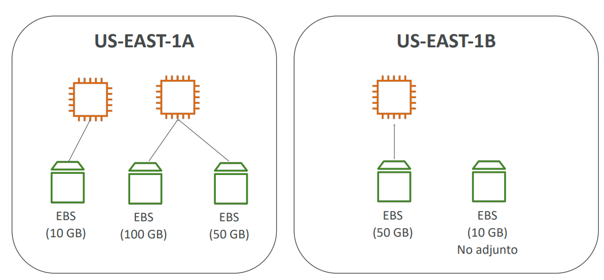

## EBS - Atributo "Borrar al terminar”
- Controla el comportamiento de EBS cuando una instancia EC2 termina
    - Por defecto, se elimina el volumen EBS root / raíz (atributo habilitado)
    - Por defecto, cualquier otro volumen EBS adjunto no se elimina (atributo deshabilitado)
- Esto puede ser controlado por la consola de AWS / AWS CLI
- Caso de uso: preservar el volumen root / raíz cuando se termina la instancias

## Snapshot / Instantáneas de EBS
Una instantánea es una copia de seguridad incremental, lo que significa que solo se guardan los bloques del volumen que han cambiado desde la instantánea más reciente. Esto disminuye el tiempo necesario para crearlo y ahorra costos de almacenamiento, ya que no se duplican los datos.
- No es necesario separar el volumen para hacer la instantánea, pero se recomienda
- Se puede copiar las instantáneas a través de AZ o Región:

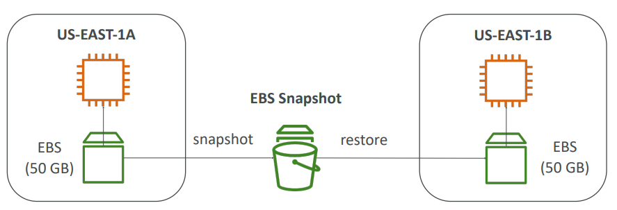

### Características de los Snapshots de EBS
#### a. Archivo de Snapshots de EBS
- Mover un snapshot a un "nivel de archivo" que es un 75% más barato
- La restauración del archivo tarda entre 24 y 72 horas

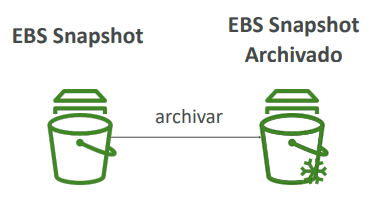

#### b. Papelera de reciclaje para Snapshots EBS
- Configura reglas para retener los snapshots eliminados para poder recuperarlos después de un borrado accidental
- Especifica la retención (de 1 día a 1 año)

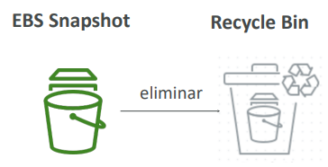

## AMI: Amazon Machine Image
- Las AMI son una **personalización** de una instancia EC2
    - EL usuario puede añadir su propio software, configuración, sistema operativo, monitorización...
    - Tiempo de arranque/configuración más rápido porque todo el software está preempaquetado
- Las AMI se construyen para una **región específica** (y pueden copiarse entre regiones)

Se pueden lanzar instancias EC2 desde:
- **Una AMI pública**: proporcionada por AWS
- **Una AMI propia**: creada y mantenida por el usuario
- **Una AMI de AWS Marketplace**: una AMI hecha por otra persona (y
potencialmente vendida)

### Proceso AMI (desde una instancia EC2)
- Iniciar una instancia EC2 y personalizarla
- Detener la instancia (para la integridad de los datos)
- Construir una AMI - esto también creará instantáneas de EBS
- Lanzar instancias desde otras AMIs

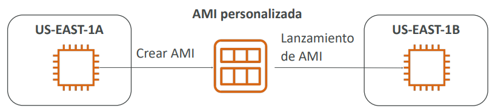

### Constructor de imágenes EC2 - EC2 Image Builder
- Se utiliza para automatizar la creación de máquinas virtuales o imágenes de contenedores
- => Automatizar la creación, mantener, validar y probar las AMIs de EC2
- Puede ejecutarse de forma programada (semanalmente, cada vez que se actualizan los
paquetes, etc...)
- Servicio gratuito (sólo se paga por los recursos subyacentes)

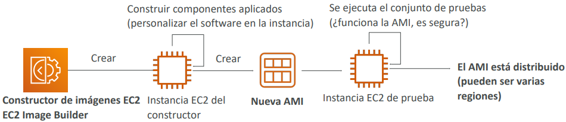

## Almacén de instancias EC2 - EC2 Instance Store
- Los volúmenes EBS son **unidades de red** con un rendimiento bueno pero “limitado"
- Mejor rendimiento de E/S (Entrada Y Salida)
- Los almacenes de instancias EC2 pierden su almacenamiento si se detienen (son efímeros)
- Bueno para el buffer / cache / datos de memoria virtual / contenido temporal
- Riesgo de pérdida de datos si el hardware falla
- Las copias de seguridad y la replicación son responsabilidad tuya

> [!IMPORTANT]
> Si necesitas un disco de hardware de alto rendimiento, utilizas EC2 Instance Store

## EFS - Elastic File System
- NFS (network file system / sistema de archivos de red) gestionado que **puede montarse en 100 EC2s**
- EFS funciona con instancias EC2 de **Linux** en **multi-AZ**
- Alta disponibilidad, escalable, caro (3x gp2), pago por uso, sin planificación de capacidad

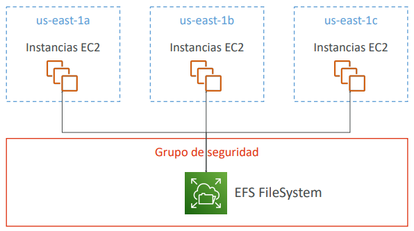

### EBS vs EFS
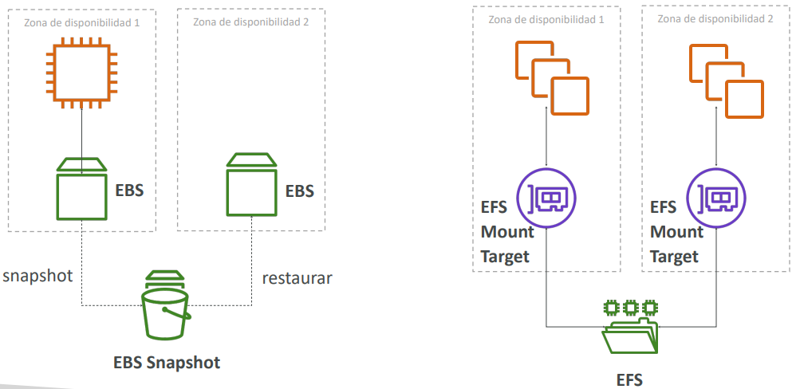

### EFS Infrequent Access (EFS-IA)
- **Clase de almacenamiento** con costes optimizados para los archivos a los que no se accedes a diario
- Hasta un 92% menos de coste en comparación con EFS Standard
- EFS moverá automáticamente tus archivos a EFS-IA basándose en la última vez que se accedió a ellos
- Habilita EFS-IA con una política de ciclo de vida (Lifecycle Policy)
- Ejemplo: mover a EFS-IA los archivos a los que no se ha accedido en 60 días
- Transparente para las aplicaciones que acceden a EFS

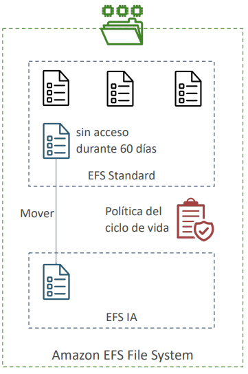

## Modelo de responsabilidad compartida para el almacenamiento de EC2
### AWS se encarga de:
- Infraestructura
- Replicación de datos para volúmenes EBS y unidades EFS
- Sustitución de hardware defectuoso
- Asegurar que sus empleados no puedan acceder a tus datos

### El cliente es responsable de:
- Configuración de procedimientos de copia de seguridad / instantánea
- Configuración de la encriptación de datos
- Responsabilidad de los datos en las unidades
- Comprender el riesgo de utilizar EC2 Instance Store

## Amazon FSx - Visión general 
- **Lanzar sistemas de archivos de alto rendimiento de terceros en AWS**
- Servicio totalmente gestionado

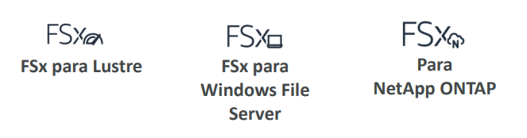

### Amazon FSx para Windows File Server
- Un sistema de archivos compartido nativo de Windows totalmente gestionado, altamente fiable y escalable
- Construido sobre Windows File Server
- Soporta el protocolo SMB y Windows NTFS
- Integrado con Microsoft Active Directory
- Se puede acceder desde AWS o desde tu infraestructura local

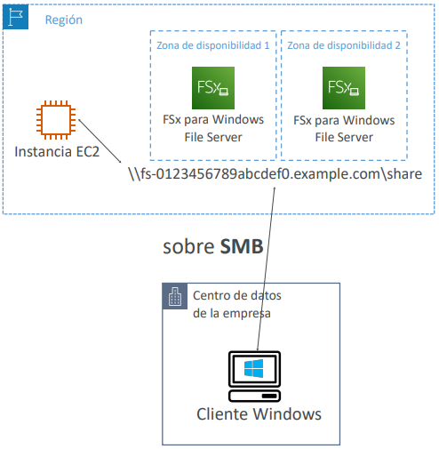

### Amazon FSx para Lustre
- Un almacenamiento de archivos totalmente gestionado, de alto rendimiento y escalable para High Performance Computing (HPC)
- El nombre Lustre deriva de "Linux" y "cluster"
- Machine Learning, análisis, procesamiento de vídeo, modelado financiero, ...
- Escala hasta 100s GB/s, millones de IOPS, latencias sub-ms

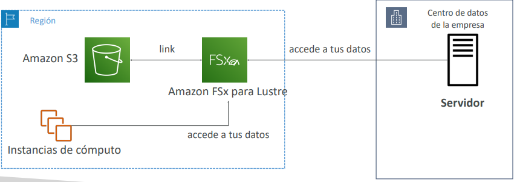

## Resumen - Almacenamiento de instancias EC2
- **Volúmenes EBS**:
    - Unidades de red adjuntas a una instancia EC2 a la vez
    - Asignados a una zona de disponibilidad
    - Puede utilizar EBS Snapshots para copias de seguridad / transferir volúmenes EBS a través de AZ
- **AMI**: crea instancias EC2 listas para usar con nuestras personalizaciones
- **EC2 Image Builder**: construye, prueba y distribuye automáticamente AMIs
- **EC2 Instance Store**:
    - Disco de hardware de alto rendimiento unido a nuestra instancia EC2
    - Se pierde si nuestra instancia se detiene / termina
- **EFS Elastic File System**: sistema de archivos en red, se puede adjuntar a 100s de instancias en una región
- **EFS-IA**: clase de almacenamiento de coste optimizado para archivos de acceso poco frecuente
- **FSx para Windows**: sistema de archivos en red para servidores Windows
- **FSx para Lustre**: sistema de archivos Linux de alto rendimiento informático

