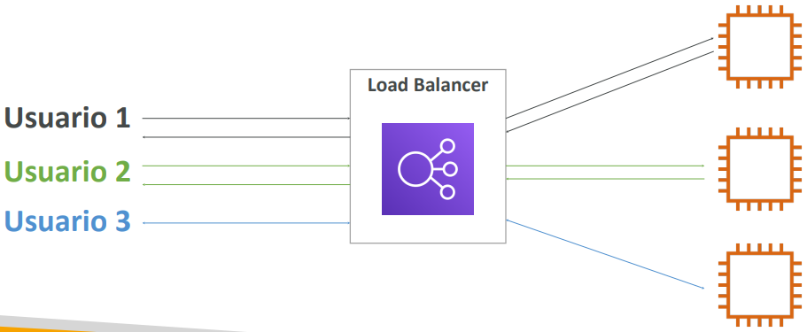
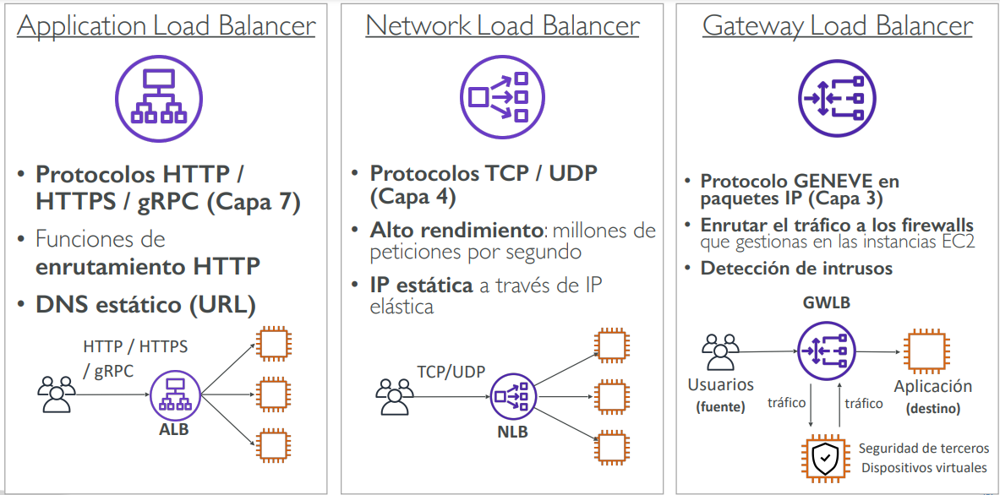
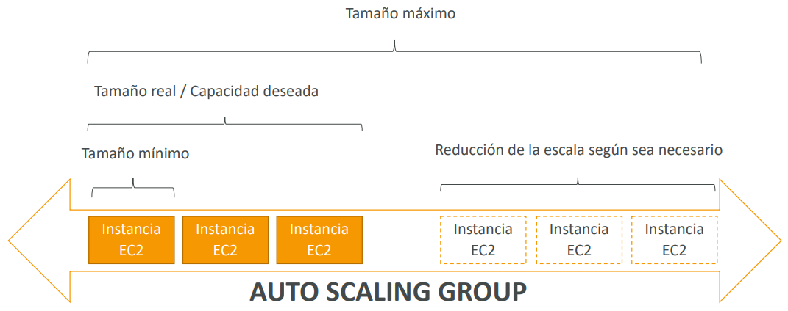
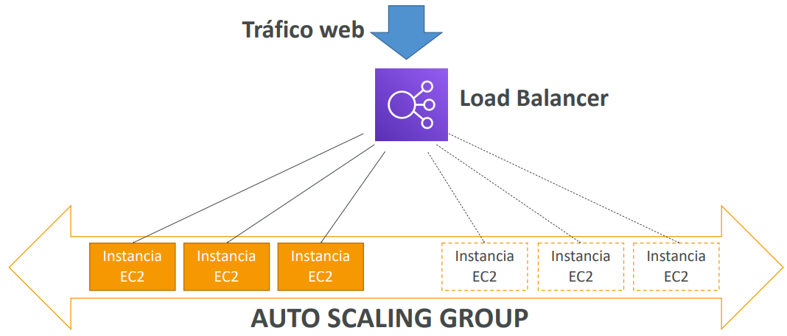

# Elastic Load Balancing & Auto Scaling Groups

## Escalabilidad y alta disponibilidad
- La escalabilidad significa que una aplicación/sistema puede manejar mayores cargas adaptándose.
- Hay dos tipos de escalabilidad:
    - Escalabilidad vertical
    - Escalabilidad horizontal (= elasticidad)
- **La escalabilidad está vinculada pero es diferente a la alta disponibilidad**

### Escalabilidad vertical
- La escalabilidad vertical significa aumentar el tamaño de la instancia
- Por ejemplo, tu aplicación se ejecuta en una instancia t2.micro
- Escalar esa aplicación verticalmente significa ejecutarla en una instancia t2.large
- La escalabilidad vertical es muy común para sistemas no distribuidos, como una base de datos
- Por lo general, hay un límite en cuanto a lo que se puede escalar verticalmente (límite de hardware)

### Escalabilidad horizontal
- Escalabilidad horizontal significa aumentar el número de instancias / sistemas para la aplicación
- El escalado horizontal implica sistemas distribuidos
- Esto es muy común para las aplicaciones web / aplicaciones modernas
- Es fácil escalar horizontalmente gracias a las ofertas en el Cloud como Amazon EC2

### Alta disponibilidad
- La alta disponibilidad suele ir de la mano del escalado horizontal
- Alta disponibilidad significa ejecutar la aplicación / sistema en al menos 2 zonas de disponibilidad
- El objetivo de la alta disponibilidad es sobrevivir a la pérdida del centro de datos (desastre)

### Alta disponibilidad y escalabilidad para EC2
- **Escalado vertical**: Aumentar el tamaño de la instancia (= escalar hacia arriba / abajo)
    - Desde: t2.nano - 0.5G de RAM, 1 vCPU
    - A: u-12tb1.metal - 12,3 TB de RAM, 448 vCPUs

- **Escalado horizontal**: Aumentar el número de instancias (= escalado hacia fuera / hacia dentro)
    - Auto Scaling Group
    - Load Balancer

- **Alta disponibilidad**: Ejecutar instancias para la misma aplicación a través de múltiples AZ
    - Auto Scaling Group *multi AZ*
    - Load Balancer *multi AZ*

### Escalabilidad vs. Elasticidad (vs. Agilidad)
- **Escalabilidad**: capacidad de acomodar una mayor carga reforzando el hardware (scale up), o añadiendo nodos (scale out)
- **Elasticidad**: una vez que un sistema es escalable, la elasticidad significa que habrá cierto "autoescalado" para que el sistema pueda escalar en función de la carga. Esto es "amigable con el Cloud": pago por uso, adecuación a la demanda, optimización de costes
- **Agilidad**: (no relacionado con la escalabilidad - distractor) los nuevos recursos de IT están a un clic de distancia, lo que significa que se reduce el tiempo para poner esos recursos a disposición de los desarrolladores de semanas a sólo minutos

## ¿Qué es el load balancing?
Los Load Balancers (equilibradores de carga) son servidores que reenvían el tráfico de Internet a múltiples servidores (Instancias EC2) en sentido descendente

### ¿Por qué utilizar un Load Balancer?
- Distribuir la carga entre múltiples instancias descendentes
- Exponer un único punto de acceso (DNS) en tu aplicación
- Manejar sin problemas los fallos de las instancias descendentes
- Realiza comprobaciones periódicas del estado de tus instancias
- Proporcionar terminación SSL (HTTPS) para tus sitios web
- Alta disponibilidad entre zonas

### ¿Por qué utilizar un Elastic Load Balancer (ELB)?
- Un ELB (Elastic Load Balancer) es un **Load Balancer (equilibrador de carga) gestionado por AWS**
    - AWS garantiza su funcionamiento
    - AWS se encarga de las actualizaciones, el mantenimiento y la alta disponibilidad
    - AWS sólo proporciona unos pocos controles de configuración
- Cuesta menos configurar tu propio Load Balancer pero te supondrá mucho más esfuerzo (mantenimiento, integraciones)

### Tipos de Load Balancer ofrecidos por AWS:
- Application Load Balancer (sólo HTTP / HTTPS) - Capa 7
- Network Load Balancer (rendimiento ultra alto, permite TCP) - Capa 4
- Gateway Load Balancer - Capa 3
- Classic Load Balancer (retirado en 2023) - Capa 4 y 7

## ¿Qué es un Auto Scaling Group?
- En la vida real, la carga de tus sitios web y aplicaciones puede cambiar
- En el Cloud, puedes crear y deshacerte de servidores muy rápidamente
- El objetivo de un Auto Scaling Group (ASG) es:
    - Escalar para fuera (añadir instancias de EC2) para adaptarse a un aumento de la carga
    - Escalar para dentro (eliminar instancias EC2) para que coincida con una disminución de la carga
    - Asegurar que tenemos un número mínimo y máximo de máquinas en funcionamiento
    - Registrar automáticamente nuevas instancias en un Load Balancer
    - Reemplazar las instancias en mal estado
- Ahorro de costes: sólo se ejecuta a una capacidad óptima (principio del Cloud)

### Auto Scaling Group (ASG) en AWS

### Auto Scaling Group en AWS con Load Balancer

### Auto Scaling Groups – Estrategias de escalado
- **Escalado manual:** Actualizar el tamaño de un ASG manualmente
- **Escalado dinámico:** Responde a los cambios en la demanda
    - *Escalado simple / por pasos*
        - Cuando se activa una alarma de CloudWatch (por ejemplo, CPU > 70%), se añaden 2 unidades
        - Cuando se dispara una alarma de CloudWatch (ejemplo CPU < 30%), entonces se elimina 1
    - *Escalado de seguimiento de objetivos*
        - Ejemplo: Quiero que la media de la CPU de ASG se mantenga en torno al 40%
    - *Escalado programado*
        - Anticipar un escalado basado en patrones de uso conocidos
        - Ejemplo: aumentar la capacidad mínima a 10 a las 17 horas de los viernes
- **Escalado predictivo**
    - Utiliza el Machine Learning para predecir el tráfico futuro con antelación
    - Aprovisiona automáticamente el número correcto de instancias EC2 por adelantado
    - Útil cuando tu carga tiene patrones predecibles basados en el tiempo

## Resumen - ELB y ASG
- **Alta disponibilidad** vs **escalabilidad** (vertical y horizontal) vs **elasticidad** vs **agilidad** en el Cloud
- **Elastic Load Balancers (ELB)**
    - Distribuyen el tráfico entre las instancias EC2 del backend, pueden ser Multi-AZ
    - Soporta chequeos de salud
    - 4 tipos: Classic (antiguo), Application (HTTP - L7), Network (TCP - L4), Gateway (L3)
- **Auto Scaling Groups (ASG)**
    - Implementa la elasticidad para tu aplicación, a través de múltiples AZ
    - Escala las instancias EC2 en función de la demanda de tu sistema, sustituye las instancias en mal estado
    - Integrado con el ELB

