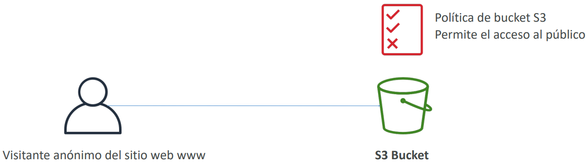
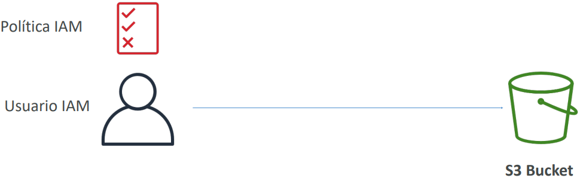
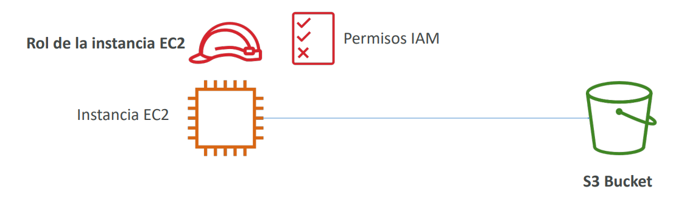
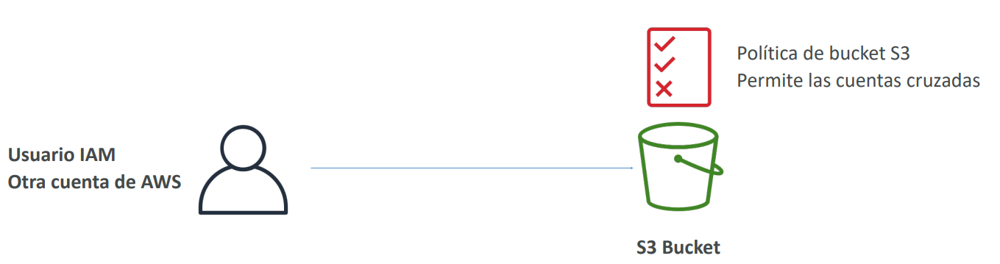
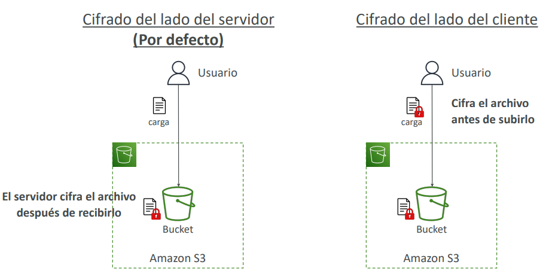
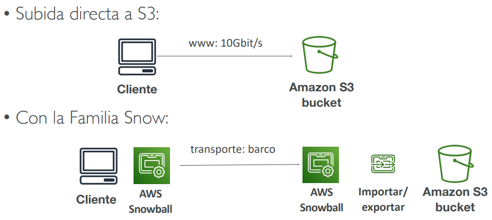
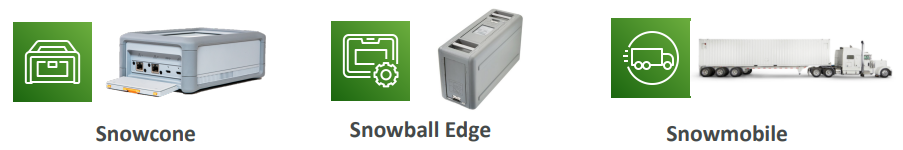
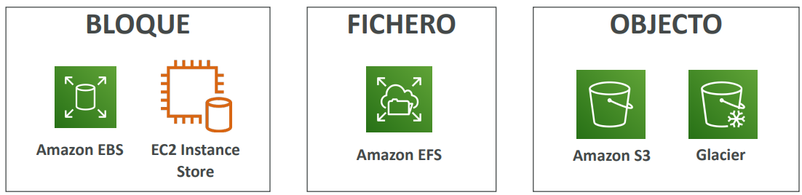
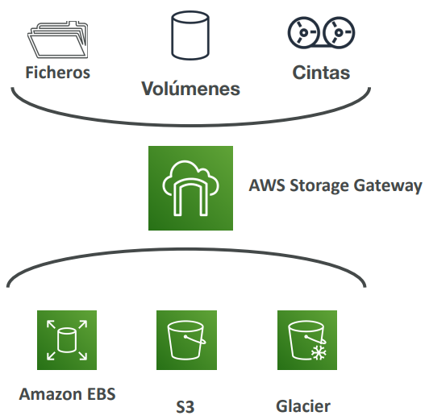

[](../5_ELB_&_ASG/README.md)
[](../README.md)
[](../7_DB/README.md)

# S3: Simple Storage Service
[](https://docs.aws.amazon.com/s3/?icmpid=docs_homepage_featuredsvcs)

## Introducción de la sección
- Amazon S3 es uno de los principales bloques de construcción de AWS
- Se anuncia como almacenamiento de "escala infinita".
- Muchos sitios web utilizan Amazon S3 como columna vertebral
- Muchos servicios de AWS utilizan Amazon S3 como una integración también
- Tendremos una aproximación paso a paso a S3
- El examen CCP requiere un conocimiento "más profundo" sobre S3

## S3 Casos de uso 
- Copia de seguridad y almacenamiento
- Recuperación de desastres
- Almacenamiento en el Cloud híbrido
- Alojamiento de aplicaciones
- Alojamiento de medios
- Data Lakes y análisis de big data
- Entrega de software
- Sitio web estático

## S3 - Buckets
- Amazon S3 permite almacenar objetos (archivos) en "buckets" (directorios)
- Los buckets deben tener un **nombre único global** (en todas las regiones y todas las cuentas)
- Los buckets se definen a **nivel de región**
- S3 parece un servicio global, pero los buckets se crean en una región

### Convención de nombres
- Sin mayúsculas, sin guión bajo
- De 3 a 63 caracteres
- No es una IP
- Debe empezar por letra minúscula o número
- NO debe empezar por el prefijo **xn--**
- NO debe terminar con el sufijo **-s3alias**

## Objetos
- Los objetos (archivos) tienen una clave
- La *clave* es la ruta **COMPLETA**:
  - `s3://mi-bucket/mi-archivo.txt`
  - `s3://mi-bucket/mi_carpeta1/otra_carpeta/mi-archivo.txt`
- La clave se compone de prefijo + nombre del objeto
  - `s3://mi-bucket/mi_carpeta1/otra_carpeta/mi-archivo.txt`
- No existe el concepto de "directorios" dentro de los buckets (aunque la interfaz de usuario te hará pensar lo contrario)

### Objetos: valores y contenido
Los valores de los objetos son el contenido del cuerpo:
- Peso  
  - Máx. Tamaño del objeto es 5TB (5000GB)
  - Si se sube más de 5GB, se debe utilizar "subida multiparte"
- Metadatos (lista de pares clave / valor de texto - metadatos del sistema o del usuario)
- Etiquetas (par clave / valor - hasta 10) - útil para la seguridad / ciclo de vida
- ID de versión (si está activado el versionado)

## Seguridad S3
#### Basada en el usuario
- **Políticas IAM:** qué llamadas a la API deben permitirse a un usuario concreto desde IAM

#### Basada en recursos
- **Políticas de bucket:** reglas para todo el bucket desde la consola de S3 - permite cuentas cruzadas
- **Lista de control de acceso a objetos (ACL):** nivel de detalle profundo (puede desactivarse)
- **Lista de control de acceso a bucket (ACL):** menos común (puede desactivarse)

#### Cifrado
Cifra objetos en Amazon S3 utilizando claves de cifrado

> [!NOTE]
> Un usuario IAM puede acceder a un objeto S3 si
> - Los permisos IAM del usuario LO PERMITEN **`OR`** la política de recursos LO PERMITE
> - **`AND`** no hay una DENEGACIÓN explícita

## Políticas de bucket S3
#### Políticas basadas en JSON 
- *Resource*: buckets y objetos 
- *Effect*: permitir (Allow) o denegar (Deny) 
- *Action*: conjunto de API a permitir o denegar 
- *Principal*: la cuenta o usuario al que aplicar la política

``` json
{
  "Version": "2012-10-17",
  "Statement": [
    {
      "Sid": "PublicRead",
      "Effect": "Allow",
      "Principal": "*",
      "Action": [
        "s3:GetObject"
      ],
      "Resource": [
        "arn:aws:s3:::examplebucket/*"
      ]
    }
  ]
}
```
#### Utilizar una política de bucket S3 para: 
- Conceder acceso público al bucket 
- Forzar que los objetos se cifren al subirlos 
- Conceder acceso a otra cuenta (cuenta cruzada)

### Ejemplo: Acceso público - Política de uso de bucket


### Ejemplo: Acceso del usuario al S3 - Permisos IAM


### Ejemplo: Acceso de la instancia EC2 - Utilizar roles IAM 


### Avanzado: Acceso entre cuentas - Uso de la política de bucket


> [!CAUTION]
> **Configuración del bucket para bloquear el acceso público**
> - Estos ajustes se crearon para **evitar la filtración de datos** de la empresa
> - Si se sabe que el bucket no debe ser nunca público, es mejor dejarlo activado
> - Pueden establecerse a nivel de cuenta

## Alojamiento de sitios web estáticos
- S3 puede alojar sitios web estáticos y hacerlos accesibles en Internet
- La URL del sitio web será (dependiendo de la región)
  - *http://bucket-name.s3-website-aws-region.amazonaws.com*
  - **`OR`**
  - *http://bucket-name.s3-website.aws-region.amazonaws.com*
- Si entrega un error 403 Forbidden, ¡asegúrate de que la política del bucket permite lecturas públicas!

## Versionado
- Puedes versionar tus archivos en Amazon S3
- Se activa **a nivel de bucket**
- La misma clave de sobrescritura cambiará la "versión": 1, 2, 3....
- Es una buena práctica versionar tus buckets
  - Protege contra borrados involuntarios (posibilidad de restaurar una versión)
  - Rolling fácil a la versión anterior

> [!NOTE]
> - Cualquier archivo que no esté versionado antes de activar el versionado tendrá la versión "nula".
> - Suspender el versionado no elimina las versiones anteriores

## Replicación (CRR & SRR)
- Replicación entre regiones (CRR)
- Replicación en la misma región (SRR)
- Los buckets pueden estar en diferentes cuentas de AWS
- La copia es asíncrona

> *Casos de uso:*
> - **CRR:** normativa, acceso de menor latencia, replicación entre cuentas
> - **SRR:** agregación de logs, replicación en vivo entre cuentas de producción y de test

> [!NOTE]
> - Se debe activar el versionado en los buckets de origen y destino, los objetos quedan con el mismo id de versión tanto en origen como en destino
> - Se debe dar los permisos IAM adecuados a S3

## S3 Durabilidad y disponibilidad
### Durabilidad:
- Alta durabilidad (99,999999999%, 11 9's) de los objetos a través de múltiples AZ
- Si almacenas 10.000.000 de objetos con Amazon S3, puedes esperar una media de pérdida de un solo objeto una vez cada 10.000 años
- Lo mismo para todas las clases de almacenamiento

### Disponibilidad:
- Mide la disponibilidad de un servicio
- Varía en función de la clase de almacenamiento
- Ejemplo: El estándar S3 tiene una disponibilidad del 99,99% = no está disponible 53 minutos al año

## Clases de almacenamiento S3
- Amazon S3 Standard - Uso general
- Amazon S3 Standard-Infrequent Access (IA)
- Amazon S3 One Zone-Infrequent Access
- Amazon S3 Glacier Instant Retrieval
- Amazon S3 Glacier Flexible Retrieval
- Amazon S3 Glacier Deep Archive
- Amazon S3 Intelligent Tiering

> [!IMPORTANT]
> Se puede pasar de una clase a otra manualmente o utilizando las configuraciones del ciclo de vida de S3

## 1. Standard S3 - Uso general
- Disponibilidad del 99,99%.
- Se utiliza para datos de acceso frecuente
- Baja latencia y alto rendimiento
- Soporta 2 fallos concurrentes de la instalación
> *Casos de uso:* Análisis de Big Data, aplicaciones móviles y de juegos, distribución de contenidos...

## 2. Clases de almacenamiento S3 – Infrequent Access
- Clases de almacenamiento en S3
- Coste inferior al de S3 Standard

### 2.a. Amazon S3 Standard-Infrequent Access (S3 Standard-IA)
- Disponibilidad del 99,9%.
> *Casos de uso:* Recuperación de desastres, copias de seguridad

### 2.b. Amazon S3 One Zone-Infrequent Access (S3 One Zone-IA)
- Alta durabilidad (99,999999999%) en una sola AZ; los datos se pierden cuando se destruye la AZ
- Disponibilidad del 99,5%.
> *Casos de uso:* Almacenamiento de copias de seguridad secundarias de datos locales, o de datos que puedes recrear

## 3. Amazon S3 Glacier
- Almacenamiento de objetos de bajo coste pensado para archivar / hacer copias de seguridad
- Precio: precio del almacenamiento + coste de recuperación del objeto

### 3.a. Amazon S3 Glacier Instant Retrieval
- Recuperación en milisegundos, ideal para datos a los que se accede una vez al trimestre
- Duración mínima de almacenamiento de 90 días

### 3.b. Amazon S3 Glacier Flexible Retrieval (antes Amazon S3 Glacier)
- Acelerada (de 1 a 5 minutos), Estándar (de 3 a 5 horas), Masiva (de 5 a 12 horas) - gratis
- Duración mínima de almacenamiento de 90 días

### 3.c. Amazon S3 Glacier Deep Archive - para almacenamiento a largo plazo:
- Estándar (12 horas), Masiva (48 horas)
- Duración mínima de almacenamiento de 180 días

## 4. S3 Intelligent-Tiering
- Pequeña cuota mensual de monitorización y jerarquización automática
- Mueve los objetos automáticamente entre los niveles de acceso en función del uso
- No hay cargos por recuperación en S3 Intelligent-Tiering

**Tipos de intelligent tiering:**
- *Frequent Access tier (automático):* nivel por defecto
- *Infrequent Access tier (automático):* objetos no accedidos durante 30 días
- *Archive Instant Access tier (automático):* objetos no accedidos durante 90 días
- *Archive Access tier (opcional):* configurable de 90 a más de 700 días
- *Deep Archive Access tier (opcional):* configurable de 180 días a 700+ días

## Comparación de clases S3
[](https://aws.amazon.com/es/s3/storage-classes/)

| | Standard | Intelligent-Tiering | Standard-IA | One Zone-IA | Glacier Instant Retrieval | Glacier Flexible Retrieval | Glacier Deep Archive |
|-|-|-|-|-|-|-|-|
| **Durabilidad** | 99.9...% == (11 9's) | 99.9...% == (11 9's) | 99.9...% == (11 9's) | 99.9...% == (11 9's) | 99.9...% == (11 9's) | 99.9...% == (11 9's) | 99.9...% == (11 9's) |
| **Disponibilidad** | 99.99% | 99.9% | 99.9% | 99.5% | 99.9% | 99.99% | 99.99% |
| **Acuerdo de nivel de servicio de disponibilidad** | 99.9% | 99% | 99% | 99% | 99% | 99.9% | 99.9% |
| **Zonas de disponibilidad** | >= 3 | >= 3 | >= 3 | 1 | >= 3 | >= 3 | >= 3 |
| **Min. Duración del almacenamiento** | Ninguno | Ninguno | 30 Días | 30 Días | 90 Días | 90 Días | 180 Días |
| **Min. Tamaño del objeto facturable** | Ninguno | Ninguno | 128 KB | 128 KB | 128 KB | 40 KB | 40 KB |
| **Tasa de recuperación** | Ninguno | Ninguno | Por GB recuperado | Por GB recuperado | Por GB recuperado | Por GB recuperado | Por GB recuperado |

## Comparación de precios - *Ejemplo: us-east-1*
[](https://aws.amazon.com/s3/pricing/)

| | Standard | Intelligent-Tiering | Standard-IA | One Zone-IA | Glacier Instant Retrieval | Glacier Flexible Retrieval | Glacier Deep Archive |
|-|-|-|-|-|-|-|-|
| **Costo de almacenamiento (por GB al mes)** | 0.023$ | 0.0025$ - 0.023$ | 0.0125$ | 0.01$ | 0.004$ | 0.0036$ | 0.00099$ |
| **Costo de recuperación (por cada 1000 solicitudes)** | **GET**: 0.0004$ <br> **POST**: 0.005$ | **GET**: 0.0004$ <br> **POST**: 0.005$ | **GET**: 0.001$ <br> **POST**: 0.01$ | **GET**: 0.001$ <br> **POST**: 0.01$ | **GET**: 0.01$ <br> **POST**: 0.02$ | **GET**: 0.0004$ <br> **POST**: 0.03$ <br> **Expedited**: 10$ <br> **Standard**: 0.05$ <br> **Bulk**: gratis | **GET**: 0.0004$ <br> **POST**: 0.05$ <br> **Standard**: 0.10$ <br> **Bulk**: 0.025$ |
| **Tiempo de recuperación** | Instantáneo | Instantáneo | Instantáneo | Instantáneo | **Expedited** (1 – 5 mins) <br> **Standard** (3 – 5 hours) <br> **Bulk** (5 – 12 hours) | **Expedited** (1 – 5 mins) <br> **Standard** (3 – 5 hours) <br> **Bulk** (5 – 12 hours) | **Standard** (12 horas) <br> **Bulk** (48 horas) |
| **Costo de la monitorización (1000 objetos)** | | 0.0025$ | | | | | |

## S3 Object Lock & Glacier Vault Lock
### S3 Object Lock
- Adoptar un modelo WORM (Write Once Read Many).
- Bloquea el borrado de una versión del objeto durante un tiempo determinado.

### Glacier Vault Lock
- Adoptar un modelo WORM (Write Once Read Many).
- Bloquea la política para futuras ediciones (ya no se puede modificar).
- Útil para la normativa y retención de datos.

## Cifrado S3


## Modelo de responsabilidad compartida para S3
### AWS se encarga de:
- Infraestructura
- Replicación de datos para volúmenes EBS y unidades EFS
- Sustitución de hardware defectuoso
- Asegurar que sus empleados no puedan acceder a tus datos

### El cliente es responsable de:
- Configuración de procedimientos de copia de seguridad / instantánea
- Configuración de la encriptación de datos
- Responsabilidad de los datos en las unidades
- Comprender el riesgo de utilizar EC2 Instance Store

## Familia AWS Snow
[](https://aws.amazon.com/es/snowball/)

Dispositivos portátiles de alta seguridad para **recopilar, procesar datos, y migrar datos hacia y desde AWS**

- Snowcone (Migración de datos & Edge computing)
- Snowball Edge (Migración de datos & Edge computing)
- Snowmobile (Migración de datos)

### Migraciones de datos con AWS Snow
#### Tiempo de transferencia:
| Tamaño de datos | 100 Mbps      | 1 Gbps       | 10 Gbps     |
|-----------------|---------------|--------------|-------------|
| 10 TB           | 12 días       | 30 horas     | 3 horas     |
| 100 TB          | 124 días      | 12 días      | 30 horas    |
| 1 PB            | 3 años        | 124 días     | 12 días     |

**Desafíos:**
- Conectividad limitada
- Ancho de banda limitado
- Alto coste de la red
- Ancho de banda compartido (no se puede maximizar la línea)
- Estabilidad de la conexión

> [!IMPORTANT]
> Familia AWS Snow: dispositivos sin conexión para realizar migraciones de datos
> Si la transferencia a través de la red tarda más de una semana, ¡utiliza los dispositivos Snowball!

### Diagramas


## Familia AWS Snow para migraciones de datos


### Familia AWS Snow: Snowball Edge (para las transferencias de datos)
- Solución de transporte físico de datos: mover TBs o PBs de datos dentro o fuera de AWS
- Alternativa a mover datos a través de la red (y pagar tarifas de red)
- Paga por trabajo de transferencia de datos
- Proporciona almacenamiento de bloques y almacenamiento de objetos compatible con Amazon S3
- **Almacenamiento optimizado Snowball Edge**
  - 80 TB de capacidad de HDD para volumen de bloques y almacenamiento de objetos compatible con S3
- **Computación optimizada de Snowball Edge**
  - 42 TB de capacidad HDD o 28 TB de capacidad NVMe para volumen de bloques y almacenamiento de objetos compatible con S3

> *Casos de uso:*
> - Migraciones al Cloud de grandes volúmenes de datos
> - Recuperación ante desastres

### Familia AWS Snow: AWS Snowcone
- **Pequeño y portátil, en cualquier lugar, robusto y seguro, resiste entornos difíciles**
- Ligero (4,5 libras, 2,1 kg)
- Dispositivo utilizado para computación de borde, almacenamiento y transferencia de datos
- **Snowcone** - 8 TB de almacenamiento HDD
- **Snowcone SSD** - 14 TB de almacenamiento SSD
- Utiliza Snowcone donde no quepa Snowball (entorno con limitaciones de espacio)
- Debes proporcionar tu propia batería / cables
- Se puede enviar a AWS sin conexión, o conectarlo a internet y utilizar **AWS DataSync** para enviar los datos

### Familia AWS Snow: AWS Snowmobile
- Transfiere exabytes de datos (1 EB = 1.000 PB = 1.000.000 TBs)
- Cada Snowmobile tiene 100 PB de capacidad (utiliza varias en paralelo)
- Alta seguridad: temperatura controlada, GPS, videovigilancia 24/7
- Mejor que la Snowball si transfieres más de 10 PB

### Comparativa
| | Snowcone y Snowcone SSD | Almacenamiento optimizado Snowball Edge | Snowmobile |
|-|-|-|-|
| **Capacidad de almacenamiento** | 8 TB HDD<br>14 TB SSD | 80 TB utilizables | < 100 PB |
| **Tamaño de la migración**      | Hasta 24 TB, online y offline | Hasta petabytes, sin conexión | Hasta exabytes, sin conexión |
| **Agente DataSync**             | Preinstalado                  |                               |                              |

### Familia AWS Snow - Proceso de uso
1. Solicita la entrega de dispositivos Snowball desde la consola de AWS
2. Instala el cliente Snowball / AWS OpsHub en tus servidores
3. Conecta el Snowball a tus servidores y copia los archivos utilizando el cliente
4. Devuelve el dispositivo cuando hayas terminado (va a la instalación de AWS adecuada)
5. Los datos se cargarán en un bucket de S3
6. La Snowball se borrará por completo

## ¿Qué es Edge Computing?
- Procesa los datos mientras se crean en una **Edge Location**, Un camión en la carretera, un barco en el mar, una estación minera bajo tierra...
- Estos lugares pueden tener
  - Acceso a Internet limitado / inexistente
  - Acceso limitado / no fácil a la potencia de cálculo
- Configuramos un dispositivo Snowball Edge / Snowcone para realizar Edge Computing
- Casos de uso de Edge Computing:
  - Preprocesamiento de datos
  - Machine Learning
  - Transcodificación de flujos multimedia
- Eventualmente (si es necesario) podemos devolver el dispositivo a AWS (para transferir datos, por ejemplo)

## Snow Family – Edge Computing 
### Snowcone y Snowcone SSD (más pequeños)
  - 2 CPU, 4 GB de memoria, acceso por cable o inalámbrico
  - Alimentación USB-C mediante un cable o la batería opcional

### Snowball Edge - Computación optimizada
  - 104 vCPUs, 416 GiB de RAM
  - GPU opcional (útil para procesamiento de vídeo o Machine Learning)
  - Almacenamiento utilizable de 28 TB NVMe o 42 TB HDD
  - Cluster de almacenamiento disponible (hasta 16 nodos)

### Snowball Edge - Almacenamiento optimizado
  - Hasta 40 vCPU, 80 GiB de RAM, 80 TB de almacenamiento

> [!NOTE]
> Todos: Pueden ejecutar instancias EC2 y funciones AWS Lambda (utilizando AWS IoT Greengrass)
> Opciones de despliegue a largo plazo: 1 y 3 años con descuento

### AWS OpsHub
[](https://aws.amazon.com/es/blogs/aws/aws-snowball-edge-update/)

- Históricamente, para utilizar los dispositivos de la Familia Snow, necesitabas una CLI (herramienta de interfaz de línea de comandos)
- Hoy en día, puedes utilizar AWS OpsHub (un software que instalas en tu ordenador/portátil) para administrar tu dispositivo de la Familia Snow
  - Desbloquear y configurar dispositivos individuales o en cluster
  - Transferir archivos
  - Lanzar y administrar instancias que se ejecutan en los dispositivos de la familia Snow
  - Supervisar las métricas del dispositivo (capacidad de almacenamiento, instancias activas en tu dispositivo)
  - Lanzar servicios de AWS compatibles en tus dispositivos (por ejemplo, instancias de Amazon EC2, AWS DataSync, Sistema de Archivos de Red (NFS))

## Cloud híbrido para el almacenamiento
- AWS está impulsando el "cloud híbrido”
  - Parte de tu infraestructura está en las instalaciones
  - Parte de tu infraestructura está en el Cloud
- Esto puede deberse a:
  - Largas migraciones a el Cloud
  - Requisitos de seguridad
  - Requisitos de normativa
  - Estrategia de IT
- S3 es una tecnología de almacenamiento propia (a diferencia de EFS / NFS), así que ¿cómo expones los datos de S3 en las instalaciones?
- ¡AWS Storage Gateway

### Opciones nativas del Cloud de almacenamiento de AWS
> [!IMPORTANT]
> Esta clasificación de las opciones de storage es muy importante en términos del examen


## AWS Storage Gateway
- Puente entre los datos locales y los del Cloud en S3
- **Servicio de almacenamiento híbrido para permitir que las instalaciones utilicen sin problemas el Cloud de AWS**
- Casos de uso: recuperación de desastres, copias de seguridad y restauración, almacenamiento por niveles
### Tipos de Gateway de almacenamiento:
  - File Gateway
  - Volume Gateway
  - Tape Gateway
> No es necesario conocer los tipos en el examen



## Resumen - Amazon S3
- **Buckets vs Objetos:** nombre único global, ligado a una región
- **Seguridad de S3:** política de IAM, política de bucket S3 (acceso público), cifrado S3
- **Sitios web de S3:** aloja un sitio web estático en Amazon S3
- **Versionado de S3:** múltiples versiones de archivos, para evitar borrados accidentales
- **Replicación de S3:** en la misma región o entre regiones, debe activar el control de versiones
- **Clases de almacenamiento S3:** Standard, IA, One Zone-IA, Intelligent, Glacier (Instant, Flexible, Deep)
- **Familia Snow:** importar datos a S3 a través de un dispositivo físico, edge computing
- **OpsHub:** aplicación de escritorio para gestionar los dispositivos de la Familia Snow
- **Storage Gateway:** solución híbrida para ampliar el almacenamiento local a S3

[](../5_ELB_&_ASG/README.md)
[](../README.md)
[](../7_DB/README.md)