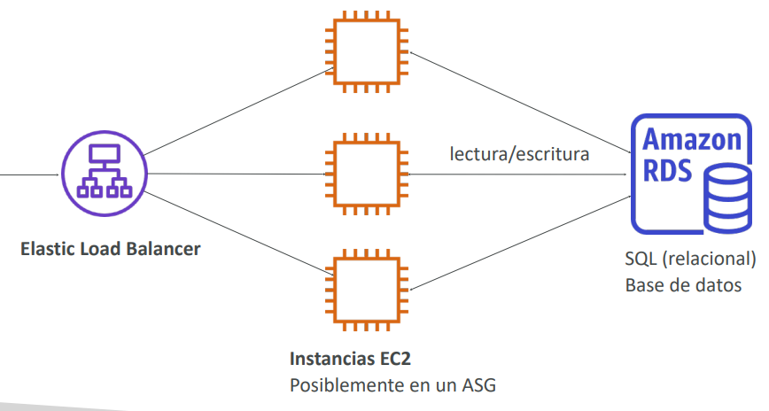
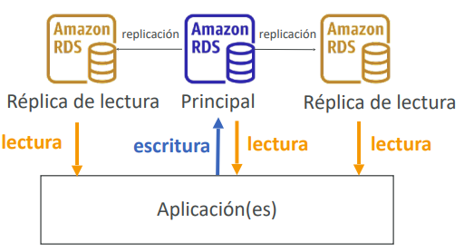
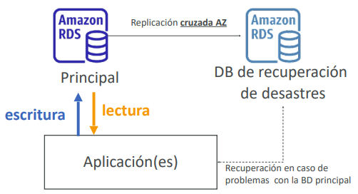
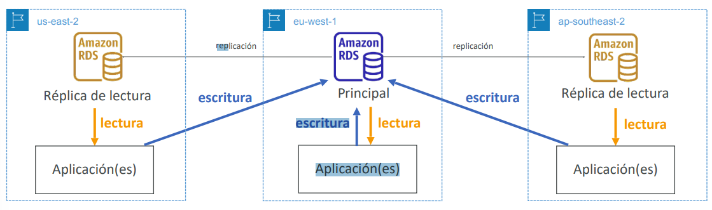
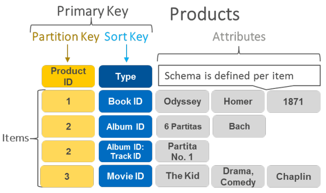
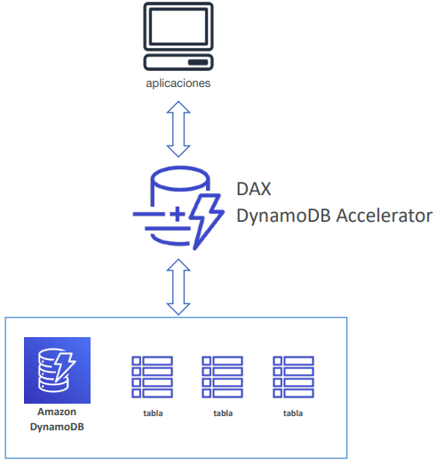
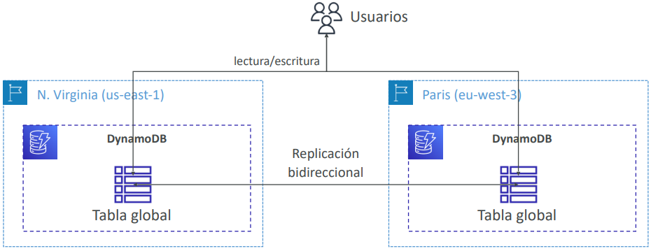
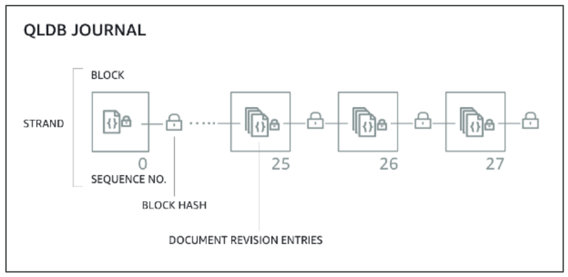
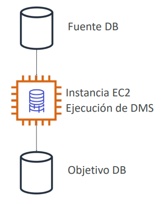

<!--  -->

# Bases de Datos

## Introducción a las bases de datos

- El almacenamiento de datos en disco (EFS, EBS, EC2 Instance Store, S3) puede tener sus límites.
- A veces, quieres almacenar datos en una base de datos...
  - Puedes **estructurar** los datos.
  - Construyes **índices** para **consultar / buscar** eficientemente en los datos.
  - Defines **relaciones** entre tus **conjuntos de datos**.

> Las bases de datos están **optimizadas para un propósito** y vienen con diferentes características, formas y restricciones.

### Bases de datos relacionales
- Tiene el mismo aspecto que las hojas de cálculo de Excel, ¡con enlaces entre ellas!
- Puede utilizar el lenguaje SQL para realizar consultas / búsquedas

### Bases de datos NoSQL
- NoSQL = no-SQL = bases de datos no relacionales
- Las bases de datos NoSQL están creadas para modelos de datos específicos y
tienen esquemas flexibles para construir aplicaciones modernas.
- Ventajas:
    - *Flexibilidad*: modelo de datos fácil de evolucionar
    - *Escalabilidad*: diseñadas para escalar utilizando clusters distribuidos
    - *Alto rendimiento*: optimizado para un modelo de datos específico
    - *Alta funcionalidad*: tipos optimizados para el modelo de datos

> [!NOTE]
> *Ejemplos*: Bases de datos clave-valor, documento, gráfico, en memoria, de búsqueda

## Bases de datos y responsabilidad compartida en AWS
- AWS ofrece el uso para *gestionar* diferentes bases de datos
- Los *beneficios* incluyen:
    - Aprovisionamiento rápido, alta disponibilidad, escalado vertical y horizontal
    - Copia de seguridad y restauración automatizadas, operaciones y actualizaciones
    - El parcheo del sistema operativo lo gestiona AWS
    - Monitorización, alertas

> [!NOTE]
> muchas tecnologías de bases de datos pueden ejecutarse en EC2, pero debes ocuparte tú mismo de la resiliencia, las copias de seguridad, los parches, la alta disponibilidad, la tolerancia a fallos, el escalado...

## [Amazon RDS](https://aws.amazon.com/rds)
- RDS significa Servicio de Base de Datos **Relacional**
- Es un servicio de bases de datos gestionado para que las bases de datos utilicen **SQL** como lenguaje de consulta.
- Permite crear bases de datos en el Cloud que son gestionadas por *AWS, Postgres, MySQL, MariaDB, Oracle, Microsoft SQL Server, Aurora (base de datos propia de AWS)*

### Ventaja sobre el uso de RDS frente al despliegue de la BD en EC2
- El RDS es un servicio gestionado:
- Aprovisionamiento automatizado, parcheo del SO
- Copias de seguridad continuas y restauración a una fecha determinada (Point in Time Restore)
- Dashboards de monitorización
- Réplicas de lectura para mejorar el rendimiento de lectura
- Configuración multi AZ para DR (Disaster Recovery)
- Ventanas de mantenimiento para actualizaciones
- Capacidad de escalado (vertical y horizontal)
- Almacenamiento respaldado por EBS (gp2 o io1)

> [!WARNING]
> PERO no puedes acceder por SSH a tus instancias**

## Arquitectura RDS 

## [Amazon Aurora](https://aws.amazon.com/rds/aurora)
- Aurora es una tecnología propietaria de AWS (no de código abierto)
- Tanto **PostgreSQL** como **MySQL** están soportadas como BD de Aurora
- Aurora está "optimizada para el Cloud de AWS" y afirma que mejora 5 veces el rendimiento de MySQL en RDS, y más de 3 veces el rendimiento de Postgres en RDS
- El almacenamiento de Aurora crece automáticamente en incrementos de 10 GB, hasta 128 TB
- Aurora cuesta más que RDS (un 20% más), pero es más eficiente
- No está en el nivel gratuito

## Despliegues RDS: Réplicas de lectura, Multi-AZ

### Réplicas de lectura

- **Escala** la carga de trabajo de lectura de tu BD 
- Puedes crear hasta 15 réplicas de lectura 
- Los datos sólo se escriben en la BD principal 

### Multi-AZ
- **Recuperación** en caso de caída de la AZ (alta disponibilidad) 
- Los datos sólo se leen/escriben en la base de datos principal 
- Sólo se puede tener otra AZ como conmutación por error 

### Multi-Region
- **Réplicas de lectura**
- **Recuperación de desastres** en caso de problema de región
- **Rendimiento local** para lecturas globales
- Coste de replicación

## [Amazon ElastiCache](https://aws.amazon.com/elasticache)
- De la misma manera que RDS es para conseguir bases de datos relacionales gestionadas...
- ElastiCache es para conseguir Redis o Memcached gestionados
- Cachés = **bases de datos en memoria** de alto rendimiento y baja latencia
- Ayuda a **reducir la carga de las bases de datos para cargas de trabajo de lectura intensiva**
- AWS se encarga del mantenimiento/parche del sistema operativo, las optimizaciones, la instalación, la configuración, la supervisión, la recuperación de fallos y las copias de seguridad

### Arquitectura de ElasticCache - Caché

## [DynamoDB](https://aws.amazon.com/documentdb)
- Totalmente gestionado con replicación a través de 3 AZ
- **Base de datos NoSQL - una base de datos no relacional**
- Escala a cargas de trabajo masivas, base de datos distribuida sin servidor
- Millones de peticiones por segundo, trillones de filas, cientos de TB de almacenamiento
- Rendimiento rápido y constante
- **Latencia de un milisegundo: recuperación de baja latencia**
- Integrada con IAM para seguridad, autorización y administración
- Bajo coste y capacidad de autoescalado
- Clase de tabla de acceso estándar e infrecuente (IA)

### DynamoDB - Tipos de Datos

- **DynamoDB es una base de datos clave/valor**

### DynamoDB Accelerator - DAX
- **Caché en memoria** totalmente gestionada para DynamoDB
- **Mejora del rendimiento x10** - latencia de un milisegundo a microsegundos - al acceder a tus tablas de DynamoDB
- Seguridad, alta escalabilidad y alta disponibilidad
- Diferencia con ElastiCache a nivel de CCP:  
  **DAX sólo se utiliza y se integra con DynamoDB**, mientras que ElastiCache puede utilizarse para otras bases de datos

### DynamoDB - Tablas Globales
- Haz que una tabla de DynamoDB sea accesible con **baja latencia** en varias regiones
- Replicación **activa-activa (lectura/escritura** en cualquier región de AWS)

## [Redshift](https://aws.amazon.com/redshift)
- Redshift se basa en PostgreSQL, **pero no se utiliza para OLTP**
- **Es OLAP - procesamiento analítico en línea (análisis y almacenamiento de datos)**
- Carga los datos una vez cada hora, no cada segundo
- Rendimiento 10 veces superior al de otros almacenes de datos, escala a PBs de datos
- Almacenamiento de datos **en columnas** (en lugar de en filas)
- Ejecución de consultas en paralelo masivo (MPP), con alta disponibilidad
- Paga a medida que avanzas en función de las instancias aprovisionadas
- Tiene una interfaz SQL para realizar las consultas
- Las herramientas de BI, como AWS Quicksight o Tableau, se integran con ella

## [Amazon EMR](https://aws.amazon.com/emr)
- EMR = Elastic MapReduce
- EMR ayuda a crear **clusters Hadoop (Big Data)** para analizar y procesar una gran cantidad de datos
- Los clusters pueden estar formados por **cientos de instancias EC2**
- También es compatible con Apache Spark, HBase, Presto, Flink...
- EMR se encarga de todo el aprovisionamiento y la configuración
- Autoescalado e integrado con instancias Spot

> **Casos de uso:**
> - Procesamiento de datos
> - Machine Learning
> - Indexación web
> - Big data...

## [Amazon Athena](https://aws.amazon.com/athena)
- Servicio de consulta sin servidor para analizar los datos almacenados en Amazon S3
- Utiliza el lenguaje SQL estándar para consultar los archivos
- Admite CSV, JSON, ORC, Avro y Parquet (construido sobre Presto)
- Precio: 5,00 dólares por TB de datos analizados
- Utiliza datos comprimidos o en columnas para ahorrar costes (menos escaneo)
- Casos de uso: Inteligencia empresarial/análisis/informes, analizar y consultar Logs de flujo de VPC, Logs de ELB, rastros de CloudTrail, etc.

> [!TIP]
> **Sugerencia de examen:** analiza los datos en S3 usando SQL sin servidor, usa Athena

## [Amazon QuickSight](https://aws.amazon.com/quicksight)
- Servicio de inteligencia empresarial impulsado por Machine Learning sin servidor para crear dashboards interactivos
- Rápido, escalable automáticamente, integrable, con precios por sesión
- Integrado con **RDS, Aurora, Athena, Redshift, S3…**

> **Casos de uso:**
> - Análisis empresarial
> - Construir visualizaciones
> - Realizar análisis ad-hoc
> - Obtener información empresarial con los datos

## [DocumentDB](https://aws.amazon.com/documentdb)
Así como Aurora es una "implementación de AWS" de PostgreSQL, MySQL, etc. DocumentDB es lo mismo que MongoDB (que es una base de datos NoSQL)
- MongoDB se utiliza para almacenar, consultar e indexar datos JSON
- “Conceptos de despliegue” similares a los de Aurora
- Totalmente gestionado, de alta disponibilidad con replicación a través de 3 AZ
- El almacenamiento de DocumentDB crece automáticamente en incrementos de 10 GB, hasta 128 TB
- Escala automáticamente a cargas de trabajo con millones de peticiones por segundo

## [Amazon Neptune](https://aws.amazon.com/neptune)
- Base de datos gráfica totalmente gestionada = conjunto de grafos
- Un **conjunto de datos de grafos** popular sería una red social 
  - Los usuarios tienen amigos 
  - Las publicaciones tienen comentarios 
  - Los comentarios tienen likes de los usuarios 
  - Los usuarios comparten y les gustan las publicaciones...

- Alta disponibilidad en 3 AZ, con hasta 15 réplicas de lectura 
- Construye y ejecuta aplicaciones que trabajen con conjuntos de datos altamente conectados, optimizados para estas complejas y difíciles consultas
- Puede almacenar hasta miles de millones de relaciones y consultar el gráfico con una latencia de milisegundos
- Alta disponibilidad con réplicas a través de múltiples AZs 
- Excelente para grafos de conocimiento (Wikipedia), detección de fraudes, motores de recomendación, redes sociales

## [Amazon QLDB](https://aws.amazon.com/qldb/)

- QLDB significa "Quantum Ledger Database" (base de datos de libros contables)
- Un libro de contabilidad es un libro que registra las transacciones financieras
- Totalmente gestionada, sin servidor, de alta disponibilidad, con replicación en 3 AZ
- Se utiliza para revisar el historial de todos los cambios realizados en los datos de tu aplicación a lo largo del tiempo
- Sistema inmutable: ninguna entrada puede ser eliminada o modificada, verificable criptográficamente

- Rendimiento 2-3 veces mejor que los marcos de blockchain de libro mayor común
- Diferencia con Amazon Managed Blockchain: no hay componente de descentralización, de acuerdo con las normas de regulación financiera

## [Amazon Managed Blockchain](https://aws.amazon.com/managed-blockchain)
- Blockchain permite crear aplicaciones en las que varias partes pueden ejecutar transacciones **sin necesidad de una autoridad central de confianza**.
- Amazon Managed Blockchain es un servicio gestionado para:
  - Unirte a redes públicas de blockchain
  - O crear tu propia red privada escalable
- Compatible con los marcos Hyperledger Fabric y Ethereum

## [AWS Glue](https://aws.amazon.com/glue)
- Servicio gestionado de **extracción, transformación y carga (ETL)**
- Útil para preparar y transformar datos para la analítica
- Servicio totalmente s**in servidor / serverless**

- Catálogo de datos Glue: catálogo de conjuntos de datos
- puede ser utilizado por Athena, Redshift, EMR

## [DMS – Database Migration Service](https://aws.amazon.com/dms)
- Migra de forma rápida y segura las bases de datos a AWS, con capacidad de recuperación y autocuración
- La base de datos de origen sigue disponible durante la migración

Soporta:
  - Migraciones homogéneas: por ejemplo, de Oracle a Oracle
  - Migraciones heterogéneas: por ejemplo, de Microsoft SQL Server a Aurora

## Resumen de bases de datos y análisis en AWS
- **Bases de datos relacionales - OLTP:** RDS y Aurora (SQL)
- Diferencias entre **Multi-AZ, Réplicas de Lectura, Multi-Región**
- **Base de datos en memoria (in-memory):** ElastiCache
- **Base de datos de claves/valores:** DynamoDB (sin servidor) y DAX (caché para DynamoDB)
- **Warehouse - OLAP:** Redshift (SQL)
- **Cluster Hadoop:** EMR
- **Athena:** consulta de datos en Amazon S3 (sin servidor y SQL)
- **QuickSight:** dashboards sobre tus datos (sin servidor)
- **DocumentDB:** "Aurora para MongoDB" (JSON - base de datos NoSQL)
- **Amazon QLDB:** Libro de transacciones financieras (libro inmutable, verificable criptográficamente)
- **Amazon Managed Blockchain:** cadenas de bloques Hyperledger Fabric y Ethereum gestionadas
- **Glue:** Servicio gestionado de ETL (Extract-Transform-Load) y Catálogo de Datos
- **Database Migration:** DMS
- **Neptune:** base de datos de grafos

<!--  -->