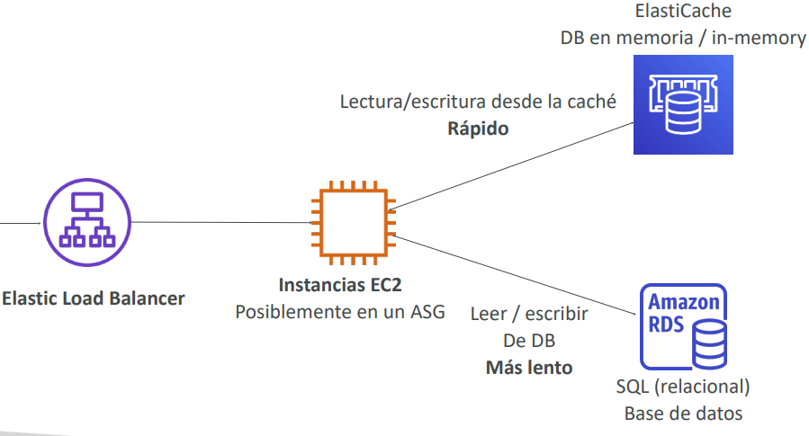
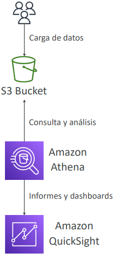

<!--  -->

# Bases de Datos

## Introducción a las bases de datos

- El almacenamiento de datos en disco (EFS, EBS, EC2 Instance Store, S3) puede tener sus límites.
- A veces, quieres almacenar datos en una base de datos...
  - Puedes **estructurar** los datos.
  - Construyes **índices** para **consultar / buscar** eficientemente en los datos.
  - Defines **relaciones** entre tus **conjuntos de datos**.

> Las bases de datos están **optimizadas para un propósito** y vienen con diferentes características, formas y restricciones.

### Bases de datos relacionales
- Tiene el mismo aspecto que las hojas de cálculo de Excel, ¡con enlaces entre ellas!
- Puede utilizar el lenguaje SQL para realizar consultas / búsquedas

### Bases de datos NoSQL
- NoSQL = no-SQL = bases de datos no relacionales
- Las bases de datos NoSQL están creadas para modelos de datos específicos y
tienen esquemas flexibles para construir aplicaciones modernas.
- Ventajas:
    - *Flexibilidad*: modelo de datos fácil de evolucionar
    - *Escalabilidad*: diseñadas para escalar utilizando clusters distribuidos
    - *Alto rendimiento*: optimizado para un modelo de datos específico
    - *Alta funcionalidad*: tipos optimizados para el modelo de datos

> [!NOTE]
> *Ejemplos*: Bases de datos clave-valor, documento, gráfico, en memoria, de búsqueda

## Bases de datos y responsabilidad compartida en AWS
- AWS ofrece el uso para *gestionar* diferentes bases de datos
- Los *beneficios* incluyen:
    - Aprovisionamiento rápido, alta disponibilidad, escalado vertical y horizontal
    - Copia de seguridad y restauración automatizadas, operaciones y actualizaciones
    - El parcheo del sistema operativo lo gestiona AWS
    - Monitorización, alertas

> [!NOTE]
> muchas tecnologías de bases de datos pueden ejecutarse en EC2, pero debes ocuparte tú mismo de la resiliencia, las copias de seguridad, los parches, la alta disponibilidad, la tolerancia a fallos, el escalado...

## Visión general de AWS RDS
- RDS significa Servicio de Base de Datos **Relacional**
- Es un servicio de bases de datos gestionado para que las bases de datos utilicen **SQL** como lenguaje de consulta.
- Permite crear bases de datos en el Cloud que son gestionadas por *AWS, Postgres, MySQL, MariaDB, Oracle, Microsoft SQL Server, Aurora (base de datos propia de AWS)*

### Ventaja sobre el uso de RDS frente al despliegue de la BD en EC2
- El RDS es un servicio gestionado:
- Aprovisionamiento automatizado, parcheo del SO
- Copias de seguridad continuas y restauración a una fecha determinada (Point in Time Restore)
- Dashboards de monitorización
- Réplicas de lectura para mejorar el rendimiento de lectura
- Configuración multi AZ para DR (Disaster Recovery)
- Ventanas de mantenimiento para actualizaciones
- Capacidad de escalado (vertical y horizontal)
- Almacenamiento respaldado por EBS (gp2 o io1)

> [!WARNING]
> PERO no puedes acceder por SSH a tus instancias**

## Arquitectura RDS 

## Amazon Aurora
- Aurora es una tecnología propietaria de AWS (no de código abierto)
- Tanto **PostgreSQL** como **MySQL** están soportadas como BD de Aurora
- Aurora está "optimizada para el Cloud de AWS" y afirma que mejora 5 veces el rendimiento de MySQL en RDS, y más de 3 veces el rendimiento de Postgres en RDS
- El almacenamiento de Aurora crece automáticamente en incrementos de 10 GB, hasta 128 TB
- Aurora cuesta más que RDS (un 20% más), pero es más eficiente
- No está en el nivel gratuito

## Despliegues RDS: Réplicas de lectura, Multi-AZ

### Réplicas de lectura

- **Escala** la carga de trabajo de lectura de tu BD 
- Puedes crear hasta 15 réplicas de lectura 
- Los datos sólo se escriben en la BD principal 

### Multi-AZ
- **Recuperación** en caso de caída de la AZ (alta disponibilidad) 
- Los datos sólo se leen/escriben en la base de datos principal 
- Sólo se puede tener otra AZ como conmutación por error 

### Multi-Region
- **Réplicas de lectura**
- **Recuperación de desastres** en caso de problema de región
- **Rendimiento local** para lecturas globales
- Coste de replicación

## Amazon ElastiCache
- De la misma manera que RDS es para conseguir bases de datos relacionales gestionadas...
- ElastiCache es para conseguir Redis o Memcached gestionados
- Cachés = **bases de datos en memoria** de alto rendimiento y baja latencia
- Ayuda a **reducir la carga de las bases de datos para cargas de trabajo de lectura intensiva**
- AWS se encarga del mantenimiento/parche del sistema operativo, las optimizaciones, la instalación, la configuración, la supervisión, la recuperación de fallos y las copias de seguridad

### Arquitectura de ElasticCache - Caché

## DynamoDB

- Totalmente gestionado con replicación a través de 3 AZ
- **Base de datos NoSQL - una base de datos no relacional**
- Escala a cargas de trabajo masivas, base de datos distribuida sin servidor
- Millones de peticiones por segundo, trillones de filas, cientos de TB de almacenamiento
- Rendimiento rápido y constante
- **Latencia de un milisegundo: recuperación de baja latencia**
- Integrada con IAM para seguridad, autorización y administración
- Bajo coste y capacidad de autoescalado
- Clase de tabla de acceso estándar e infrecuente (IA)

### DynamoDB - Tipo de Datos

- **DynamoDB es una base de datos clave/valor**

### DynamoDB Accelerator - DAX
- **Caché en memoria** totalmente gestionada para DynamoDB
- **Mejora del rendimiento x10** - latencia de un milisegundo a microsegundos - al acceder a tus tablas de DynamoDB
- Seguridad, alta escalabilidad y alta disponibilidad
- Diferencia con ElastiCache a nivel de CCP:  
  **DAX sólo se utiliza y se integra con DynamoDB**, mientras que ElastiCache puede utilizarse para otras bases de datos

### DynamoDB - Tablas Globales
- Haz que una tabla de DynamoDB sea accesible con **baja latencia** en varias regiones
- Replicación **activa-activa (lectura/escritura** en cualquier región de AWS)

## Redshift
- Redshift se basa en PostgreSQL, **pero no se utiliza para OLTP**
- **Es OLAP - procesamiento analítico en línea (análisis y almacenamiento de datos)**
- Carga los datos una vez cada hora, no cada segundo
- Rendimiento 10 veces superior al de otros almacenes de datos, escala a PBs de datos
- Almacenamiento de datos **en columnas** (en lugar de en filas)
- Ejecución de consultas en paralelo masivo (MPP), con alta disponibilidad
- Paga a medida que avanzas en función de las instancias aprovisionadas
- Tiene una interfaz SQL para realizar las consultas
- Las herramientas de BI, como AWS Quicksight o Tableau, se integran con ella

## Amazon EMR
- EMR = Elastic MapReduce
- EMR ayuda a crear **clusters Hadoop (Big Data)** para analizar y procesar una gran cantidad de datos
- Los clusters pueden estar formados por **cientos de instancias EC2**
- También es compatible con Apache Spark, HBase, Presto, Flink...
- EMR se encarga de todo el aprovisionamiento y la configuración
- Autoescalado e integrado con instancias Spot

> **Casos de uso:**
> - Procesamiento de datos
> - Machine Learning
> - Indexación web
> - Big data...

## Amazon Athena
- Servicio de consulta sin servidor para analizar los datos almacenados en Amazon S3
- Utiliza el lenguaje SQL estándar para consultar los archivos
- Admite CSV, JSON, ORC, Avro y Parquet (construido sobre Presto)
- Precio: 5,00 dólares por TB de datos analizados
- Utiliza datos comprimidos o en columnas para ahorrar costes (menos escaneo)
- Casos de uso: Inteligencia empresarial/análisis/informes, analizar y consultar Logs de flujo de VPC, Logs de ELB, rastros de CloudTrail, etc.
- Sugerencia de examen: analiza los datos en S3 usando SQL sin servidor, usa Athena

