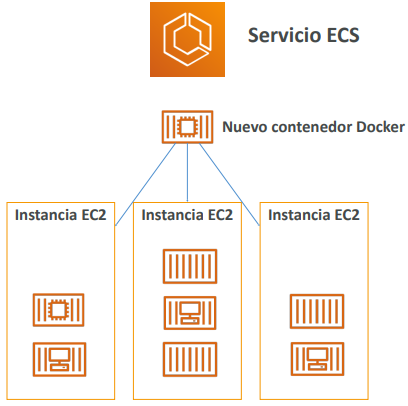
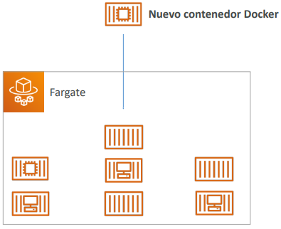
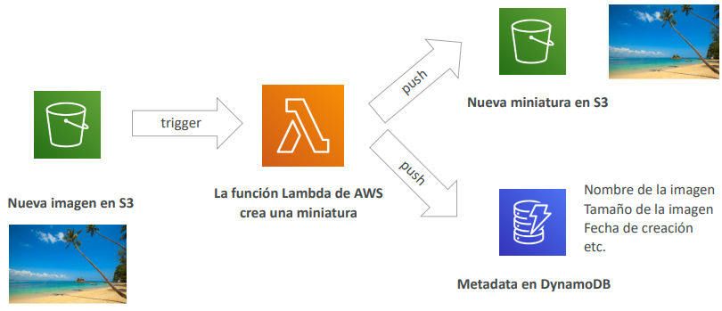
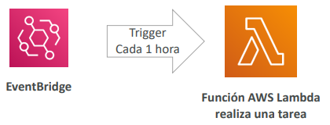

[](../7_DB)
[](../README.md)
<!-- [](../9) -->

# Otros Servicios de Computación
## [ECS - Elastic Container Service](https://aws.amazon.com/ecs)
- ECS = Elastic Container Service
- Lanzar contenedores Docker en AWS
- **Se debe aprovisionar y mantener la infraestructura (las instancias EC2)**
- AWS se encarga de iniciar/parar los contenedores
- Tiene integraciones con el Application Load Balancer



## [Fargate](https://aws.amazon.com/fargate/)
- Lanza contenedores Docker en AWS
- **No hay que aprovisionar** la infraestructura (no hay instancias EC2 que gestionar) - ¡más sencillo!
- Oferta **serverless**
- AWS sólo ejecuta los contenedores en función de la CPU / RAM deseada



## [ECR - Elastic Container Registry](https://aws.amazon.com/ecr/)
- Registro privado de Docker en AWS
- **Almacenamiento de imágenes Docker** para que puedan ser ejecutadas por ECS o Fargate

## ¿Qué es Serverless?
- Serverless es un nuevo paradigma en el que los desarrolladores ya no tienen que gestionar servidores...
- Sólo despliegan código
- Sólo despliegan... ¡funciones!
- Inicialmente... Serverless == FaaS (Función como servicio)
- Serverless fue pionero por AWS Lambda, pero ahora también incluye todo lo que se gestiona "bases de datos, mensajería, almacenamiento, etc."
- Serverless no significa que no haya servidores... significa que simplemente el usuario no los gestiona / aprovisiona / ni ve

## [Lambda](https://aws.amazon.com/lambda)
### ¿Por qué Lambda?
**EC2:**
- Servidores virtuales en el Cloud
- Limitado por la RAM y la CPU
- Funcionamiento continuo
- Escalar significa intervenir para añadir/quitar servidores

**Lambda**
- **Funciones** virtuales: ¡no hay servidores que gestionar!
- Limitado por el tiempo - **ejecuciones cortas**
- Ejecución **bajo demanda**
- **El escalado está automatizado**

### Beneficios de AWS Lambda
- Precios sencillos:
- Paga por solicitud y tiempo de computación
    - Capa gratuita de 1.000.000 de solicitudes de AWS Lambda y 400.000 GB de tiempo de computación
    - Integrado con todo el conjunto de servicios de AWS
- **Dirigido por eventos:** las funciones son invocadas por AWS cuando se necesitan
- Integrado con muchos lenguajes de programación
- Fácil monitorización a través de AWS CloudWatch
- Fácil de obtener más recursos por funciones (¡hasta 10 GB de RAM!)
- ¡El aumento de la RAM también mejorará la CPU y la red!

## Soporte del lenguaje AWS Lambda
```
- Node.js (JavaScript)
- Python
- Java (compatible con Java 8)
- C# (.NET Core)
- Golang
- C# / Powershell
- Ruby
- API de tiempo de ejecución personalizado (compatible con la comunidad, ejemplo Rust)
```
### Imagen del contenedor Lambda
- La imagen del contenedor debe implementar la API de tiempo de ejecución Lambda
- Se prefiere ECS / Fargate para ejecutar imágenes Docker arbitrarias

### Lambda Ejemplo: Creación de miniaturas Serverless


### Lambda Ejemplo: Trabajo CRON Serverless


### Precios de AWS Lambda: ejemplo
[](https://aws.amazon.com/lambda/pricing)

Pago por **llamadas**:
- Los primeros 1.000.000 de solicitudes son gratuitos
- 0,20 $ por cada millón de solicitudes a partir de entonces (0,0000002 $ por solicitud)

Pago por **duración**: (en incrementos de 1 ms)
- 400.000 GB-segundos de tiempo de cálculo al mes GRATIS
- == 400.000 segundos si la función es de 1GB de RAM
- == 3.200.000 segundos si la función es de 128 MB de RAM
- Después, 1 dólar por 600.000 GB-segundos

***Suele ser muy barato ejecutar AWS Lambda, por lo que es muy popular***