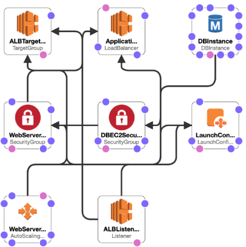
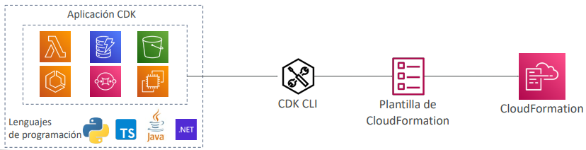
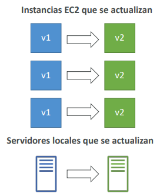
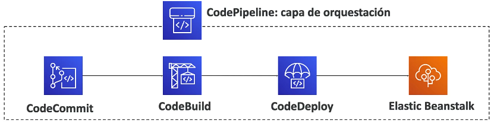
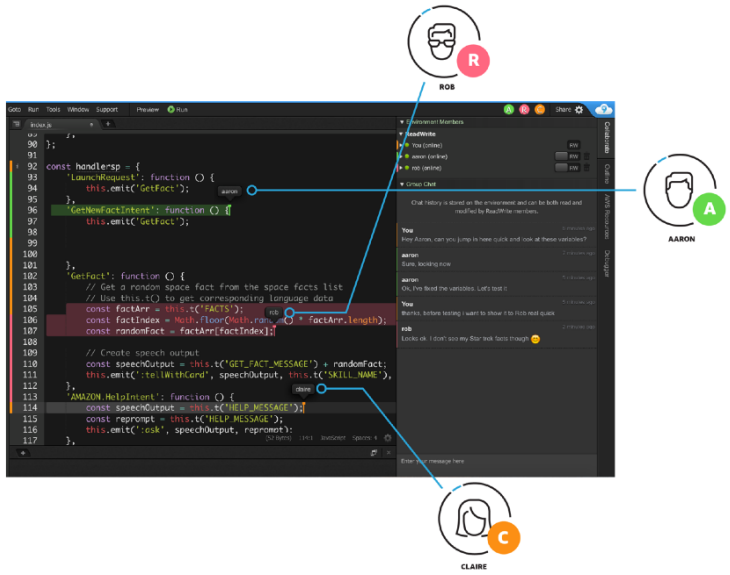
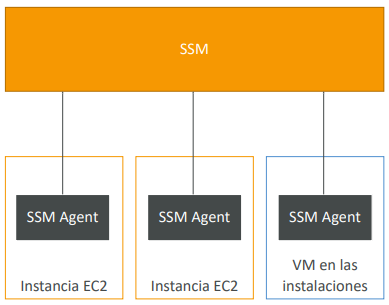
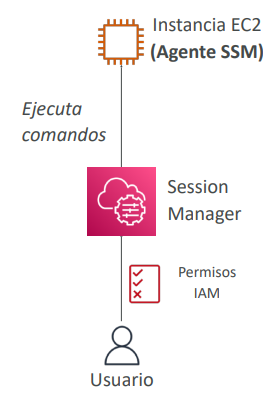

<!--  -->

# Despliegue y gestión de la infraestructura a escala
## [CloudFormation](https://aws.amazon.com/cloudformation)
CloudFormation es una forma declarativa de esbozar tu infraestructura de AWS, para cualquier recurso (la mayoría de ellos son compatibles).

Por ejemplo, dentro de una plantilla de CloudFormation, el usuario indica:
- Quiero un grupo de seguridad
- Quiero dos instancias EC2 que utilicen este grupo de seguridad
- Quiero un bucket S3
- Quiero un load balancer (ELB) delante de estas máquinas

Entonces CloudFormation los crea por el usuario, en el orden correcto, con la configuración exacta que este especificó

## # Ventajas de AWS CloudFormation
**Infraestructura como código**
- No se crean recursos manualmente, lo que es excelente para el control
- Los cambios en la infraestructura se revisan a través del código

**Coste**
- Cada recurso dentro de la pila está etiquetado con un identificador para que se pueda ver fácilmente cuánto cuesta una pila
- Se puede estimar los costes de tus recursos utilizando la plantilla de CloudFormation
- *Estrategia de ahorro:* En Dev, se podría automatizar la eliminación de plantillas a las 5 de la tarde y volver a crearlas a las 8 de la mañana, de forma segura

**Productividad**
- Posibilidad de destruir y volver a crear una infraestructura en el Cloud sobre la marcha
- Generación automatizada de diagramas para tus plantillas
- Programación declarativa (no es necesario averiguar el orden y la orquestación)

**No volver a inventar la rueda**
- Aprovecha las plantillas existentes en la web
- Aprovecha la documentación

**Soporta (casi) todos los recursos de AWS:**
- Todo lo que veremos en este curso es compatible
- Puedes utilizar "recursos personalizados" para los recursos que no son compatibles

### Stack Designer de CloudFormation 
**Ejemplo: Stack de CloudFormation para WordPress**

- Podemos ver todos los recursos 
- Podemos ver las relaciones entre los componentes

## [AWS Cloud Development Kit (CDK)](https://aws.amazon.com/cdk)
- Define la infraestructura de Cloud usando un lenguaje conocido:
    - JavaScript/TypeScript, Python, Java y .NET
- El código se "compila" en una plantilla de CloudFormation (JSON/YAML)
- Por lo tanto, se puede desplegar juntos la infraestructura y el código de ejecución de la aplicación
- Útil para las funciones Lambda
- Útil para contenedores Docker en ECS / EKS

## [AWS Elastic Beanstalk](https://aws.amazon.com/elasticbeanstalk)

- **Plataforma como servicio (PaaS)**
- Elastic Beanstalk es una visión centrada en el desarrollador de la implementación de una aplicación en AWS
- Utiliza todos los componentes que hemos visto antes: EC2, ASG, ELB, RDS, etc.
- Pero todo está en una sola vista que es fácil de entender.
- Seguimos teniendo un control total sobre la configuración
- Beanstalk es gratuito, pero se paga por las instancias subyacentes

#### Servicio gestionado
- La configuración de la instancia / el sistema operativo es manejado por Beanstalk
- La estrategia de despliegue es configurable pero la realiza Elastic Beanstalk
- Aprovisionamiento de capacidad
- Equilibrio de carga y autoescalado
- Supervisión del estado de la aplicación y capacidad de respuesta

> [!NOTE]
> Sólo el código de la aplicación es responsabilidad del desarrollador

#### Tres modelos de arquitectura:
- Despliegue de instancia única: bueno para el desarrollo
- LB + ASG: ideal para aplicaciones web de producción o preproducción
- Sólo ASG: ideal para aplicaciones no web en producción (trabajadores, etc.)

#### Soporte para muchas plataformas 
(Go, Java SE, Java con Tomcat, .NET en Windows Server con IIS, Node.js, PHP, Python, Ruby)

#### Constructor de paquetes
- Docker de un solo contenedor
- Docker multicontenedor
- Docker preconfigurado
- Si no es compatible, se puede escribir una plataforma personalizada propia (avanzado)

### Elastic Beanstalk - Monitorización de salud
- El agente de salud envía las métricas a CloudWatch
- Comprueba la salud de la aplicación, publica los eventos de salud

## [AWS CodeDeploy](https://aws.amazon.com/codedeploy)
- Queremos desplegar nuestra aplicación automáticamente
- **Servicio híbrido**
    - Funciona con instancias EC2
    - Funciona con servidores locales
- Los servidores / instancias deben ser aprovisionados y configurados de antemano con el agente de CodeDeploy

## [AWS CodeCommit](https://aws.amazon.com/codecommit)
- Antes de enviar el código de la aplicación a los servidores, es necesario almacenarlo en algún lugar
- Los desarrolladores suelen almacenar el código en un repositorio, utilizando la tecnología Git
- Una oferta pública famosa es GitHub, el producto competidor de AWS es CodeCommit

### CodeCommit:
- Servicio de control de fuentes que aloja repositorios basados en Git
- Facilita la colaboración con otros en el código
- Los cambios en el código se versionan automáticamente

#### Ventajas:
- Totalmente gestionado
- Escalable y de alta disponibilidad
- Privado, seguro, integrado con AWS

## [AWS CodeBuild](https://aws.amazon.com/codebuild)
- Servicio de construcción de código en el Cloud
- **Compila el código fuente, ejecuta las pruebas y produce paquetes que están
listos para ser desplegados (por CodeDeploy, por ejemplo)**

#### Ventajas:
- Totalmente gestionado, sin servidor
- Continuamente escalable y altamente disponible
- Seguro
- Precio de pago por uso: sólo pagas por el tiempo de compilación

## [AWS CodePipeline](https://aws.amazon.com/codepipeline)
Orquestar los diferentes pasos para que el código sea empujado automáticamente a producción
- Código => Construir => Probar => Aprovisionar => Desplegar
- Base de CICD (Integración continua y entrega continua)

#### Ventajas:
- Totalmente gestionado, compatible con CodeCommit, CodeBuild, CodeDeploy, Elastic Beanstalk, CloudFormation, GitHub, servicios de terceros (GitHub...) y plugins personalizados...
- Entrega rápida y actualizaciones rápidas

## [AWS CodeArtifact](https://aws.amazon.com/codeartifact)
- Los paquetes de software dependen unos de otros para ser construidos (también llamados dependencias de código), y se crean otros nuevos
- Almacenar y recuperar estas dependencias se llama **gestión de artefactos**
- Tradicionalmente los desarrolladores tienen que configurar su propio sistema de gestión de artefactos
- **CodeArtifact es una gestión de artefactos segura, escalable y rentable** para el desarrollo de software
- Funciona con herramientas comunes de gestión de dependencias como Maven, Gradle, npm, yarn, twine, pip y NuGet
- **Los desarrolladores y CodeBuild pueden recuperar las dependencias directamente desde CodeArtifact**

## [AWS CodeStar](https://aws.amazon.com/codestar)
- Interfaz de usuario unificada para gestionar fácilmente las actividades de desarrollo de software en un solo lugar
- "Forma rápida" de empezar a configurar correctamente CodeCommit, CodePipeline,
CodeBuild, CodeDeploy, Elastic Beanstalk, EC2, etc.
- Puedes editar el código "en la nube" utilizando AWS Cloud9

> [!CAUTION]
> Suspensión del soporte de AWS CodeStar

## [AWS Cloud9](https://aws.amazon.com/cloud9)
- AWS Cloud9 es un IDE (Entorno de Desarrollo Integrado) en el Cloud para escribir, ejecutar y depurar código
- Los IDE "clásicos" (como IntelliJ, Visual Studio Code...) se descargan en un ordenador antes de ser utilizados
- Un IDE en el Cloud se puede utilizar dentro de un navegador web, lo que significa que puedes trabajar en tus proyectos desde tu oficina, casa o cualquier lugar con Internet sin necesidad de configuración
- AWS Cloud9 también permite la colaboración de código en tiempo real (pair programming)

## [AWS Systems Manager (SSM)](https://aws.amazon.com/systems-manager)
- Nos ayuda a **gestionar** nuestros **sistemas EC2 y On-Premises** a <ins>*escala*</ins>
- Otro servicio **híbrido** de AWS
- Obtenga información operativa sobre el estado de su infraestructura
- Conjunto de más de 10 productos
- Funciona para Linux, Windows, MacOs y Raspberry Pi OS (Raspbian)

#### Las características más importantes:
- **Automatización de parches para mejorar la normativa**
- **Ejecuta comandos en toda una flota de servidores**
- Almacena la configuración de los parámetros con el almacén de parámetros SSM

### *Cómo funciona Systems Manager?*
- Necesitamos instalar el agente SSM en los sistemas que controlamos
- Se instala por defecto en las AMI de Amazon Linux y en algunas AMI de Ubuntu
- Si una instancia no puede ser controlada con SSM, probablemente se trate de un problema con el agente SSM
- Gracias al agente SSM, podemos **ejecutar comandos, parchear y configurar** nuestros servidores

### Systems Manager – SSM Session Manager
- Te permite iniciar un shell seguro en tus servidores EC2 y locales
- **No se necesita acceso SSH ni claves SSH**
- **No se necesita el puerto 22 (mayor seguridad)**

> [!IMPORTANT]
> - Se puede usar como bastion host, lo que facilita las cosas
> - Envía los datos de registro de la sesión a S3 o a CloudWatch Logs

