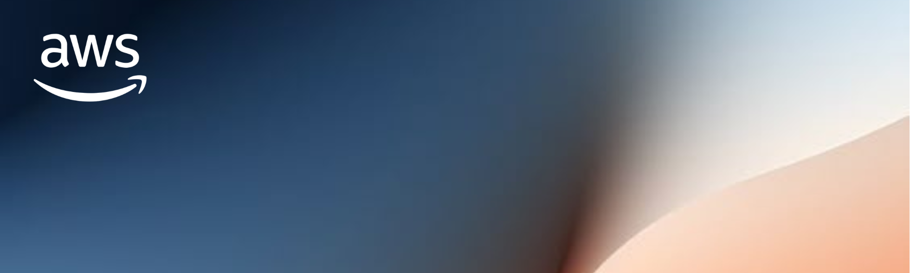

## 🔗 Links

## Content
1. [¿Qué es cloud computing?](./1_Cloud_Computing/README.md)
2. [IAM - Identity & Access Management](./2_IAM/README.md)
3. [EC2 - Elastic Compute Cloud](./3_EC2/README.md)
4. [EBS - Almacenamiento de instancias EC2](./4_EBS/README.md)
5. [ELB y ASG - Elastic Load Balancing y Auto Scaling Groups](./5_ELB_&_ASG/README.md)
6. [S3 - Simple Storage Service](./6_S3/README.md)
7. [Bases de datos y analíticas](./7_DB/README.md)
8. [Otros servicios de computación: ECS, Lambda, Batch, Lightsail](./8_Other_Compute_Services/README.md)
9. [Despliegue y gestión de la infraestructura a escala](./9_Deploy_&_Infra/README.md)
10. [Aprovechando la infraestructura global de AWS](./10_Get_Advantage_Of_Cloud/README.md)
11. [Integraciones del Cloud](./11_Cloud_Integrations/README.md)
12. [Monitorización del Cloud](./12_Cloud_Monitorization/README.md)
13. [Virtual Private Cloud (VPC)](./13_VPC/README.md)
14. [Seguridad y normativa](./14_Security_&_Compliance/README.md)
15. [Machine Learning](./15_Machine_Learning/README.md)
16. [Gestión de la cuenta, facturación y soporte técnico](./16_Account_Billing_Support/README.md)
17. Identidad avanzada
18. Otros servicios